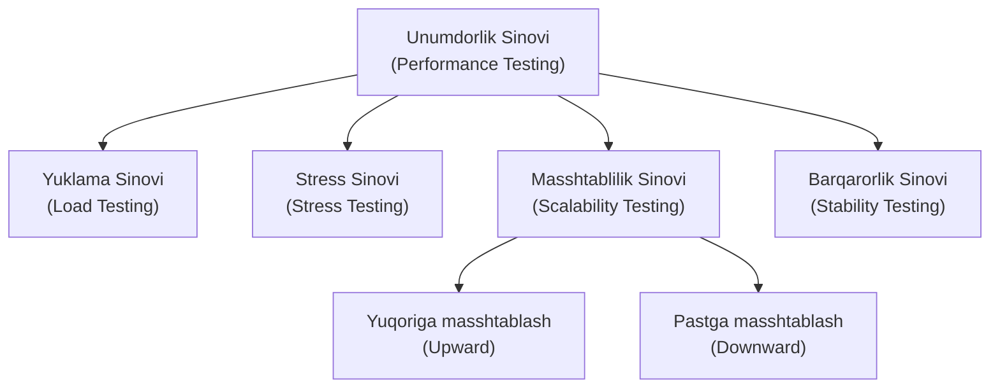

import { Callout } from 'nextra/components'

# Unumdorlik Sinovi (Performance Testing)

> Oxirgi yangilanish: 25-iyul, 2026

**Unumdorlik sinovi (Performance Testing)** — turli xil yuklama sharoitlarida dasturiy ilovaning tezligi, barqarorligi, masshtabliligi va sezgirligini (javob qaytarish tezligini) baholash uchun qo'llaniladigan nofunksional sinov texnikasidir. U ilovaning unumdorlik bo'yicha qo'yilgan talablarga qay darajada mos kelishini tekshiradi.

Ushbu bobda siz unumdorlik sinovi nima ekanligi, u nima uchun o'tkazilishi, o'lchanadigan asosiy omillar, uning turlari va qo'llanish sohalari bilan tanishasiz.

---

## Unumdorlik Sinovi Nima? (What is Performance Testing?)

**Unumdorlik sinovi (Performance Testing)** — turli xil yuklama sharoitlarida dasturiy ilovaning tezligi, barqarorligi, masshtabliligi va sezgirligini (javob qaytarish tezligini) baholash uchun qo'llaniladigan nofunksional sinov texnikasidir. U ilovaning unumdorlik bo'yicha qo'yilgan talablarga qay darajada mos kelishini tekshiradi.

Ushbu sinov dasturning bir vaqtning o'zida kutilgan miqdordagi foydalanuvchilar oqimiga qoniqarli javob berish tezligini va tizim barqarorligini saqlab qolgan holda xizmat ko'rsata olishini baholaydi.

Asosiy maqsad — tizimda sekinlashuvga sabab bo'layotgan **"tor bo'g'inlar"ni (bottlenecks)** aniqlash va dastur ishlab chiqarish (production) muhitiga chiqarilishidan oldin unumdorlik talablariga javob berishini kafolatlashdir.

Unumdorlik sinovi odatda veb-ilovalar, mobil ilovalar, desktop dasturlar, API'lar va korporativ tizimlarda o'tkaziladi.

### Unumdorlik Sinovining Asosiy O'lchov Omillari:
- **Javob berish vaqti (Response Time):** Foydalanuvchi so'rov yuborganidan boshlab dastur yoki server javob qaytarguncha ketgan vaqt. Javob berish vaqti qancha kam bo'lsa, tizim shuncha tez ishlaydi.
- **Yuklama (Load):** Bir vaqtning o'zida ilovaga murojaat qilayotgan foydalanuvchilar yoki so'rovlar soni. Tizim kutilgan yuklama ostida to'g'ri ishlashi tekshiriladi.
- **Barqarorlik (Stability):** Dasturning belgilangan yuklama ostida ma'lum vaqt davomida uzilishlarsiz, qulashlarsiz (crash) va tezlikni yo'qotmasdan barqaror ishlay olish qobiliyati.

---

## Unumdorlik Sinovi Qachon O'tkaziladi?

Dasturiy ta'minot funksional jihatdan barqaror bo'lib, unga bir vaqtda bir nechta foydalanuvchilar kirish ehtimoli paydo bo'lganda unumdorlik sinovi o'tkaziladi. 

<Callout type="warning">
**Muhim eslatma:** Unumdorlik sinovi nofunksional sinov hisoblanadi. Ilova funksional jihatdan to'liq barqaror bo'lmaguncha unumdorlik sinovi o'tkazilmaydi. Shuningdek, unumdorlik sinovini qo'lda (manual) o'tkazib bo'lmaydi, chunki bu juda qimmatga tushadi va soniyalarning ulushlarini qo'lda aniq o'lchash imkonsizdir.
</Callout>

---

## Unumdorlik Sinovi Turlari

Unumdorlik sinovi to'rtta asosiy turga bo'linadi:

1. **Yuklama sinovi (Load Testing)**
2. **Stress sinovi (Stress Testing)**
3. **Masshtablilik sinovi (Scalability Testing)**
4. **Barqarorlik sinovi (Stability Testing)**

### 1. Yuklama sinovi (Load Testing)
Kutilayotgan me'yoriy yuklamaga teng yoki undan kam bo'lgan yuklama berilganda dasturning ishlashini tekshirish.
> **Misol:** Mijoz talabiga ko'ra tizim 1000 ta bir vaqtda kiruvchi foydalanuvchini ko'tara olishi va javob vaqti har bir so'rov uchun 3 soniyadan oshmasligi kerak.

### 2. Stress sinovi (Stress Testing)
Dasturga kutilgan me'yordan ancha yuqori bo'lgan yuklama berilganda uning xatti-harakatini tekshirish.
> **Misol:** Yuqoridagi misoldagi 1000 ta foydalanuvchi o'rniga birdaniga 1100 ta yoki undan ko'p foydalanuvchi oqimi kiritiladi va maqsad 4 soniya ichida javob olish bo'ladi. Agar tizim bardosh bersa, sinov muvaffaqiyatli deb topiladi.

### 3. Masshtablilik sinovi (Scalability Testing)
Foydalanuvchilar sonini bosqichma-bosqich oshirish yoki kamaytirish orqali dastur unumdorligini tekshirish. Ikki turga bo'linadi:
- **Yuqoriga masshtablash (Upward Scalability Testing):** Foydalanuvchilar soni tizim qulaguncha (*crash point*) bosqichma-bosqich oshirib boriladi. Maqsad — tizimning eng yuqori maksimal imkoniyatini aniqlash.
- **Pastga masshtablash (Downward Scalability Testing):** Agar yuklama sinovi muvaffaqiyatsiz bo'lsa, xatolik keltirib chiqargan "tor bo'g'in"ni (*bottleneck*) aniqlash maqsadida foydalanuvchilar soni sekin-asta kamaytirib boriladi.

### 4. Barqarorlik sinovi (Stability Testing)
Dasturga ma'lum bir yuklamani uzoq vaqt (masalan, bir necha soat yoki kun) davomida uzluksiz berib, uning barqarorligini tekshirish.

---

## Amaliy Misol: Yuklama va Stressni Baholash

Mijoz talabi bo'yicha me'yoriy yuklama 1000 ta foydalanuvchi deb belgilangan tizimni ko'rib chiqamiz:

- **1-Ssenariy:** 1000 foydalanuvchi, javob vaqti 2.7 soniya → **Muvaffaqiyatli (Pass)**, chunki talab qilingan 1000 foydalanuvchiga bardosh berdi (Yuklama sinovi).
- **2-Ssenariy:** Yuklama 100 taga oshirildi (1100 foydalanuvchi), javob vaqti 3.5 soniya → **Muvaffaqiyatli (Pass)** (Stress sinovi).
- **3-Ssenariy (Yuqoriga masshtablash):**
  - `1200 foydalanuvchi → 3.5 soniya`: Kutilgan me'yordan oshib ketdi (**Fail**)
  - `1300 foydalanuvchi → 4.0 soniya`: Kutilgan me'yordan oshib ketdi (**Fail**)
  - `1400 foydalanuvchi → Tizim quladi (Crashed)`

---

## Hajm Sinovi (Volume) va Chidamlilik Sinovi (Soak)

<Callout type="info">
**Volume va Soak testing** unumdorlik sinovi bilan bog'liq bo'lgan alohida sinov usullaridir:

- **Hajm sinovi (Volume Testing):** Tizimga katta hajmdagi ma'lumotlarni kiritish orqali uning xatti-harakatini tekshiradi. Bu yerda asosiy e'tibor foydalanuvchilar soniga emas, balki **ma'lumotlar hajmiga** qaratiladi. (*Yuklama = foydalanuvchilar soni, Hajm = ma'lumotlar miqdori*).
- **Chidamlilik sinovi (Soak Testing):** Tizimni noqulay yoki kam quvvatli muhitda uzoq vaqt davomida uzluksiz ishlatib sinash. Bu salbiy sinov turi hisoblanadi.
</Callout>

---

## Unumdorlik Sinovi Jarayoni (Bosqichlari)

Unumdorlik sinovi quyidagi bosqichlarda o'tkaziladi:

1. **Unumdorlik ssenariylarini aniqlash:**
   - *Eng ko'p ishlatiladigan ssenariylar:* Masalan, Gmail'da kirish (login), xat yozish (compose), kiruvchi xatlar (inbox) va chiqish (logout).
   - *Eng muhim biznes ssenariylari:* Biznes uchun hal qiluvchi bo'lgan amallar.
   - *Katta hajmdagi tranzaksiyalar:* Bir vaqtda minglab foydalanuvchilar bajaradigan amallar.
2. **Sinov skriptlarini rejalashtirish va loyihalash:** Maxsus sinov dasturlari o'rnatiladi va avtomatlashtirilgan skriptlar yoziladi.
3. **Sinov muhitini sozlash va yuklamani taqsimlash:** Dasturiy ta'minot va server muhiti tayyorlanib, yuklama taqsimoti belgilanadi.
4. **Skriptlarni ishga tushirish:** Sinov jarayoni bajariladi va ko'rsatkichlar nazorat qilinadi.
5. **Natijalarni olish:** Maksimal, o'rtacha va minimal javob vaqtlari qayd etiladi.
6. **Natijalarni tahlil qilish:** Agar javob vaqti me'yorga to'g'ri kelmasa, sabablari o'rganiladi.
7. **Tor bo'g'inlarni (Bottlenecks) aniqlash va sozlash (Tuning):** Xatolik kodda, apparat vositalarida (RAM, protsessor, disk), tarmoqda yoki operatsion tizimda ekanligi aniqlanib, tuzatiladi.
8. **Qayta sinash (Re-run):** Muammolar hal etilgach, skriptlar qaytadan ishga tushiriladi.

---

## Unumdorlik Sinovida Uchraydigan Asosiy Muammolar

- **Javob berish vaqti muammosi (Response time issue):** Server so'rovga juda sekin javob qaytarishi foydalanuvchilarning tizimdan voz kechishiga sabab bo'ladi.
- **Masshtablilik muammosi (Scalability issue):** Foydalanuvchilar soni oshganda tizimning bir vaqtda kelayotgan so'rovlarni qabul qila olmasligi.
- **Tor bo'g'in (Bottleneck):** Tizimning biror elementi unumdorlikni pasaytirib, butun jarayonni sekinlashtirishi. Asosiy sabablari:
  - Xotira (RAM) yetishmovchiligi;
  - Diskdan foydalanish (Disk usage) darajasining yuqoriligi;
  - Protsessor (CPU) haddan tashqari yuklanishi;
  - Operatsion tizim cheklovlari;
  - Tarmoq o'tkazuvchanligi muammolari.
- **Tezlik muammosi (Speed issue):** Ilovaning umumiy sekin ishlashi.

---

## Unumdorlik Sinovi Asboblari (Tools)

Unumdorlik sinovida tijorat va ochiq kodli dasturlar qo'llaniladi:

### Ochiq kodli vositalar:
- **Apache JMeter:** Java tilida yozilgan eng mashhur ochiq kodli dastur. Statik va dinamik resurslarni sinash, serverlar va tarmoqlarga og'ir yuklamalar berish orqali unumdorlikni tahlil qilish imkonini beradi.

### Tijorat vositalari:
- **LoadRunner (Micro Focus / HP):** Turli protokollar va tizimlarni qo'llab-quvvatlovchi eng kuchli korporativ vositalardan biri. Muammolar manbasini tezkor aniqlaydi.
- **WebLOAD:** Veb va mobil ilovalarda yuklama, unumdorlik va stress sinovlarini amalga oshiruvchi kompleks vosita.
- **NeoLoad:** Veb va mobil ilovalarni tezkor sinash va tor bo'g'inlarni aniqlash imkonini beruvchi zamonaviy platforma.

*Shuningdek, LoadUI Pro, StresStimulus, LoadView, LoadNinja va RedLine13 kabi zamonaviy vositalar ham keng qo'llaniladi.*
