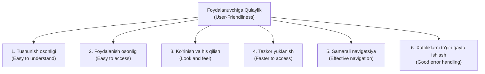
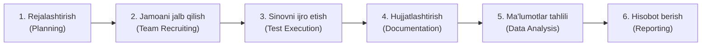

import { Callout } from 'nextra/components'

# Foydalanish Qulayligi Sinovi (Usability Testing)

Bugungi kunda ilovalar do'konlarida (App Store, Google Play va boshqalar) insonlarga kundalik yumushlarida ko'maklashuvchi son-sanoqsiz ilovalar mavjud. Agar yangi dastur foydalanuvchiga noqulaylik tug'dirsa, salbiy taassurot qoldirsa yoki past baholansa, u keng ommalashmasdan va yetarli miqdorda yuklab olinmasdanoq bozordan chiqib ketishi mumkin.

Bitta salbiy sharh butun jamoaning oylar davomida sarflagan mehnati, resurslari, rejalashtirishlari va mahsulotni yaratishdagi ishtiyoqiga jiddiy putur yetkazishi mumkin. Aynan shuning uchun **Foydalanish qulayligi sinovi (Usability Testing)** bu kabi muammolarni bartaraf etishda hal qiluvchi ahamiyatga ega bo'lib, STLC (Dasturiy Ta'minotni Sinash Hayotiy Sikli) davomida test muhandislari hamda real foydalanuvchilar tomonidan amalga oshiriladi.

---

## Foydalanish Qulayligi Sinovi Nima? (What is Usability Testing?)

**Foydalanish qulayligi sinovi (Usability Testing)** — nofunksional sinovlar toifasiga kiruvchi muhim dasturiy sinov texnikasidir. U asosan foydalanuvchiga yo'naltirilgan dizaynda (*user-centered interaction design*) dasturiy mahsulotdan foydalanish qay darajada oson, tushunarli va qulay ekanligini baholash uchun qo'llaniladi. 

Ilovaning foydalanuvchiga qulayligi (*user-friendliness*), samaradorligi (*efficiency*) va aniqligini (*accuracy*) tekshirish jarayoni **Usability Testing** deb ataladi.

Ushbu sinovning bosh maqsadi — buyurtmachi tomonidan belgilangan funksional va biznes talablarini to'liq saqlagan holda, mahsulot uni ishlatishi kerak bo'lgan yakuniy foydalanuvchi uchun qulay, sodda va to'siqlarsiz bo'lishini ta'minlashdir.

Boshqacha aytganda, ushbu sinov dasturiy mahsulotning inson bilan muloqot qilishidagi kamchiliklarni aniqlaydi. Shu sababli u ko'pincha **Foydalanuvchi Tajribasi Sinovi (UX Testing — User Experience Testing)** deb ham yuritiladi.

U veb-sayt yoki mobil ilovadagi foydalanish bilan bog'liq muammolarni bartaraf etishga yordam beradi: sayt bo'ylab navigatsiya qilish qulayligidan tortib, eng yaxshi foydalanuvchi tajribasini taqdim etish uchun uning jarayonlari (*flow*) va kontentini tasdiqlashgacha bo'lgan barcha jihatlarni qamrab oladi.

Odatda foydalanish qulayligi sinovi dasturchilar jamoasi tomonidan emas, balki **real foydalanuvchilar** tomonidan o'tkaziladi. Chunki mahsulotni yaratgan dasturchilar o'z ishlariga o'rganib qolganliklari sababli foydalanuvchi tajribasiga xos bo'lgan nozik xatolik va noqulayliklarni payqamasliklari mumkin.

<Callout type="info">
**Muhim eslatma:** Foydalanish qulayligi sinovi foydalanuvchi ehtiyojlarini yanada chuqurroq anglash maqsadida dasturiy ta'minotni ishlab chiqish hayotiy siklining (SDLC) **Loyihalash (Designing)** bosqichidayoq boshlanishi mumkin.
</Callout>

---

## Foydalanuvchiga Qulaylikning 6 Asosiy Mezoni

Foydalanish qulayligi sinovida ilovaning qulayligi (*user-friendliness*) quyidagi 6 ta asosiy mezon asosida baholanadi:

### 1. Tushunish osonligi (Easy to understand)
Dasturiy ta'minot yoki ilovaning barcha funksiyalari, tugmalari va belgilari yakuniy foydalanuvchiga aniq, ravshan va tushunarli bo'lishi kerak.

### 2. Foydalanish osonligi (Easy to access)
Qulay ilova barcha toifadagi foydalanuvchilar uchun ochiq va to'siqlarsiz kirish imkoniyatiga ega bo'lishi lozim.

### 3. Tashqi ko'rinish va his qilish (Look and feel)
Ilovaning tashqi ko'rinishi va interfeysi foydalanuvchida qiziqish uyg'otadigan darajada yoqimli va chiroyli bo'lishi lozim. Agar grafik foydalanuvchi interfeysi (GUI) pala-partish bo'lsa, foydalanuvchi ilovadan foydalanish ishtiyoqini yo'qotadi. Mahsulot sifati buyurtmachi talablariga mos darajada yuqori bo'lishi shart.

### 4. Tezkor yuklanish va kirish (Faster to access)
Ilova tezkor ishlashi kerak, ya'ni tizimning javob berish vaqti (response time) qisqa bo'lishi zarur. Agar tizim sekin javob bersa, foydalanuvchining hafsalasi pir bo'ladi. Odatda sahifa va amallarning yuklanish vaqti **3 dan 6 soniyagacha** bo'lishini ta'minlash maqsadga muvofiqdir.

### 5. Samarali navigatsiya (Effective navigation)
Ilovaning eng muhim jihatlaridan biridir. Bunga quyidagilar kiradi:
- Sifatli ichki havolalar (*Good Internal Linking*);
- Ma'lumot beruvchi yuqori (Header) va quyi (Footer) panellar;
- Qulay va aniq qidiruv funksiyasi.

### 6. Xatoliklarni to'g'ri qayta ishlash (Good error handling)
Xatoliklarni kod darajasida to'g'ri tutib olish va qayta ishlash dasturni baquvvat (robust) va xatolardan xoli qiladi. Ekranda tushunarsiz texnik kodlar o'rniga foydalanuvchiga muammoni va uning yechimini aniq tushuntiruvchi xabarlarni ko'rsatish qulaylikni sezilarli darajada oshiradi.

---

## Nega Foydalanish Qulayligi Sinovi Zarur?

Foydalanish qulayligi sinovining bosh maqsadi — yuqori darajadagi foydalanuvchi tajribasiga (UX) ega tizim yaratishdir. Usability nafaqat dasturlash yoki veb-sayt yaratishda, balki har qanday mahsulot dizaynida juda muhimdir.

Foydalanuvchilar dastur bilan ishlashda quyidagi parametrlardan to'liq qoniqish hosil qilishlari shart:
- **Ilova oqimi (Flow):** Dasturdagi jarayonlar ketma-ketligi silliq va mantiqiy bo'lishi;
- **Navigatsiya qadamlari:** Bo'limlar o'rtasida o'tish qadamlari aniq va qisqa bo'lishi;
- **Kontent:** Matnlar va tushuntirishlar sodda tilda berilishi;
- **Tashqi tartib (Layout):** Elementlar ekranda qulay va to'g'ri joylashishi;
- **Javob berish tezligi:** Har bir buyruq zudlik bilan ijro etilishi.

Sinov davomida quyidagi ikki savolga javob olinadi:
1. Ilovadan foydalanish qanchalik oson?
2. Ilovani o'rganib olish qanchalik yengil?

---

## Foydalanish Qulayligi Sinovining Muhim Xususiyatlari

- Dasturiy ta'minotda **qora quti (black-box)** sinoviga kiruvchi muhim nofunksional sinov texnikasidir.
- Asosan **Tizimli sinov (System Testing)** va **Qabul qilish sinovi (Acceptance Testing)** bosqichlarida o'tkaziladi.
- Dasturiy ta'minotni ishlab chiqish hayot siklining (SDLC) erta bosqichlarida qo'llanilishi mumkin.
- Yakuniy foydalanuvchilarning ilovadan nimalarni kutayotganligini yaqqol ko'rsatib beradi.
- Dasturiy mahsulot o'zining rejalashtirilgan maqsadiga xizmat qilayotganini tasdiqlaydi.
- Mahsulotning foydalanuvchiga qulayligi, foydaliligi, kuzatuvchanligi va jozibadorligini baholaydi.
- Real foydalanuvchilar tizim bilan qanday ishlayotgani haqida bevosita va to'g'ridan-to'g'ri fikr-mulohazalarni taqdim etadi.

---

## Sinov Davomida Tekshiriladigan Asosiy Parametrlar

Foydalanish qulayligi sinovi tizim sifatini oshirish uchun quyidagi 6 ta parametrni tekshiradi:

1. **Samaradorlik (Efficiency):** Tajribali foydalanuvchi o'zining asosiy vazifalarini bajarish uchun minimal vaqt sarflashi lozim.
2. **Eslab qolish qulayligi (Memorability):** Foydalanuvchi ma'lum vaqt tanaffusdan so'ng ilovaga qaytganida, hech qanday qo'shimcha yordamsiz oddiy amallarni osongina bajara olishi kerak. Agar foydalanuvchi tanaffusdan so'ng yana boshidan o'rganishga majbur bo'lsa, bu ilovaning eslab qolish qulayligi yomon ekanligini anglatadi.
3. **Aniqlik (Accuracy):** Mahsulotda noo'rin, keraksiz yoki chalkash ma'lumotlar bo'lmasligi, shuningdek ishlamaydigan (singan / broken) havolalar mavjud emasligi tekshiriladi.
4. **O'rganish osonligi (Learnability):** Yangi foydalanuvchi ilovadagi asosiy amallarni o'rganishi uchun sarflanadigan vaqt minimal bo'lishi kerak.
5. **Qoniqish (Satisfaction):** Foydalanuvchi ilovadan foydalanganda undan qoniqish va xushnudlik hosil qilishi kerak.
6. **Xatoliklarni aniqlash va tuzatish (Errors):** Foydalanuvchi xatoga yo'l qo'yganida, tizim xatoni osonlik bilan tuzatishga va vazifani qaytadan muvaffaqiyatli yakunlashga yordam berishi zarur.

---

## Foydalanish Qulayligi Sinovining Usullari va Strategiyalari

Foydalanish qulayligi sinovida quyidagi asosiy uslublar qo'llaniladi:

### 1. A/B Sinovi (A/B Testing)
Mahsulotning bitta muhim elementi o'zgartirilgan ikkita versiyasi (A va B) yaratiladi va foydalanuvchilar guruhlariga taqdim etiladi. Interfeys elementlari, tugma ranglari, matnlar yoki shriftlar taqqoslanib, qaysi biri foydalanuvchilarga ko'proq yoqqanligi va yuqori natija berganligi aniqlanadi.

### 2. Yo'lakdagi sinov (Hallway Testing)
Eng tejamkor va samarali usullardan biri. Unda mahsulot haqida avvaldan hech qanday tushunchaga ega bo'lmagan tasodifiy kishilarga ilovani ishlatib ko'rish beriladi. Bu orqali oddiy funksiyalardagi eng jiddiy noqulayliklar va chalkashliklar tezda fosh etiladi.

### 3. Laboratoriya sinovi (Laboratory Usability Testing)
Maxsus ajratilgan laboratoriya xonasida, kuzatuvchilar ko'z o'ngida amalga oshiriladi. Kuzatuvchilar testchilarning harakatlarini sinchkovlik bilan kuzatib boradi va natijalarni jamoaga hisobot qilib beradi.

### 4. Ekspert tahlili (Expert Review)
Usability sohasida chuqur tajribaga ega bo'lgan mutaxassislar (UX/UI ekspertlari) tomonidan amalga oshiriladi. Ekspertlar ilovani tezkor baholaydi va zaif jihatlarni darhol payqaydi. Ushbu usul yuqori malakali mutaxassisni talab qilgani sababli biroz qimmat bo'lishi mumkin, ammo juda aniq natija beradi.

### 5. Avtomatlashtirilgan ekspert tahlili (Automated Expert Review)
Maxsus avtomatlashtirish skriptlari va vositalari orqali amalga oshiriladi. Avtomatlashtirish muhandisi qulaylik qoidalarini tekshiruvchi testlarni yozadi va ishga tushiradi. U tezkor va inson omilini kamaytiradi, biroq inson tuyg'usi va chuqur his-tuyg'ularini to'liq ifodalay olmaydi.

### 6. Masofaviy sinov (Remote Usability Testing)
Turli hududlar yoki mamlakatlarda joylashgan kishilar tomonidan masofadan turib o'tkaziladi. U ikki qismga bo'linadi:
- **Sinxron masofaviy sinov (Synchronous Remote Usability Testing):** Video konferensiya vositalari (masalan, WebEx, Zoom) orqali real vaqtda ekranni birgalikda kuzatish asosida olib boriladi.
- **Asinxron masofaviy sinov (Asynchronous Remote Usability Testing):** Foydalanuvchilar o'zlarining shaxsiy qurilmalarida mustaqil ishlaydilar; ularning harakat loglari, fikr-mulohazalari va ko'rsatkichlari maxsus dasturlar orqali avtomatik tarzda qayd etiladi.

---

## Foydalanish Qulayligi Sinovi Jarayoni (Process)

Sinov jarayoni 6 ta ketma-ket bosqichdan iborat:

1. **Rejalashtirish (Planning):** Sinov rejasi (Test Plan) ishlab chiqiladi. Tizimning eng muhim funksiyalari, sinov usuli, qatnashuvchilar soni va demografiyasi, hamda hisobot shakllari belgilanadi.
2. **Jamoani tanlash va jalb qilish (Team Recruiting):** Mahsulot murakkabligi va byudjetga ko'ra yakuniy foydalanuvchilar yoki testchilar guruhi jalb etiladi hamda ularga aniq vazifalar taqsimlanadi.
3. **Sinovni ijro etish (Test Execution):** Test ishtirokchilari belgilangan amallarni bajarib, duch kelgan noqulayliklar va muammolarni qayd etib boradilar.
4. **Natijalarni hujjatlashtirish (Test Result Documentation):** Sinov jarayonida to'plangan barcha xatoliklar va ko'rsatkichlar qayd etiladi.
5. **Ma'lumotlar tahlili (Data Analysis):** Fikr-mulohazalar tasniflanadi, umumiy qoliplar aniqlanadi va mahsulotni yaxshilash bo'yicha amaliy takliflar ishlab chiqiladi.
6. **Hisobot berish (Reporting):** Natijalar, tavsiyalar, ekran yozuvlari va audio-video materiallar ishlab chiquvchilar hamda dizaynerlar jamoasiga taqdim etiladi.

---

## Amaliy Misollar (Examples of Usability Testing)

### 1-misol: Ilovalarni taqqoslash
Aytaylik, bir xil vazifani bajaradigan ikkita dastur mavjud — **P** va **Q**.
- **P** ilovasi funksiyalarini to'liq o'rganish uchun foydalanuvchiga **4 soat** kerak bo'ldi.
- **Q** ilovasini o'rganish uchun esa **6 soat** vaqt ketdi.

Dastlabki xulosa bo'yicha **P** ilovasi o'rganish osonligi jihatidan qulayroq. Biroq, agar **P** ilovasining tashqi ko'rinishi juda noqulay bo'lsa (masalan: qizil fonda och ko'k rangli matn ishlatilgan bo'lsa), uni to'liq qulay deb bo'lmaydi. Shuning uchun qulaylik faqat bitta omil bilan emas, barcha mezonlar yig'indisi orqali belgilanadi.

### 2-misol: Bank boshqaruv tizimi
Bank filiali boshqaruvchisi (Manager) uchun yangi dastur yaratildi. Bu yerda boshqaruvchi — yakuniy foydalanuvchidir. Test muhandislari boshqaruvchining yonida o'tirib, uning dasturdan qanday foydalanayotganini, qaysi amallarda to'xtab qolayotganini va tizimning qaysi joyida xatoliklarga yo'l qo'yilayotganini kuzatadilar va qayd etadilar.

### 3-misol: O'yin ilovasini testdan o'tkazish
Kompaniya rahbari ishlab chiqilgan o'yin dasturini turli toifadagi xodimlar va do'stlarga tarqatadi. Ular o'yindan foydalanib o'z fikrlarini bildiradilar. Barcha foydalanuvchilar shikoyat qilgan jiddiy kamchiliklar birinchi navbatda to'g'rilanadi, kamroq uchragan mayda kamchiliklar esa keyingi relizlarga qoldirilishi mumkin.

---

## Foydalanish Qulayligi Sinovi Nazorat Ro'yxati (Checklist)

Foydalanish qulayligi sinovida alohida test-keyslar yozish o'rniga ko'pincha **standart nazorat ro'yxati (Checklist)** qo'llaniladi:
1. Nazorat ro'yxatini shakllantirish (*Create a checklist*)
2. Ro'yxatni ko'rib chiqish va tasdiqlash (*Review & Approve checklist*)
3. Ro'yxat bo'yicha sinovni ijro etish (*Execute checklist*)
4. Bajarilish hisobotini shakllantirish (*Derive checklist report*)

### E-tijorat (E-commerce) sayti uchun checklist namunasi:
- Barcha mahsulot rasmlarida alternativ matn (`alt` tegi / tooltip) mavjudmi?
- Tizimga kirish (Login) oynasida *"Parolni unutdingizmi?"* havolasi bormi?
- Barcha ichki sahifalarda bosh sahifaga (*Homepage*) qaytish havolasi bormi?
- Barcha asosiy tugma va komponentlarni barcha qurilmalarda bosish qulaymi?

---

## Foydalanish Qulayligi Sinovidagi Xatolar (Bugs)

Foydalanish qulayligi sinovidagi eng katta xatolik — sinovni loyihalash va ishlab chiqish jarayonining **juda kechki bosqichlarida** o'tkazishdir. Agar dastur to'liq chiqarilguncha kutilsa, aniqlangan muammolarni bartaraf etishga na vaqt, na mablag' yetadi va qilingan ulkan mehnat bekor ketishi mumkin.

Shuningdek, ushbu sinov davomida quyidagi xatoliklar aniqlanadi:
- **Yo'l chuqurlari (Path holes):** Foydalanuvchini maqsadli harakatdan chalg'ituvchi yoki to'xtatib qo'yuvchi noqulay navigatsiya to'siqlari.
- **Potensial nuqsonlar (Potential bugs):** Foydalanuvchi ma'lum sharoitlarda xato harakat qilishi oqibatida tizimda yuzaga kelishi mumkin bo'lgan noqulayliklar.
