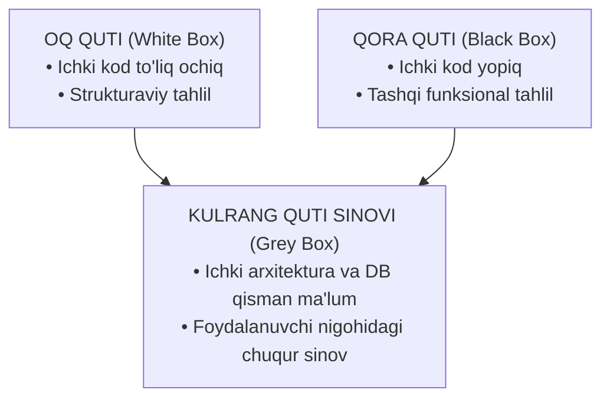
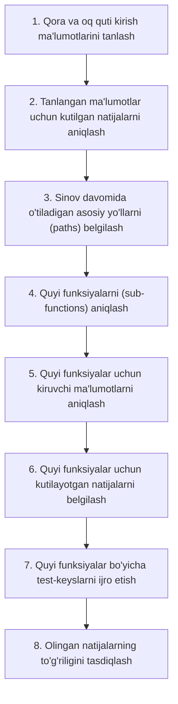
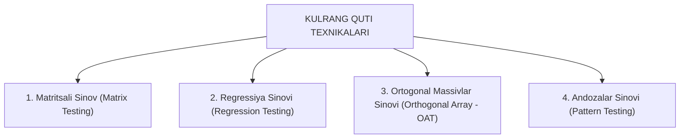

import { Callout } from 'nextra/components'

# Kulrang Quti Sinovi (Grey Box Testing in Software Testing)

> Oxirgi yangilanish: 25-iyul, 2026

**Kulrang quti sinovi (Grey Box Testing)** — test muhandisi dasturiy ta'minotning ichki tuzilishi va arxitekturasi haqida qisman (cheklangan) bilimga ega bo'lgan holda amalga oshiriladigan sinov texnikasidir. U dasturning funksionalligi va ichki xatti-harakatlarini har tomonlama tasdiqlash uchun **Qora quti sinovi (Black Box Testing)** hamda **Oq quti sinovi (White Box Testing)** xususiyatlarini o'zaro birlashtiradi.

Ushbu bo'limda siz kulrang quti sinovi nima ekanligi, u qanday ishlashi, nima sababdan qo'llanilishi, uning bosqichlari, asosiy texnikalari va amaliy sohalari bilan batafsil tanishasiz.

---

## Kulrang Quti Sinovi Nima? (What is Grey Box Testing?)

**Kulrang quti sinovi** — bu qora quti va oq quti yondashuvlarini muvozanatli uyg'unlashtiruvchi sinov turidir. Sinovchi dasturning ichki dizayni yoki manba kodi haqida qisman ma'lumotga ega bo'ladi va ushbu bilimlardan dasturni yakuniy foydalanuvchi nuqtai nazaridan tekshiruvchi samarali test-keyslarni loyihalashda foydalanadi.

Kulrang quti sinovida test muhandisidan manba kodiga to'liq kirish talab etilmaydi. Buning o'rniga ilovaning arxitekturasi, ma'lumotlar bazasi tuzilishi (DB schema), API'lar yoki dizayn hujjatlari bo'yicha qisman bilimlar yetarli hisoblanadi. Bu faqat qora quti sinovining o'zi bilan topib bo'lmaydigan yashirin nuqsonlarni fosh etishga yordam beradi.

Kulrang quti sinovi dasturiy komponentlar o'rtasidagi o'zaro ta'sirlarni tekshirish hamda ma'lumotlar oqimi (data flow), integratsiya va xavfsizlik bilan bog'liq muammolarni aniqlash uchun keng qo'llaniladi. U ayniqsa ichki tuzilishni qisman tushunish sinov qamrovini sezilarli darajada oshiradigan murakkab dasturiy tizimlarda juda foydalidir.

---

## Kulrang Quti Sinovi Asosan Qayerlarda Qo'llaniladi?

1. **Integratsion Sinov (Integration Testing):** Turli modullar va tashqi tizimlarning o'zaro to'g'ri aloqa qilishini tekshirish.
2. **Tizimli Sinov (System Testing):** Tizimning yaxlit ishlashini ma'lumotlar bazasi va server bilan birga tahlil qilish.
3. **Veb-ilovalarni Sinash (Web Application Testing):** Brauzer, server va ma'lumotlar bazasi o'rtasidagi so'rov-javoblarni tekshirish.
4. **API Sinovlari (API Testing):** REST yoki SOAP so'rovlarining server ichidagi holatga ta'sirini tekshirish.
5. **Penetratsion / Xavfsizlik Sinovlari (Penetration Testing):** Tizim arxitekturasi qisman ma'lum bo'lganda zaifliklarni aniqlash.

<Callout type="info">
Tester dastur implementatsiyasi haqida faqat qisman bilimga ega bo'lganligi sababli, kulrang quti sinovi foydalanuvchi nigohini saqlab qolgan holda funksional va strukturaviy sinovlar o'rtasidagi mukammal muvozanatni ta'minlaydi.
</Callout>

---

## Nima Uchun Kulrang Quti Sinovi Kerak? (Why Grey Box Testing?)

Kulrang quti sinovini o'tkazishning asosiy sabablari quyidagilardan iborat:

- **Birlashgan afzalliklar:** Qora quti va oq quti sinovlarining kuchli jihatlarini bir vaqtda taqdim etadi.
- **Dasturchi va tester tajribasining uyg'unligi:** Mahsulot sifatini yaxshilash uchun bir vaqtning o'zida ham dasturchilar, ham test muhandislarining ma'lumotlaridan foydalanadi.
- **Vaqtni tejash:** Funksional va nofunksional sinovlarning uzoq davom etuvchi jarayonlariga ketadigan vaqt sarfini qisqartiradi.
- **Dasturchilarga qulaylik:** Dasturchilarga mahsulotdagi nuqsonlarni bartaraf etish uchun yetarli vaqt beradi.
- **Haqiqiy foydalanuvchi nuqtai nazari:** Sinovda dasturchi yoki dizaynerning emas, balki yakuniy foydalanuvchining nuqtai nazariga tayanadi.
- **Talablarni chuqur tahlil qilish:** Talablarni o'rganish va texnik spetsifikatsiyalarni foydalanuvchi nigohi bilan chuqur belgilashni ta'minlaydi.

---

## Kulrang Quti Sinov Strategiyasi (Grey Box Testing Strategy)

Kulrang quti sinovida test muhandisi test-keyslarni manba kodining o'zidan loyihalashi shart emas. Ushbu sinovni o'tkazish uchun test-keyslar **tizim arxitekturasi, algoritmlar, ichki holatlar (internal states)** yoki dastur xatti-harakatining boshqa yuqori darajadagi tavsiflari asosida ishlab chiqilishi mumkin.

Funksiyalarni tekshirish uchun u qora quti sinovining barcha qulay va tushunarli texnikalaridan foydalanadi. Test-keyslarni yaratish talablarga asoslanadi va tasdiqlash metodlari (assertion methods) orqali dasturni sinashdan oldin barcha shartlar oldindan belgilanadi.

---

## Kulrang Quti Sinovini O'tkazishning 8 Asosiy Bosqichi

1. **1-qadam:** Qora quti va oq quti kirish ma'lumotlari to'plamidan eng muhim kiruvchi qiymatlarni tanlab olish va aniqlash.
2. **2-qadam:** Tanlangan kiruvchi qiymatlardan kelib chiqib, kutilayotgan natijalarni (Expected Outputs) aniqlash.
3. **3-qadam:** Sinov davrida o'tilishi lozim bo'lgan barcha asosiy mantiqiy yo'llarni (Major Paths) aniqlash.
4. **4-qadam:** Tizimni chuqur darajada sinash uchun asosiy funksiyalarning tarkibiy qismi bo'lgan quyi funksiyalarni (Sub-functions) aniqlash.
5. **5-qadam:** Ushbu quyi funksiyalar uchun maxsus kiruvchi ma'lumotlarni belgilash.
6. **6-qadam:** Quyi funksiyalar uchun kutilayotgan natijalarni belgilash.
7. **7-qadam:** Quyi funksiyalar uchun ishlab chiqilgan test-keyslarni ijro etish.
8. **8-qadam:** Haqiqiy natijalarning to'g'riligini va kutilgan natijalarga mosligini tasdiqlash.

Kulrang quti sinovi uchun loyihalashtirilgan test-keyslar **Xavfsizlik (Security)**, **Brauzerlar mosligi**, **Grafik interfeys (GUI)**, **Operatsion tizim** hamda **Ma'lumotlar bazasi (Database)** bilan bog'liq barcha muhim sohalarni to'liq qamrab oladi.

---

## Kulrang Quti Sinovining 4 Asosiy Texnikasi

Kulrang quti sinovida keng qo'llaniladigan 4 ta asosiy uslub mavjud:

### 1. Matritsali Sinov (Matrix Testing)
Ushbu texnika ma'lum bir dasturda ishlatilgan barcha o'zgaruvchilarni (variables) aniqlaydi va tahlil qiladi. Har qanday dasturda o'zgaruvchilar ma'lumotlar dastur ichida harakatlanishi uchun asosiy vositadir. Ular talabga muvofiq bo'lishi shart, aks holda dasturning o'qiluvchanligi va ishlash tezligi pasayadi. Matritsali sinov dasturdagi ishlatilgan o'zgaruvchilarni tahlil qilish orqali **ishlatilmagan (unused)** va **boshlang'ich qiymat berilmagan (uninitialized)** o'zgaruvchilarni aniqlash va olib tashlash usulidir.

### 2. Regressiya Sinovi (Regression Testing)
Dasturning biron-bir qismiga kiritilgan o'zgartirish yoki tuzatish uning boshqa qismlarida nojo'ya yoki kutilmagan salbiy oqibatlarni ("to'lqin effekti") keltirib chiqarmaganligini tasdiqlash uchun xizmat qiladi. Qayta tasdiqlash sinovida aniqlangan nuqson tuzatilgach, dasturning o'sha qismi to'g'ri ishlay boshlaydi, biroq bu tuzatish dasturning boshqa joyida mutlaqo yangi nuqson paydo qilishi mumkin. Regressiya sinovi xatarli testlarni qayta sinash, tarmoqlararo sinov yoki barchasini qayta sinash kabi strategiyalar orqali bunday muammolarning oldini oladi.

### 3. Ortogonal Massivlar Sinovi (Orthogonal Array Testing — OAT)
Ushbu sinovning maqsadi — **minimal miqdordagi test-keyslar bilan maksimal kod va funksionallikni qamrab olishdir**. Test-keyslar shunday tuziladiki, ular eng kam sonli testlar yordamida ham ichki kodni, ham foydalanuvchi interfeysi (GUI) funksiyalarini eng yuqori darajada qamrab oladi.

### 4. Andozalar Sinovi (Pattern Testing)
Ushbu usul avvalgi dasturiy ta'minotning arxitekturasi va andozasi (pattern) asosida yaratilgan yangi dasturlar uchun qo'llaniladi. Bunday dasturlarda avvalgi tizimlarda uchragan bir xil turdagi xatoliklar qaytalanishi ehtimoli yuqori bo'ladi. Andozalar sinovi o'tmishdagi nosozliklarning asl sabablarini aniqlaydi, bu esa ularni yangi dasturiy ta'minotda oldindan bartaraf etish imkonini beradi.

---

## Sinov Vositalari, Stublar va Drayverlar

Kulrang quti metodologiyasida sinov jarayonini samarali o'tkazish uchun odatda avtomatlashtirilgan dasturiy vositalardan keng foydalaniladi.

Sinovchiga test kodlarini qo'lda yozish yukini yengillashtirish va tayyor bo'lmagan modullarni simulyatsiya qilish uchun maxsus **Stublar (Stub — sun'iy quyi modul)** va **Modul Drayverlari (Module Driver — chaqiruvchi bosh modul)** taqdim etiladi. Bu esa mustaqil modullarning o'zaro integratsiyasini tezkor va qulay tekshirishga xizmat qiladi.
