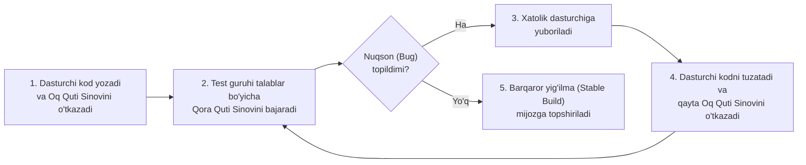
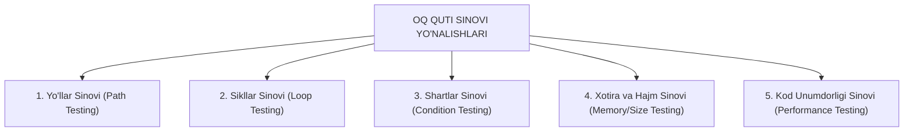
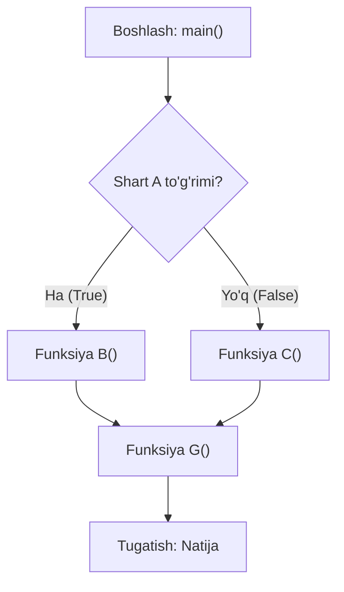

import { Callout } from 'nextra/components'

# Oq Quti Sinovi (White Box Testing in Software Testing)

**Oq quti sinovi (White Box Testing)** — dasturiy ta'minotning ichki tuzilishi, mantiqiy oqimi va manba kodini tekshirishga qaratilgan dasturiy sinov texnikasidir. U kodning to'g'ri ishlashini dasturdagi yo'llar, shartlar, sikllar va boshqa ichki komponentlarni bevosita sinash orqali tasdiqlaydi.

Ushbu qo'llanmada siz oq quti sinovi nima ekanligi, uning ishlash jarayoni, asosiy turlari, tahlil texnikalari, afzalliklari, kamchiliklari hamda qora quti sinovidan asosiy farqlari bilan batafsil tanishasiz.

---

## Oq Quti Sinovi Nima? (What is White Box Testing?)

**Oq quti sinovi** — shuningdek **Shisha quti sinovi (Glass Box Testing)**, **Shaffof quti sinovi (Clear Box Testing)**, **Strukturaviy sinov (Structural Testing)**, **Ochiq quti sinovi (Open Box Testing)** yoki **Ko'rinuvchan quti sinovi (Transparent Box Testing)** deb ham ataladi. U ilovaning ichki logikasi va implementatsiyasini to'liq tekshirishga qaratilgan. Test-keyslar dasturning manba kodi, boshqaruv oqimi (control flow) va ma'lumotlar oqimi (data flow) asosida ishlab chiqiladi.

Oq quti sinovining bosh maqsadi — ichki kodning xatosiz bajarilishini, barcha mantiqiy yo'llar to'liq sinovdan o'tishini hamda kod darajasidagi yashirin nuqsonlarni barvaqt aniqlashni kafolatlashdir. Ushbu sinov manba kodiga bevosita kirishni talab qilganligi sababli, u odatda **dasturchilar (Developers)** yoki chuqur dasturlash bilimiga ega bo'lgan test muhandislari (SDET) tomonidan amalga oshiriladi.

"Oq quti" atamasi dasturiy ta'minotning ichki tuzilishini bemalol ko'rish va o'rganish imkoniyatini bildiradi. Bu faqat ilovaning tashqi xatti-harakatini baholovchi **Qora quti sinovi (Black Box Testing)** dan tubdan farq qiladi.



Odatiy ishlab chiqish jarayonida dasturchilar dasturiy ta'minotni test guruhiga topshirishdan oldin oq quti sinovini o'tkazadilar. Shundan so'ng, test muhandislari belgilangan talablarga nisbatan qora quti sinovini bajaradilar. Agar nuqsonlar aniqlansa, ular dasturchilarga xabar qilinadi. Dasturchilar muammolarni tuzatadilar va yangilangan dasturni qaytarishdan oldin yana bir bor oq quti sinovidan o'tkazadilar.

Dasturchilar nuqsonlarni to'g'rilash uchun to'liq mas'uldirlar, chunki manba kodini o'zgartirish ilovaning boshqa qismlariga kutilmagan ta'sir ko'rsatishi mumkin. Test jamoasi esa kodni o'zgartirish bilan emas, balki xatoliklarni aniqlash va aniq qayd etishga e'tibor qaratadi.

---

## Oq Quti Sinovining 5 Asosiy Yo'nalishi

Oq quti sinovida dasturiy kodni har tomonlama tekshirish uchun quyidagi 5 ta asosiy texnikadan foydalaniladi:



---

### 1. Yo'llar Sinovi (Path Testing)

Yo'llar sinovida dasturning **boshqaruv oqimi grafigi (flow graph)** chiziladi va barcha mustaqil yo'llar (independent paths) to'liq sinovdan o'tkaziladi. 

Oqim grafigi dastur mantiqining qanday harakatlanishini va har bir blok boshqasi bilan qanday bog'langanligini ko'rsatadi:



Barcha mustaqil yo'llarni sinash degani — masalan, `main()` funksiyasidan `G` funksiyasigacha bo'lgan har bir yo'l uchun parametrlarni oldindan to'g'ri o'rnatib, dastur aynan o'sha yo'nalishda xatosiz ishlayotganligini tekshirish va yuzaga kelgan xatolarni tuzatishni anglatadi.

---

### 2. Sikllar Sinovi (Loop Testing)

Sikllar sinovida dasturdagi barcha takrorlanuvchi operatorlar (`while`, `for`, `do-while` va h.k.) tekshiriladi. Bunda siklning yakunlanish sharti (ending condition) to'g'ri ishlayotgani va shartlar chegarasi yetarli ekanligi sinovdan o'tkaziladi.

**Misol:** Faraz qilaylik, dasturchi kodda 50 000 marta takrorlanuvchi sikl yozgan:

```c
{
    while(50000)
    {
        // Kod logikasi
    }
}
```

Ushbu dasturni 50 000 marta aylanishi bo'yicha qo'lda birma-bir tekshirib chiqish imkonsizdir. Shu sababli, dasturchilar ushbu 50 000 siklni avtomatik tekshirish uchun manba kodining o'zida kichik yordamchi test dasturini yozadilar. Bu dasturlashda **Birlik sinovi (Unit Test)** deb ataladi va uni faqat dasturchilar yozadilar:

```c
Test_P()
{
    // 50,000 siklni avtomatik tekshiruvchi test kodi
}
```

#### Parallel Ishlash va O'zgarishlar Muammosi:
Dasturchi mijozning 1, 2, 3, 4 kabi talablari asosida yuzlab qatorlardan iborat parallel dasturlarni yozadi. Agar dasturchi oq quti sinovini qo'lda satrma-satr bajarsa, xatoni topish va qayta tekshirish juda ko'p vaqt va kuch talab qiladi hamda mahsulotning reliz muddatini kechiktiradi.

Bundan tashqari, agar mijoz talablarni o'zgartirsa, barcha dasturlarni yana boshidan tekshirish kerak bo'ladi. Ushbu muammo quyidagicha hal qilinadi:
- Dasturchilar asosiy dastur kodi bilan bir xil tilda yozilgan maxsus **birlik sinov (Unit Test)** dasturlarini tuzadilar.
- Ushbu test kodlari asosiy kod bilan bog'lanadi.
- Talablar o'zgarganda yoki xato tuzatilganda, dasturchi o'zgarishni asosiy dasturda ham, test dasturida ham amalga oshiradi va test dasturini bir zumda ishga tushirib natijani oladi.

---

### 3. Shartlar Sinovi (Condition Testing)

Shartlar sinovida dasturdagi barcha mantiqiy shartlar ikkala qiymat — `true` (rost) va `false` (yolg'on) bo'yicha to'liq tekshiriladi. Ya'ni, har bir `if` va `else` tarmoqlari sinchiklab sinab ko'riladi:

```c
if (shart) // true bo'lganda
{
    // 1-blok buyruqlari
}
else       // false bo'lganda
{
    // 2-blok buyruqlari
}
```

Ushbu dastur ikkala holat uchun ham to'g'ri ishlashi shart: agar shart to'g'ri bo'lsa `if` tarmog'i, aks holda esa `else` tarmog'i xatosiz ijro etilishi tekshiriladi.

---

### 4. Xotira va Kod Hajmi Bo'yicha Sinov (Memory/Size Perspective)

Dastur kodining hajmi va uning operativ xotiradagi iste'moli quyidagi sabablarga ko'ra asossiz ravishda oshib ketishi mumkin:

1. **Kodni qayta ishlatmaslik (No Code Reuse):**
   Faraz qilaylik, bitta ilovadagi to'rtta dasturda dastlabki 10 qatorli kod bir xil. Ushbu 10 qatorni har safar qayta yozmasdan, alohida mustaqil funksiya sifatida yozish va unga murojaat qilish lozim. Bu nafaqat kod hajmini qisqartiradi, balki xato chiqqanda ham tuzatishni faqat bitta joyda kiritishga imkon beradi.
2. **Turli dasturlash logikasi:**
   Bitta vazifani bitta dasturchi 250 KB hajmda yozsa, boshqa tajribali dasturchi boshqacha optimal logika bilan uni 100 KB hajmda yozishi mumkin.
3. **Ishlatilmagan o'zgaruvchilar va chaqirilmagan funksiyalar (Dead Code):**
   Dasturchi e'tiborsizlik bilan dasturda e'lon qilgan, lekin kodning hech qayerida ishlatilmagan o'zgaruvchilar va funksiyalar:

```c
int a = 15;        // Hech qayerda chaqirilmagan
int b = 20;
String S = "Welcome";
int p = b;

Create_user()      // 200 qatorli funksiya, lekin hech qachon ishlatilmaydi
{
    // 200 qator kod
}
```

Yuqoridagi kodda `a` o'zgaruvchisi va `Create_user()` funksiyasi hech qayerda chaqirilmagan. Bu tizimda behuda xotira sarfiga olib keladi.

<Callout type="info">
**Rational Purify Vositasi:**
Katta hajmdagi kodda bunday ortiqcha o'zgaruvchilar va funksiyalarni inson ko'zi bilan topish o'ta qiyin. Buning uchun C va C++ tillarida **Rational Purify** kabi maxsus o'rnatilgan vositadan foydalaniladi. Ushbu vosita dastur kodi bo'ylab o'tib, ishlatilmagan qismlarni aniqlaydi va natijaviy hisobotda ko'rsatadi. Dasturchi ushbu keraksiz funksiyalarni darhol o'chiradi.
</Callout>

4. **Tayyor ichki funksiyalardan foydalanmaslik:**
   Dasturchi dasturlash tilidagi mavjud tayyor standart kutubxonalardan foydalanmasdan, hamma narsani o'zining shaxsiy logikasi bilan noldan yozishga uringanda loyiha hajmi keraksiz kattalashadi va vaqt yo'qotiladi.

---

### 5. Dastur Unumdorligini Sinash (Tezlik va Javob Vaqti)

Dasturiy ta'minot quyidagi sabablarga ko'ra sekin ishlashi mumkin:
- Murakkab va optimallashtirilmagan mantiq (logic).
- Mantiqiy `AND` va `OR` operatorlarining noto'g'ri ketma-ketlikda ishlatilishi.
- Bir nechta ketma-ket `nested if` (ichma-ich if) o'rniga qulay `switch-case` operatoridan foydalanmaslik.

Dasturchi oq quti sinovini o'tkazayotganda kod sekin ishlayotganini sezishi mumkin, biroq aynan qaysi kod qatori butun dasturni to'xtatib turganini (bottleneck) qo'lda qidirib topish qiyin.

<Callout type="info">
**Rational Quantify Vositasi:**
Bunday muammolarni avtomatik aniqlash uchun **Rational Quantify** vositasi qo'llaniladi. Ushbu vosita butun kodni ishga tushiradi va natijani qalin va ingichka chiziqlar ko'rinishida taqdim etadi:
- **Qalin chiziq (Thick line):** Dasturda eng ko'p vaqt talab qilayotgan, tizimni sekinlashtirayotgan kod blokini bildiradi.
- Qalin chiziq ustiga ikki marta bosilganda, vosita avtomatik ravishda o'sha samarasiz kod qatoriga olib boradi va uni rang bilan ajratib ko'rsatadi.
- Dasturchi ushbu kodni optimallashtiradi va vositani qayta ishga tushiradi. Barcha chiziqlar ingichka holatga kelganda, dastur unumdorligi yaxshilangan deb hisoblanadi.
</Callout>

---

## Oq Quti Sinovining Umumiy Bosqichlari (Generic Steps)

Oq quti sinovini tizimli va samarali bajarish uchun quyidagi qadamlar ketma-ketligi qo'llaniladi:

1. **Test-ssenariylar va test-keyslarni loyihalash:** Barcha test holatlarini ishlab chiqish va ularni yuqori ustuvorlik darajasi (high priority) bo'yicha tartiblash.
2. **Kodni ish vaqtida (runtime) tahlil qilish:** Resurslardan foydalanish, kirilmagan kod sohalari hamda turli metod va operatsiyalar qancha vaqt olayotganini o'rganish.
3. **Ichki yordamchi dasturlarni (subroutines) sinash:** Yopiq (non-public) metodlar va ichki interfeyslarning barcha turdagi ma'lumotlarni to'g'ri qayta ishlay olishini tekshirish.
4. **Boshqaruv buyruqlarini tekshirish:** Sikllar va shartli o'tish operatorlarining turli kiruvchi ma'lumotlar bilan aniqlik va samaradorligini tahlil qilish.
5. **Kod xavfsizligini tekshirish:** Manba kodi xavfsizlikni qanday boshqarayotganini o'rganish orqali barcha mumkin bo'lgan zaifliklar va xavflarni aniqlash.

---

## Oq Quti Sinovida Qo'llaniladigan Asosiy Texnikalar

| Texnika | Ta'rifi va Mazmuni |
| :--- | :--- |
| **Ma'lumotlar Oqimi Sinovi (Data Flow Testing)** | Dasturdagi o'zgaruvchilarning e'lon qilinishi, qiymat berilishi va ishlatilishi ketma-ketligini hodisalar oqimiga ko'ra tekshiradi. |
| **Boshqaruv Oqimi Sinovi (Control Flow Testing)** | Dasturning boshqaruv strukturasi orqali buyruqlarning bajarilish tartibini aniqlaydi. Dasturning boshqaruv grafigi asosida test yo'llari belgilanadi. |
| **Tarmoqlar Sinovi (Branch Testing)** | Boshqaruv oqimi grafigidagi barcha shartli o'tish tarmoqlarini qamrab oladi. Qaror qabul qilish nuqtalarining barcha ehtimoliy natijalari (`true` va `false`) kamida bir marta bajarilishini ta'minlaydi. |
| **Operatorlar Sinovi (Statement Testing)** | Manba kodidagi barcha buyruqlar va satrlar kamida bir marta bajarilishini ta'minlovchi oq quti test-keyslarini yaratishda qo'llaniladi. Jami mavjud buyruqlardan qanchasi bajarilganligini foizda hisoblaydi. |
| **Qarorlar Sinovi (Decision Testing)** | Mantiqiy (Boolean) ifodalarning rost va yolg'on natijalarini tekshiradi. `if`, `do-while` yoki `switch-case` kabi ikki yoki undan ortiq natijaga ega bo'lgan barcha qaror nuqtalarini sinovdan o'tkazadi. |

---

## Oq Quti Sinovi va Qora Quti Sinovi O'rtasidagi Farqlar

| Taqqoslash Mezoni | Oq Quti Sinovi (White Box Testing) | Qora Quti Sinovi (Black Box Testing) |
| :--- | :--- | :--- |
| **Ijrochi (Kim bajaradi?)** | Asosan **dasturchilar (Developers)** tomonidan o'tkaziladi. | Asosan **test muhandislari (QA Engineers)** tomonidan o'tkaziladi. |
| **Dasturlash bilimi** | Dasturlash tillari va algoritmlarni chuqur tushunish shart. | Dasturlash tillarini bilish talab etilmaydi. |
| **Tekshirish obyekti** | Manba kodi ko'rib chiqiladi va kodning ichki logikasi sinovdan o'tkaziladi. | Ilovaning funksionalligi talablar spetsifikatsiyasi (SRS) asosida tekshiriladi. |
| **Ichki dizayn bilimi** | Dasturning ichki arxitekturasi va kodi to'liq ma'lum bo'lishi shart. | Dasturning ichki tuzilishini bilishga hech qanday ehtiyoj yo'q. |
| **Sinov darajasi** | Asosan Birlik sinovi (Unit Testing) va Integratsiya bosqichlarida qo'llaniladi. | Tizimli sinov (System Testing) va Qabul sinovlarida (UAT) qo'llaniladi. |
| **Sinov boshlanishi** | Dasturlash boshlangandanoq, kod yozilishi bilan parallel amalga oshiriladi. | Dasturiy yig'ilma (Build) tayyor bo'lgandan so'ng boshlanadi. |
