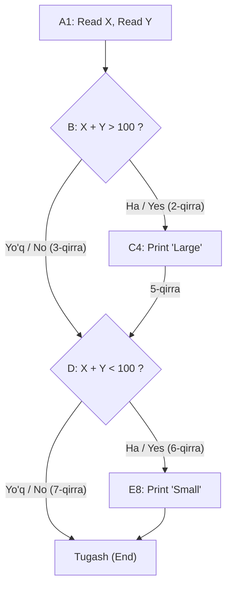

import { Callout } from 'nextra/components'

# Tarmoqlar Qamrovi Sinovi (Branch Coverage Testing)

> Oxirgi yangilanish: 25-iyul, 2026

**Tarmoqlar qamrovi sinovi (Branch Coverage Testing)** — shartli qaror qabul qilish operatorlaridan kelib chiquvchi har bir tarmoq (branch) sinov jarayonida kamida bir marta bajarilishini tekshiradigan oq quti sinov texnikasidir. U shartli operatorlar bilan bog'liq barcha mumkin bo'lgan bajarilish yo'llari to'liq baholanishini ta'minlaydi.

Ushbu bobda siz tarmoqlar qamrovi sinovi nima ekanligi, u qanday ishlashi, qanday hisoblanishi hamda amaliy misolini o'rganasiz.

---

## Tarmoqlar Qamrovi Sinovi Nima? (What is Branch Coverage Testing?)

**Tarmoqlar qamrovi sinovi** — dasturdagi har bir qaror qabul qilish nuqtasining (decision point) barcha tarmoqlari kamida bir marta ishga tushirilganligini tekshiruvchi oq quti sinov usulidir. U har bir shartli operatorning ham **rost (true)**, ham **yolg'on (false)** natijalari sinovdan o'tkazilishini kafolatlaydi.

Ushbu texnika dasturdagi barcha tarmoqlarni aniqlash uchun **Boshqaruv Oqimi Grafigi (Control Flow Graph — CFG)**dan foydalanadi. Test holatlari har bir tarmoq bajarilishi va dasturning barcha qaror qabul qilish nuqtalari to'liq qamrab olinishi uchun loyihalashtiriladi.

Tarmoqlar qamrovi (Branch Coverage) va Qarorlar qamrovi (Decision Coverage) bir-biriga juda yaqin bo'lsa-da, maqsad jihatidan farq qiladi:
- **Qarorlar qamrovi (Decision Coverage):** har bir qaror operatorining o'zi umumiy `true` va `false` natija berishini tekshiradi.
- **Tarmoqlar qamrovi (Branch Coverage):** har bir qaror nuqtasidan boshlanuvchi har bir alohida tarmoq (yo'nalish) bo'ylab harakatlanishga e'tibor qaratadi.

Tarmoqlar qamrovi odatda dasturdagi jami tarmoqlar soniga nisbatan sinovda bajarilgan tarmoqlar foizini hisoblash orqali o'lchanadi. U birlik sinovlarida (Unit Testing) shartli mantiq va tarmoqlanish operatorlaridagi nuqsonlarni aniqlashda keng qo'llaniladi.

---

## Tarmoqlar Qamrovi Qanday Hisoblanadi? (How to Calculate Branch Coverage?)

Tarmoqlar qamrovini hisoblashning bir necha usullari mavjud, biroq eng keng tarqalgan usul — **yo'llarni topish (pathfinding)** usulidir.

Ushbu usulda bajarilgan tarmoqlar yo'llari soni orqali tarmoqlar qamrovi hisoblanadi. Tarmoqlar qamrovi texnikasi qarorlar qamroviga muqobil sifatida ham qo'llanilishi mumkin. Ayrim manbalarda u alohida texnika sifatida ajratilmasa-da, aslida u qarorlar qamrovidan farq qiladi va boshqaruv oqimi grafigining barcha tarmoqlarini to'liq sinash uchun zarurdir.

```text
Tarmoqlar qamrovi (BC) = Bajarilgan tarmoq yo'llari soni
```

---

## Amaliy Kod Misoli

Quyidagi oddiy kod strukturasini ko'rib chiqamiz:

```text
Read X  
Read Y  
IF X + Y > 100 THEN  
    Print "Large"  
ENDIF  
IF X + Y < 100 THEN  
    Print "Small"  
ENDIF  
```

Bu dasturda ikkita o'zgaruvchi (`X` va `Y`) kiritiladi va ikkita shart tekshiriladi:
- Agar birinchi shart rost bo'lsa, `"Large"` chop etiladi; agar yolg'on bo'lsa, keyingi shartga o'tiladi.
- Agar ikkinchi shart rost bo'lsa, `"Small"` chop etiladi.

---

### Boshqaruv Oqimi Grafigi (CFG Diagrammasi)

Ushbu kod strukturasi uchun boshqaruv oqimi grafigi quyidagicha bo'ladi:



---

### Grafigi va Yo'llar Tahlili

Yuqoridagi boshqaruv oqimi grafigi tahlili:

1. **1-Holat — "Ha (Yes)" qarori bo'yicha harakatlanish:**
   - Yo'l: `A1 -> B2 -> C4 -> D6 -> E8`
   - Qamrab olingan qirralar: **1, 2, 4, 5, 6 va 8**.
   - Biroq ushbu yo'lda **3 va 7-qirralar** qamrab olinmay qoladi.
2. **2-Holat — "Yo'q (No)" qarori bo'yicha harakatlanish:**
   - Qolgan 3 va 7-qirralarni qamrab olish uchun "Yo'q (No)" qarori bo'yicha harakatlanish zarur.
   - Yo'l: `A1 -> B3 -> 5 -> D7`
   - Qamrab olingan qirralar: **3 va 7**.

Shunday qilib, ushbu ikki yo'l orqali o'tish dasturdagi barcha tarmoqlarni to'liq qamrab oladi:

- **1-Yo'l (Path 1):** `A1-B2-C4-D6-E8`
- **2-Yo'l (Path 2):** `A1-B3-5-D7`

```text
Tarmoqlar qamrovi (Branch Coverage) = Yo'llar soni = 2
```

---

### Tarmoqlar Qamrovi Natijalari Jadvali

| Holat (Case) | Qamrab olingan tarmoqlar (qirralar) | Bajarilgan yo'l (Path) | Tarmoqlar qamrovi (Branch Coverage) |
| :--- | :--- | :--- | :--- |
| **Ha (Yes)** | 1, 2, 4, 5, 6, 8 | `A1-B2-C4-D6-E8` | 1-yo'l |
| **Yo'q (No)** | 3, 7 | `A1-B3-5-D7` | 2-yo'l |
| **Xulosa** | **Barcha tarmoqlar (100%)** | **2 ta yo'l yordamida to'liq qamrab olindi** | **BC = 2** |

<Callout type="info">
Har ikkala yo'lni (Path 1 va Path 2) sinovdan o'tkazish orqali barcha shartli tarmoqlar to'liq tekshiriladi va dasturdagi barcha mantiqiy yo'nalishlar xatoliklarga nisbatan baholanadi.
</Callout>
