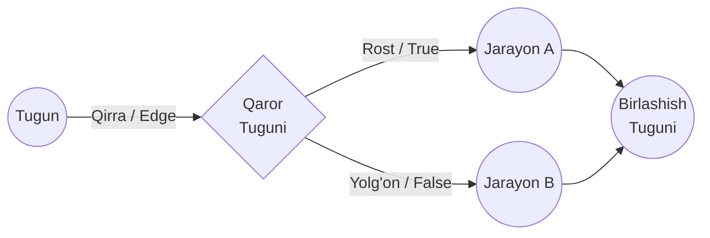
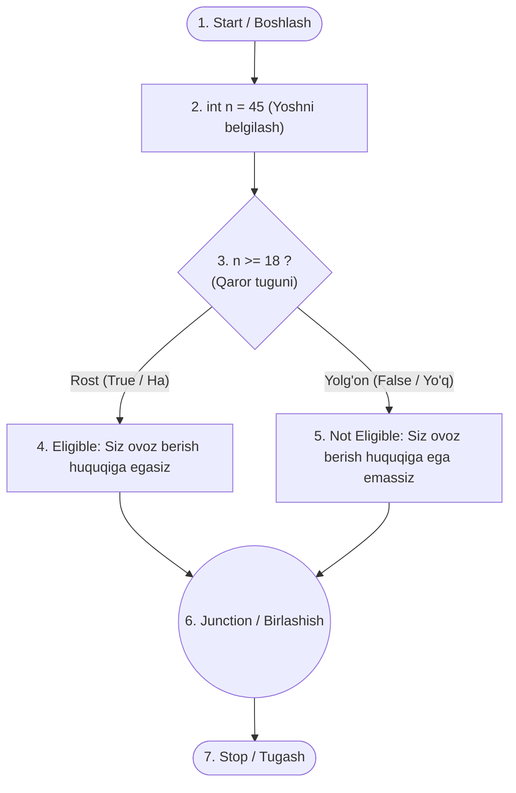

import { Callout } from 'nextra/components'

# Boshqaruv Oqimi Sinovi (Control Flow Testing)

**Boshqaruv oqimi sinovi (Control Flow Testing)** — dasturning bajarilish yo'llarini (execution paths) tekshiruvchi oq quti sinov texnikasidir. U mantiqiy xatoliklarni aniqlash maqsadida operatorlar, tarmoqlar va takrorlanishlar (tsikllar) qanday tartibda bajarilishini o'rganadi.

Ushbu bobda siz boshqaruv oqimi sinovi nima ekanligi, u qanday ishlashi, tarkibiy qismlari, grafik elementlari hamda amaliy dasturiy misoli bilan batafsil tanishasiz.

---

## Boshqaruv Oqimi Sinovi Nima? (What is Control Flow Testing?)

**Boshqaruv oqimi sinovi** — dasturning boshqaruv tuzilmasiga (control structure) asoslangan holda uning bajarilish yo'llarini tahlil qiladigan oq quti sinov usulidir. Test keyslar (test cases) dasturdagi barcha bajarilish yo'llari, shartli qaror qabul qilish nuqtalari va tsikllar kutilganidek ishlashini tasdiqlash uchun tuziladi.

Ushbu texnika asosan barcha muhim boshqaruv yo'llari kamida bir marta bajarilishini ta'minlash maqsadida **birlik sinovlari (Unit Testing)** bosqichida keng qo'llaniladi. Turli bajarilish yo'llarini sinovdan o'tkazish orqali shartli operatorlar, tsikllar va tarmoqlanish mantig'i bilan bog'liq nuqsonlar samarali aniqlanadi.

Boshqaruv oqimi sinovi dasturning ishlash tartibini grafik tarzda ifodalovchi **Boshqaruv Oqimi Grafigi (Control Flow Graph — CFG)**ga asoslanadi. Ushbu grafik dasturdagi barcha mumkin bo'lgan bajarilish yo'llarini aniqlash va aniq test holatlarini ishlab chiqish uchun xizmat qiladi.

---

## Boshqaruv Oqimi Grafigida Qo'llaniladigan Belgilar (Notations)

Boshqaruv oqimi grafigi (CFG) quyidagi asosiy tarkibiy qismlardan tashkil topadi:

1. **Tugun (Node)**
2. **Qirra / Yoy (Edge)**
3. **Qaror tuguni (Decision Node)**
4. **Birlashish tuguni (Junction Node)**



### 1. Tugun (Node)
Boshqaruv oqimi grafigidagi tugunlar dasturiy jarayonlar ketma-ketligini (yo'lini) shakllantirish uchun ishlatiladi. Asosan, u qaysi operatsiyadan so'ng qaysi biri kelishini ifodalaydi. Shu orqali test muhandisi dastur qadamlarining izchilligini aniq belgilab oladi.

Masalan, quyidagi amaliy misolda birinchi tugun dastur boshlanishini (`start`), keyingi tugun esa `n` ga qiymat biriktirishni anglatadi.

### 2. Qirra (Edge)
Boshqaruv oqimi grafigidagi qirralar (yo'naltirilgan strelkalar) tugunlar o'rtasidagi harakat yo'nalishini bog'lash uchun ishlatiladi. Barcha strelkalar dastur bajarilishi qaysi tugundan qaysi biriga o'tishini ko'rsatadi.

### 3. Qaror tuguni (Decision Node)
Boshqaruv oqimi grafigidagi qaror tuguni ma'lum bir shart yoki qiymatga asosan keyingi qaysi protsedura tuguniga o'tish kerakligini belgilab beradi.

Misolda qaror tuguni `n` ning qiymatiga qarab keyingi qadamni tanlaydi: agar `n >= 18` bo'lsa "Eligible" (huquqqa ega) jarayoni, agar `n < 18` bo'lsa "Not Eligible" (huquqqa ega emas) jarayoni bajariladi.

### 4. Birlashish tuguni (Junction Node)
Boshqaruv oqimi grafigidagi birlashish tuguni kamida uchta bog'lanish (kiruvchi yoki chiquvchi yo'nalish chiziqlari) bir nuqtada birlashadigan chorrahadir.

---

## Amaliy Misol (Example)

Keling, ovoz berish yoshini tekshiruvchi Java dasturi misolini ko'rib chiqamiz:

```java
public class VoteEligiblityAge {  
    public static void main(String []args) {  
        int n = 45;  
        if (n >= 18) {  
            System.out.println("You are eligible for voting");  
        } else {  
            System.out.println("You are not eligible for voting");  
        }  
    }  
}
```

### Dasturning Boshqaruv Oqimi Grafigi (CFG Diagrammasi)

Yuqoridagi kod uchun boshqaruv oqimi grafigi quyidagicha tuziladi:



---

## Grafik Tahlili va Test Keyslarni Loyihalash

Ushbu misol ovoz berish uchun yosh chegarasi mezonini tekshiradi:
- Agar yosh `18` yoki undan katta bo'lsa, `"You are eligible for voting"` xabari chiqadi.
- Agar yosh `18` dan kichik bo'lsa, `"You are not eligible for voting"` xabari chop etiladi.

### Grafik tarkibiy qismlari:
- **Tugunlar (Nodes):** `start`, `age (n = 45)`, `eligible`, `not eligible` va `stop`.
- **Qaror tuguni (Decision Node):** `n >= 18` sharti — berilgan qiymatga ko'ra qaysi tarmoq (`if` yoki `else`) ishga tushishini hal qiladi.
- **Birlashish tuguni (Junction Node):** `eligible` va `not eligible` tarmoqlari bitta nuqtada uchrashib, so'ng `stop` tuguniga yo'naladi.

<Callout type="info">
Test holatlari (test cases) dasturning bajarilish yo'llari to'g'ri ishlashini aniqlash uchun ushbu oqim grafigi orqali loyihalashtiriladi. Barcha **tugunlar**, **qirralar**, **qaror tugunlari** va **birlashish nuqtalari** to'liq qamrovli test holatlarini yaratishda hal qiluvchi ahamiyatga ega.
</Callout>
