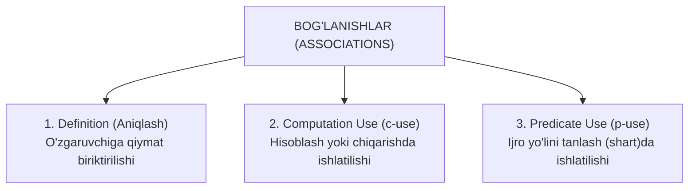

import { Callout } from 'nextra/components'

# Ma'lumotlar Oqimi Sinovi (Data Flow Testing)

> Oxirgi yangilanish: 25-iyul, 2026

**Ma'lumotlar oqimi sinovi (Data Flow Testing)** — dasturiy ta'minot bo'ylab ma'lumotlarning qanday harakatlanishini tahlil qiluvchi oq quti sinov texnikasidir. U o'zgaruvchilarning butun hayotiy sikliga — ularning e'lon qilinishi va boshlang'ich qiymat berilishidan (initialization) to ishlatilishi va xotiradan o'chirilishigacha (disposal) bo'lgan jarayonga e'tibor qaratadi.

Ushbu bo'limda siz ma'lumotlar oqimi sinovi nima ekanligi, u qanday ishlashi, aniqlaydigan nuqsonlari, amaliy dasturiy misoli, bog'lanishlar (associations) hamda Definition, C-use va P-use kategoriyalari bilan batafsil tanishasiz.

---

## Ma'lumotlar Oqimi Sinovi Nima? (What is Data Flow Testing?)

**Ma'lumotlar oqimi sinovi** — dastur bajarilishi davomida o'zgaruvchilar qanday aniqlanishi (defined), qiymat berilishi (assigned), ishlatilishi (used) va o'zgartirilishini (modified) kuzatish orqali ma'lumotlar oqimini tekshiradigan texnikadir. Uning bosh maqsadi — **o'zgaruvchilardan noto'g'ri foydalanish bilan bog'liq nuqsonlarni aniqlashdir**.

Ushbu texnika o'zgaruvchining aniqlanishi (Definition) va undan keyingi qo'llanilishi (Usage) o'rtasidagi bog'liqlikni o'rganadi. Dastur bo'ylab ma'lumotlar harakatini tahlil qilish orqali test muhandislari tizimning noto'g'ri ishlashiga olib kelishi mumkin bo'lgan nomuvofiqliklarni aniqlaydilar.

Ma'lumotlar oqimi sinovida dasturning bajarilish yo'llarini ifodalash uchun odatda **Boshqaruv Oqimi Grafigi (Control Flow Graph — CFG)** qo'llaniladi. Ushbu grafik qiymatlar qayerda biriktirilayotgani va qayerda chaqirilayotganini tekshirish orqali o'zgaruvchilar hayotidagi anomaliyalarni aniqlashga yordam beradi.

---

## Ma'lumotlar Oqimi Sinovi Aniqlaydigan Asosiy Muammolar

Ushbu texnika yordamida quyidagi dasturiy xatoliklar fosh etiladi:

1. **Boshlang'ich qiymat berilmasdan ishlatilgan o'zgaruvchilar:** O'zgaruvchiga qiymat biriktirilmasdan turib uning qiymatiga murojaat qilish (Undefined / Null Pointer xatosi).
2. **Initsializatsiya qilingan, lekin hech qachon ishlatilmagan o'zgaruvchilar:** Xotirada joy band qilgan, ammo kodda biror marta ham chaqirilmagan "o'lik" o'zgaruvchilar.
3. **Oldingi qiymati ishlatilmasdan, qayta yangi qiymat berilgan o'zgaruvchilar:** O'zgaruvchiga qiymat beriladi, biroq u o'qilmasdan darhol ustiga boshqa qiymat yoziladi.
4. **Endi kerak bo'lmagan, lekin dasturda saqlanib qolayotgan o'zgaruvchilar:** Resurslar xotiradan o'z vaqtida bo'shatilmasligi.

---

## Ma'lumotlar Oqimi Sinoviga Amaliy Misol

Quyidagi kod misolida dasturiy ta'minotdagi ma'lumotlar oqimi anomaliyalari qanday aniqlanishini ko'rib chiqamiz:

```c
1. read x;
2. if (x > 0)
3.     a = x + 1;
4. if (x <= 0)
5.     while (x < 1) {
6.         x = x + 1;
       }
7. a = x + 1;
8. print a;
```

Ushbu kodda jami **8 ta buyruq (statement)** mavjud. Biz barcha 8 ta buyruqni qamrab oluvchi sinov yo'llarini tanlashimiz kerak.

Keltirilgan koddan ko'rinib turibdiki, barcha buyruqlarni bitta yo'l bilan qamrab olib bo'lmaydi:
- Agar 2-buyruqdagi shart `true` bo'lsa, 4, 5, 6 va 7-buyruqlar qamrab olinmay qoladi.
- Agar 4-buyruqdagi shart `true` bo'lsa, 2 va 3-buyruqlar chetda qoladi.

Shu sababli, barcha buyruqlarni to'liq qamrab olish uchun **2 ta mustaqil yo'l** tanlanadi:

---

### 1-Yo'l: x = 1 qiymati berilganda
- **Sinov yo'li:** `1, 2, 3, 8`
- **Natija (Output):** `2`

**Jarayon tahlili:**
- Avval kod 1-bosqichga keladi: `x` ning qiymati o'qiladi va unga `1` biriktiriladi.
- So'ng 2-buyruqqa o'tadi: `if (x > 0)`. Bu yerda `1 > 0` bo'lgani sababli shart **True** bo'ladi.
- Kod 3-buyruqqa o'tadi: `a = x + 1` amali bajariladi (`a = 1 + 1 = 2`).
- Nihoyat, kod to'g'ridan-to'g'ri 8-buyruqqa o'tadi va `a` ning qiymatini chop etadi (**Chiqish natijasi: 2**).

---

### 2-Yo'l: x = -1 qiymati berilganda
- **Sinov yo'li:** `1, 2, 4, 5, 6, 5, 6, 5, 7, 8`
- **Natija (Output):** `2`

**Jarayon tahlili:**
- 1-bosqich: `x` qiymati `-1` deb o'qiladi.
- 2-bosqich: `if (x > 0)` sharti tekshiriladi. `-1 > 0` bo'lmagani sababli shart **False** bo'ladi.
- Shart yolg'on bo'lgani uchun kod 3-buyruqqa kirmay, to'g'ridan-to'g'ri 4-buyruqqa sakraydi: `if (x <= 0)`.
- `-1 <= 0` bo'lgani uchun 4-buyruq **True** bo'ladi va 5-buyruqdagi siklga o'tadi: `while (x < 1)`.
- `-1 < 1` to'g'ri (**True**), shuning uchun kod 6-buyruqqa kiradi: `x = x + 1` amali bajariladi:
  - `x = -1 + 1 = 0`.
- Endi `x = 0` qiymati bilan yana 5-buyruqqa qaytadi: `0 < 1` sharti yana **True**.
- Yana 6-buyruq bajariladi:
  - `x = 0 + 1 = 1`.
- Endi `x = 1` qiymati bilan yana 5-buyruqqa keladi: `1 < 1` sharti **False** bo'ladi.
- Sikl tugaydi va kod 7-buyruqqa o'tadi: `a = x + 1` (`a = 1 + 1 = 2`).
- 8-buyruqda `a` ning qiymati chop etiladi (**Chiqish natijasi: 2**).

---

## Kod Uchun Bog'lanishlar Tuzish (Associations)

**Bog'lanishlar (Associations)** — o'zgaruvchining e'lon qilingan (aniqlangan) joyi bilan uning barcha qo'llanilgan o'rinlari ro'yxatini shakllantirishdir.

Yuqoridagi kod uchun jami bog'lanishlar juftliklari:

```text
(1, (2, f), x), (1, (2, t), x), (1, 3, x), (1, (4, t), x), (1, (4, f), x), 
(1, (5, t), x), (1, (5, f), x), (1, 6, x), (1, 7, x), 
(6, (5, f), x), (6, (5, t), x), (6, 6, x), (3, 8, a), (7, 8, a)
```

### Bog'lanishlarning Batafsil Tushuntirilishi:

- **`(1, (2, t), x)` va `(1, (2, f), x)`:** 1-buyruq (`read x;`) va 2-buyruq (`if(x > 0)`) o'rtasida. `x` 1-qatorda aniqlangan va 2-qatorda shart sifatida ishlatilgan. 2-buyruq mantiqiy bo'lib, rost yoki yolg'on bo'lishi mumkinligi uchun bog'lanish ikkita holatda yoziladi: `t` (true) va `f` (false).
- **`(1, 3, x)`:** 1-buyruq (`read x;`) va 3-buyruq (`a = x + 1`) o'rtasida. `x` 1-qatorda aniqlangan va 3-qatorda hisoblash uchun ishlatilgan (Hisoblash qo'llanishi / c-use).
- **`(1, (4, t), x)` va `(1, (4, f), x)`:** 1-buyruq (`read x;`) va 4-buyruq (`if(x <= 0)`) o'rtasida. Shartli mantiqiy bo'lgani sababli `true` va `false` uchun alohida olinadi.
- **`(1, (5, t), x)` va `(1, (5, f), x)`:** 1-buyruq (`read x;`) va 5-buyruq (`while(x < 1)`) o'rtasida.
- **`(1, 6, x)`:** 1-qatorda aniqlangan `x`, 6-qatorda `x = x + 1` amali bajarilishida ishlatilgan (Hisoblash qo'llanishi / c-use).
- **`(1, 7, x)`:** 1-qatorda aniqlangan `x`, 5-shart yolg'on bo'lganda 7-qatordagi `a = x + 1` amalida ishlatilgan.
- **`(6, (5, f), x)` va `(6, (5, t), x)`:** 6-qatorda `x = x + 1` orqali yangilangan `x` qiymati 5-qatordagi sikl shartida ishlatilgan (Predikatli qo'llanish / p-use).
- **`(6, 6, x)`:** 6-buyruq `x` ning joriy qiymatidan foydalanib, unga yana yangi qiymat biriktiradi (`x = -1 + 1 = 0`).
- **`(3, 8, a)`:** 3-qatorda `a` o'zgaruvchisi aniqlangan (`a = x + 1`) va 8-qatorda chop etish uchun ishlatilgan.
- **`(7, 8, a)`:** 7-qatorda `a` o'zgaruvchisi aniqlangan (`a = x + 1`) va 8-qatorda chop etish uchun ishlatilgan.

---

## Bog'lanishlarni Kategoriyalarga Ajratish (Definition, C-use, P-use)

Barcha aniqlangan bog'lanishlar quyidagi uchta asosiy toifaga guruhlanadi:



### 1. Aniqlash (Definition)
O'zgaruvchiga qiymat biriktirilgan payt uning aniqlanishi hisoblanadi. Kodda qiymat birinchi buyruqda o'qiladi va oqim bo'ylab harakatlanadi.

**Barcha aniqlanishlar qamrovi (All definitions coverage):**
```text
(1, (2, f), x), (6, (5, f), x), (3, 8, a), (7, 8, a)
```

### 2. Predikatli Qo'llanish (Predicate use — p-use)
Agar o'zgaruvchining qiymati dasturning qaysi tarmoq bo'ylab davom etishini belgilovchi **shartli operatorlarda** ishlatilsa, bu predikatli qo'llanish hisoblanadi.
- Masalan: 4-buyruqdagi `if (x <= 0)` — bu p-use, chunki uning rost yoki yolg'onligiga qarab dastur yoki 5-qatordagi siklga, yoki boshqa tarmoqqa o'tadi.

### 3. Hisoblashdagi Qo'llanish (Computation use — c-use)
Agar o'zgaruvchining qiymati yangi natijani hisoblash, boshqa o'zgaruvchiga qiymat berish yoki ekranga chiqarish uchun ishlatilsa, bu hisoblashdagi qo'llanish hisoblanadi.
- `3-buyruq: a = x + 1` $\rightarrow$ `(1, 3, x)`
- `7-buyruq: a = x + 1` $\rightarrow$ `(1, 7, x)`
- `8-buyruq: print a` $\rightarrow$ `(3, 8, a), (7, 8, a)`

---

## Qamrov Toifalari (Coverage Categories)

### Barcha c-use Qamrovi (All c-use coverage):
```text
(1, 3, x), (1, 6, x), (1, 7, x), (6, 6, x), (6, 7, x), (3, 8, a), (7, 8, a)
```

### Barcha c-use va Ba'zi p-use Qamrovi (All c-use some p-use coverage):
```text
(1, 3, x), (1, 6, x), (1, 7, x), (6, 6, x), (6, 7, x), (3, 8, a), (7, 8, a)
```

### Barcha p-use va Ba'zi c-use Qamrovi (All p-use some c-use coverage):
```text
(1, (2, f), x), (1, (2, t), x), (1, (4, t), x), (1, (4, f), x), 
(1, (5, t), x), (1, (5, f), x), (6, (5, f), x), (6, (5, t), x), 
(3, 8, a), (7, 8, a)
```

<Callout type="info">
**Xulosa:**
Ushbu guruhlar to'plangandan so'ng, test muhandisi har bir o'zgaruvchining kamida bir marta ishlatilgan yoki ishlatilmaganligini sinchiklab tekshiradi. Kodda mavjud bo'lgan, lekin hech qachon ishlatilmagan keraksiz buyruqlar va o'zgaruvchilar aniqlanib, dastur kodidan butunlay olib tashlanadi (optimizatsiya qilinadi).
</Callout>
