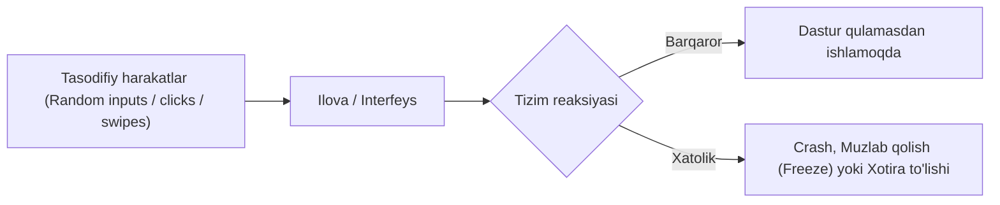
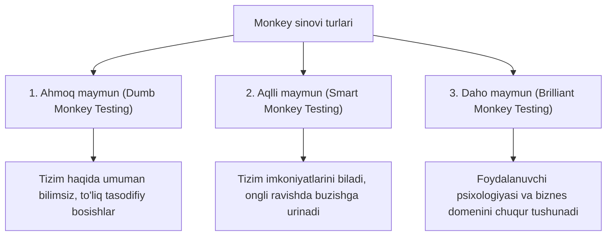

import { Callout } from 'nextra/components'

# Monkey sinovi (Monkey Testing)

**Monkey sinovi (Monkey Testing)** — bu dasturiy ta'minotga hech qanday oldindan yozilgan test holatlarisiz (**Test Cases**), mutlaqo tasodifiy ma'lumotlar, klaviatura tugmalari va foydalanuvchi harakatlarini kiritish orqali tizimning qulashini (**Crash**) yoki kutilmagan xatoliklarni aniqlashga qaratilgan sinov usulidir.

Ushbu atama dastlab **Glenford J. Myers** tomonidan 1979-yilda yozilgan mashhur *"The Art of Software Testing"* kitobida tilga olingan. U ko'pincha **Tasodifiy sinov (Random Testing)** yoki **Stoxastik sinov (Stochastic Testing)** deb ham yuritiladi.

---

## Monkey sinovining uchta asosiy turi

Monkey sinovi bajaruvchining tizim haqidagi bilimi va yondashuviga ko'ra uchta toifaga bo'linadi:

### 1. Ahmoq maymun sinovi (Dumb Monkey Testing)
* Sinovchi (yoki skript) tizimning qanday ishlashi, qaysi sahifa qayerga olib borishi yoki kiritilgan ma'lumotlar to'g'ri/noto'g'riligi haqida hech qanday tasavvurga ega emas.
* **Afzalligi:** Texnik mutaxassislar xayoliga ham kelmagan, oddiy foydalanuvchilar tasodifan duch kelishi mumkin bo'lgan eng g'alati defektlarni topadi.

### 2. Aqlli maymun sinovi (Smart Monkey Testing)
* Sinovchi tizimning maqsadi, arxitekturasi va navigatsiya oqimini yaxshi biladi.
* Tizimni atayin buzish, unga yuqori yuklama berish va yashirin zaifliklarni fosh qilish uchun ongli ravishda tasodifiy va murakkab ma'lumotlarni kiritadi. Xatolik topilganda, uni aniq hujjatlashtiradi.

### 3. Daho maymun sinovi (Brilliant Monkey Testing)
* Sinovchi butun biznes sohasini (domen) va real mijozlarning xatti-harakat modellarini professional darajada tushunadi.
* Tizimning kelajakda yuzaga kelishi mumkin bo'lgan jiddiy arxitektura va xavfsizlik muammolarini foydalanuvchi nigohi bilan tasodifiy kombinatsiyalarda tekshiradi.

---

## Smart Monkey va Dumb Monkey taqqoslanishi

| Xususiyat | Aqlli maymun (Smart Monkey) | Ahmoq maymun (Dumb Monkey) |
| :--- | :--- | :--- |
| **Tizimdan xabardorlik** | Tizim arxitekturasi va ish oqimini biladi | Tizim haqida hech qanday tushunchaga ega emas |
| **Kiritiladigan ma'lumotlar** | To'g'ri va noto'g'ri ma'lumotlarni tushunib kiritadi | Yaroqli yoki yaroqsizligini bilmagan holda tasodifiy kiritadi |
| **Xatoliklarni qayd etish** | Xatolik yuz berganda sababini tushuntirib beradi | Xatolik qanday sodir bo'lganini bilmasligi mumkin |
| **Qo'llanish sohasi** | Stress va yuklama sinovlarida juda foydali | Foydalanuvchi interfeysini sindirish va tasodifiy qulashlarni topishda |

---

## Monkey sinovi, Gorilla sinovi va Adhoc sinov farqlari

* **Monkey Testing vs Gorilla Testing:** Gorilla sinovi oldindan rejalashtirilgan holda tizimning bitta modulini qayta-qayta to'xtovsiz "ezib" tekshiradi. Monkey sinovi esa rejasiz va butun tizim bo'ylab tasodifiy harakatlanadi.
* **Monkey Testing vs Adhoc Testing:** Adhoc sinovini dasturni yaxshi tushunadigan mutaxassis tajribasiga tayanib o'tkazadi. Dumb monkey sinovini esa har qanday shaxs yoki avtomatlashtirilgan tasodifiy generator bajarishi mumkin.
* **Fuzz Testing:** Fuzz sinovi faqat tasodifiy ma'lumotlar paketini (Data injection) yuborishga qaratilgan bo'lsa, Monkey sinovi foydalanuvchi xatti-harakatlarini (tugmalar bosilishi, ekran siljitishlari) qamrab oladi.

---

## Monkey sinovining afzalliklari va kamchiliklari

### Afzalliklari:
* **Qimmatli ssenariylar talab qilinmaydi:** Test-keyslar yozish va hujjatlashtirishga vaqt ketmaydi.
* **Kutilmagan xatolarni topadi:** Standart testlar bilan hech qachon aniqlab bo'lmaydigan qulashlarni yuzaga chiqaradi.
* **Mobil ilovalar uchun ideal:** Smartfonlarda ekranga tasodifiy teginishlar, bir vaqtda bir nechta barmoq bilan bosishlarni (masalan, Android UI/Application Exerciser Monkey) sinashda tengsizdir.

### Kamchiliklari:
* **Xatoni qayta takrorlash (Reproduce) qiyin:** Harakatlar to'liq tasodifiy bo'lgani sababli dasturchiga xato qaysi ketma-ketlikda yuz berganini ko'rsatib berish murakkab.
* **Test qamrovi (Coverage) kafolatlanmaydi:** Tizimning qaysi qismlari sinab ko'rilgani va qaysilari qolib ketganini aniq hisoblab bo'lmaydi.

<Callout type="info">
  Google Android ekotizimida mobil ilovalarni chidamlilikka sinash uchun rasmiy **UI/Application Exerciser Monkey** vositasi mavjud bo'lib, u qurilmaga millionlab tasodifiy bosishlar va sensor signallarini yuborish imkonini beradi.
</Callout>
