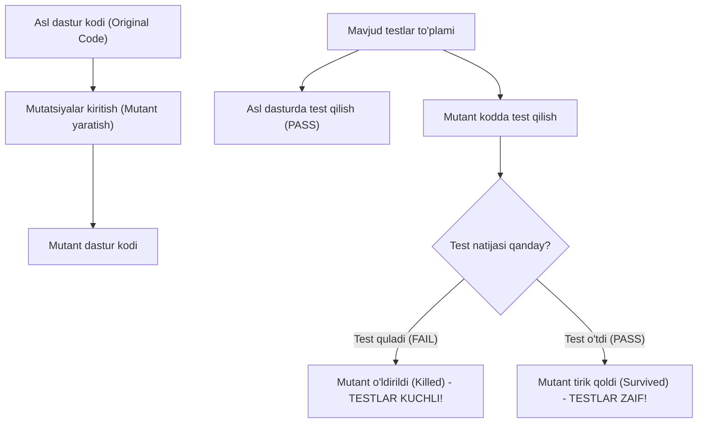
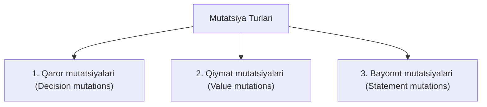

import { Callout } from 'nextra/components'

# Mutatsion sinov (Mutation Testing)

**Mutatsion sinov (Mutation Testing)** — bu oq quti (White-box) va xatoliklarga asoslangan (Fault-based) sinov usuli bo'lib, uning yordamida **mavjud test-keyslarning samaradorligi va sifati tekshiriladi**.

Bunda dasturning manba kodiga ataylab mayda o'zgarishlar (mutatsiyalar/xatolar) kiritiladi va hosil bo'lgan yangi versiya **Mutant** deb ataladi. Agar mavjud test to'plami bu xatoni aniqlay olsa, testlar sifatli deb topiladi.



---

## Nega Mutatsion sinov o'tkaziladi?

Odatda dasturchilar test qamrovini (Code Coverage) 80-90% deb ko'rsatishadi. Ammo qamrovning yuqoriligi testlar haqiqatda xatolarni topa olishini kafolatlamaydi (chunki test assertion'lari bo'sh yoki noto'g'ri yozilgan bo'lishi mumkin).

**Mutatsion sinovning maqsadi:**
* Test to'plamining sifatini baholash;
* Testlar orqali yetarli tekshirilmagan zaif kod qismlarini fosh qilish;
* Soxta xotirjamlik beruvchi (yuzaki) testlarni aniqlash.

<Callout type="info">
Oddiy qilib aytganda: *Oddiy testlar kodni tekshiradi, mutatsion testlar esa testlarning o'zini tekshiradi.*
</Callout>

---

## Mutatsiya turlari (Mutation Operators)

Mutatsiyalar dastur kodiga uch xil usulda kiritiladi:



### 1. Qaror mutatsiyalari (Decision mutations)
Mantiqiy va arifmetik amallarning belgilari almashtiriladi:
* Arifmetik amallar: `+` o'rniga `-`, `*` o'rniga `/`;
* Taqqoslash amallari: `>` o'rniga `<`, `>=` o'rniga `==`;
* Mantiqiy bog'lovchilar: `AND (&&)` o'rniga `OR (||)`.

```javascript
// Asl kod:
if (age >= 18) { allowEntry(); }

// Mutant kod:
if (age > 18) { allowEntry(); } // yoki age < 18
```

### 2. Qiymat mutatsiyalari (Value mutations)
Konstanta va chegaraviy sonli qiymatlar o'zgartiriladi:
* Katta qiymatni kichigiga almashtirish (masalan: `100` o'rniga `0`);
* O'sish operatorlarini almashtirish (`i++` o'rniga `i--`).

### 3. Bayonot mutatsiyalari (Statement mutations)
Kod qatorlarini olib tashlash yoki o'rinlarini almashtirish:
* Muhim funksiya chaqiruvini yoki o'zgaruvchi qiymatini o'chirib qo'yish (comment qilish).

---

## Mutatsion ball (Mutation Score)

Mutatsion sinov natijasi maxsus metrika — **Mutatsion ball** bilan o'lchanadi:

```text
Mutatsion ball = (O'ldirilgan mutantlar soni / Jami mutantlar soni) × 100%
```

* **O'ldirilgan mutant (Killed Mutant):** Agar test mutant kodda xatolik yuz berganini aniqlab, `FAIL` bersa, demak mutant yo'q qilindi. Bu kutilgan to'g'ri natija.
* **Omon qolgan mutant (Survived Mutant):** Agar kod buzilgan bo'lsa ham barcha testlar muvaffaqiyatli `PASS` bo'lsa, demak test to'plami bu xatoni sezmadi. Test-keyslarni yaxshilash talab etiladi.

---

## Mutatsion sinov vositalari

Ushbu jarayonni qo'lda bajarish juda ko'p vaqt talab qilganligi bois, maxsus avtomatlashtirilgan vositalardan foydalaniladi:

* **Stryker:** JavaScript, TypeScript, C# va Scala uchun eng mashhur mutatsion sinov vositasi;
* **PIT (Pitest):** Java va JVM ekotizimi uchun standart hisoblangan tezkor mutatsion vosita;
* **Mutmut:** Python dasturlash tili uchun mutatsion sinov vositasi.

---

## Afzalliklari va Kamchiliklari

### Afzalliklari
* An'anaviy "Code Coverage" metrikasiga qaraganda test sifatini ancha aniqroq ko'rsatadi.
* Yashirin va chekka holatlardagi (edge cases) xatolarni aniqlashga yordam beradi.
* Ishlab chiquvchilarni yanada ishonchli va to'liq assertion'larga ega testlar yozishga undaydi.

### Kamchiliklari
* **Katta hisoblash quvvati va vaqt talab qiladi:** Yuzlab mutantlar yaratilganda barcha testlar qayta-qayta yuzlab marta ishga tushirilishi kerak.
* Faqat oq quti (kod ochiq bo'lgan) sharoitida ishlaydi.
* Ekvivalent mutantlar (Equivalent mutants) muammosi: kod o'zgarsa-da, aslida funksional ma'nosi o'zgarmagan holatlarni avtomat vositalar ajrata olmasligi mumkin.
