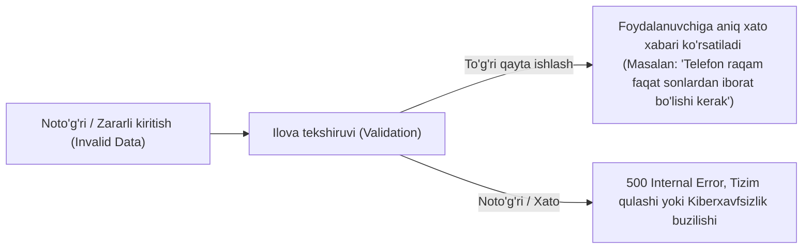
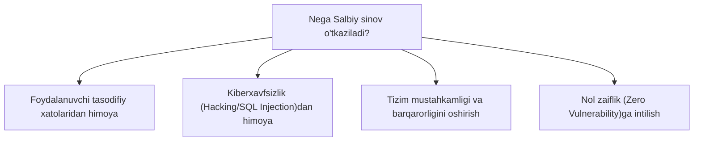

import { Callout } from 'nextra/components'

# Salbiy sinov (Negative Testing)

**Salbiy sinov (Negative Testing)** — bu dasturiy ta'minotga kutilmagan, noto'g'ri, yaroqsiz (invalid) yoki chegaradan tashqari ma'lumotlar kiritilganda tizim o'zini qanday tutishini tekshirishga qaratilgan sinov usulidir.

Ushbu sinov dasturning qulab tushmasligini (**Crash bo'lmaslik**), xatoliklarni to'g'ri qayta ishlashini va foydalanuvchiga tushunarli xabar berishini kafolatlaydi. Shuningdek, u **Failure Testing** yoki **Error Path Testing** deb ham nomlanadi.

---

## Ijobiy va Salbiy sinovning taqqoslanishi

| Xususiyat | Ijobiy sinov (Positive Testing) | Salbiy sinov (Negative Testing) |
| :--- | :--- | :--- |
| **Kiritiladigan ma'lumot** | Yaroqli va to'g'ri (Valid) ma'lumotlar | Yaroqsiz va noto'g'ri (Invalid) ma'lumotlar |
| **Asosiy maqsad** | Dastur talab bo'yicha to'g'ri ishlashini tekshirish | Noto'g'ri sharoitda tizim qulamasligini tekshirish |
| **Kutilayotgan natija** | Muvaffaqiyatli bajarilish (Success path) | To'g'ri xatolik xabari (Graceful error handling) |
| **Ketma-ketlik** | Har doim birinchi bo'lib bajariladi | Ijobiy sinov muvaffaqiyatli o'tgach bajariladi |

---

## Salbiy sinov nima uchun kerak?

* **Foydalanuvchilarning insoniy xatolari:** Foydalanuvchilar har doim ham ma'lumotlarni yo'riqnomaga muvofiq kiritmaydi (masalan, raqam o'rniga harf yozish, maydonni bo'sh qoldirish).
* **Xavfsizlik tahdidlari:** Tajovuzkorlar tizimni buzish uchun maxsus zararli kodlar (SQL Injection, XSS skriptlari) kiritishga urinishadi. Salbiy sinov bu kabi zaifliklarni fosh qiladi.
* **Ma'lumotlar butunligi (Data Integrity):** Noto'g'ri formatdagi ma'lumotlar bazaga kirib ketib, boshqa jadvallarni buzib yuborishining oldi olinadi.

---

## Salbiy test holatlari toifalari (Negative Test Case Categories)

Salbiy testlarni tuzishda quyidagi asosiy ssenariylar qo'llaniladi:

1. **Chegaraviy qiymatlar sinovi (Data Bounds Test):**  
   Maydon uchun belgilangan minimal va maksimal qiymatlardan tashqaridagi sonlar bilan tekshirish (masalan, yosh maydoniga `-5` yoki `200` kiritish).
2. **Maydon hajmi sinovi (Field Size Test):**  
   Maksimal belgilar soni cheklovini tekshirish (masalan, parol maydoni maksimum 20 belgi bo'lsa, 100 ta belgi yozib ko'rish).
3. **Majburiy maydonlar sinovi (Required / Mandatory Data Entry):**  
   Ro'yxatdan o'tishda yulduzcha (`*`) bilan belgilangan muhim maydonlarni bo'sh qoldirib yuborishga urinish.
4. **Ma'lumotlar turi mosligi (Data Type Mismatch):**  
   Faqat matn qabul qiladigan maydonga sonlar kiritish yoki telefon raqami maydoniga harflar kiritish.
5. **Qo'shtirnoq va maxsus belgilar (Special Characters / SQL Injection):**  
   Matn maydonlariga bittalik qo'shtirnoq (`'`), `<script>` teglari yoki SQL buyruqlari kiritib tizim reaksiyasini tekshirish.
6. **Veb sessiya sinovi (Web Session Testing):**  
   Tizimga kirmasdan (Login qilmasdan) to'g'ridan-to'g'ri ichki yopiq sahifa URL manziliga (masalan, `/admin/dashboard`) kirishga urinish.

---

## Amaliy misollar

| Maydon | Ijobiy kiritish (Valid) | Salbiy kiritish (Invalid) | Kutilayotgan javob |
| :--- | :--- | :--- | :--- |
| **Ism** | `Ali Valiyev` | `123456` yoki `<script>` | "Ism faqat harflardan iborat bo'lishi kerak" |
| **Telefon** | `+998901234567` | `salom998` | "Telefon raqami noto'g'ri kiritildi" |
| **Elektron pochta** | `test@example.com` | `test.com` yoki `@misol` | "Yaroqli email manzilini kiriting" |
| **Tug'ilgan sana** | `15/05/1995` | `32/13/2026` | "Mavjud bo'lmagan sana kiritildi" |
| **Fayl yuklash (Rasm)** | `avatar.png` (2 MB) | `virus.exe` yoki fayl hajmi > 50 MB | "Faqat JPG, PNG formatidagi fayllar qabul qilinadi" |

---

## Salbiy sinovning afzalliklari va qiyinchiliklari

### Afzalliklari:
* Tizimning mustahkamligini (Robustness) sezilarli darajada oshiradi.
* Kiberxavfsizlik zaifliklarini jonli efirga chiqmasdan avval bartaraf qiladi.
* Foydalanuvchilarning tushunarsiz xatolar sababli tizimni tark etishini kamaytiradi.

### Qiyinchiliklari:
* Cheksiz sonli salbiy ssenariylar mavjud bo'lgani uchun barcha variantlarni qamrab olish ko'p vaqt va xarajat talab qiladi.
* Yaxshi salbiy testlarni yozish uchun QA muhandisidan "buzg'unchi" ijodiy tafakkur va chuqur bilim talab qilinadi.

<Callout type="info">
  **Qoida:** Avvalo Ijobiy sinovni (Positive Testing) bajaring. Agar tizim kutilgan to'g'ri oqimda ishlamasa, salbiy sinovni boshlashdan ma'no yo'q. Dastur to'g'ri ishlashi tasdiqlangach, uni sindirishga qaratilgan salbiy sinovlarga o'tiladi.
</Callout>
