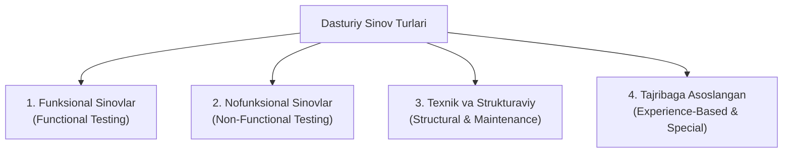

import { Cards, Callout } from 'nextra/components'

# Dasturiy Ta'minotni Sinash Turlari (Types of Software Testing)

Dasturiy ta'minotni sinash — bu ilovaning sifati, to'g'riligi, xavfsizligi va unumdorligini har tomonlama baholash uchun qo'llaniladigan turli xil metodologiyalar majmuidir. 

**QA COMPASS** platformasining ushbu bo'limida dasturiy ta'minot sohasida eng ko'p qo'llaniladigan **34 dan ortiq sinov turlari** xalqaro **ISTQB** va **ISO/IEC 25010** standartlari asosida batafsil yoritilgan.

---

## 🧭 Sinov Turlarining Asosiy Tasnifi

Dasturiy sinovlar maqsadiga, kodga kirish imkoniyatiga va tekshirish ob'ektiga ko'ra quyidagi guruhlarga bo'linadi:

---

## 1. Asosiy Yondashuvlar (Qo'lda va Avtomatlashtirilgan)

<Cards num={2}>
  <Cards.Card
    title="🖐️ Qo'lda Sinash (Manual Testing)"
    href="/docs/types-of-testing/manual-testing"
  >
    Avtomatlashtirish vositalarisiz, test muhandisi tomonidan inson omili yordamida test-keyslarni bajarish.
  </Cards.Card>
  <Cards.Card
    title="⚡ Avtomatlashtirilgan Sinov (Automation Testing)"
    href="/docs/types-of-testing/automation-testing"
  >
    Dasturiy vositalar (Playwright, Selenium) va skriptlar orqali testlarni avtomatik bajarish.
  </Cards.Card>
</Cards>

---

## 2. Muhim Funksional Sinov Turlari

Tizim biznes talablariga va spetsifikatsiyalariga muvofiq to'g'ri ishlayotganligini tekshirish:

<Cards num={2}>
  <Cards.Card
    title="🔥 Tutun Sinovi (Smoke Testing)"
    href="/docs/types-of-testing/smoke-testing"
  >
    Yangi yig'ilma (build) chiqqanda tizimning eng muhim bazaviy funksiyalari ishlayotganini tezkor tekshirish.
  </Cards.Card>
  <Cards.Card
    title="🩺 Sanity Sinovi (Sanity Testing)"
    href="/docs/types-of-testing/sanity-testing"
  >
    Xatolik tuzatilgandan so'ng faqat o'sha modul va unga yondosh funksiyalar to'g'ri ishlashini sinash.
  </Cards.Card>
  <Cards.Card
    title="🔄 Regressiya Sinovi (Regression Testing)"
    href="/docs/types-of-testing/regression-testing"
  >
    Yangi kod kiritilishi yoki tuzatishlar mavjud ishlayotgan funksiyalarga salbiy ta'sir qilmaganligini kafolatlash.
  </Cards.Card>
  <Cards.Card
    title="✅ Qabul Sinovi (Acceptance Testing)"
    href="/docs/types-of-testing/acceptance-testing"
  >
    Buyurtmachi va yakuniy foydalanuvchilar talablariga muvofiqlikni tekshirish (UAT).
  </Cards.Card>
  <Cards.Card
    title="🅰️ Alfa Sinov (Alpha Testing)"
    href="/docs/types-of-testing/alpha-testing"
  >
    Mahsulot tashqi foydalanuvchilarga berilishidan oldin kompaniya ichki xodimlari tomonidan sinov.
  </Cards.Card>
  <Cards.Card
    title="🅱️ Beta Sinov (Beta Testing)"
    href="/docs/types-of-testing/beta-testing"
  >
    Mahsulotni real foydalanuvchilarning cheklangan guruhiga taqdim etish orqali real muhitda sinash.
  </Cards.Card>
  <Cards.Card
    title="🧩 Komponent Sinovi (Component Testing)"
    href="/docs/types-of-testing/component-testing"
  >
    Ilovaning alohida modullari va birliklarini mustaqil holda tekshirish.
  </Cards.Card>
  <Cards.Card
    title="🖥️ GUI Sinovi (GUI Testing)"
    href="/docs/types-of-testing/gui-testing"
  >
    Foydalanuvchi grafik interfeysi (tugmalar, menyular, shriftlar, ranglar va layout) to'g'riligini tekshirish.
  </Cards.Card>
</Cards>

---

## 3. Nofunksional Sinov Turlari (ISO/IEC 25010)

Ilovaning unumdorligi, xavfsizligi, barqarorligi va qulayligini baholash:

<Cards num={2}>
  <Cards.Card
    title="📈 Yuklama Sinovi (Load Testing)"
    href="/docs/types-of-testing/load-testing"
  >
    Kutilayotgan odatiy va maksimal foydalanuvchilar oqimida tizimning javob vaqti va samaradorligini o'lchash.
  </Cards.Card>
  <Cards.Card
    title="💥 Stress Sinovi (Stress Testing)"
    href="/docs/types-of-testing/stress-testing"
  >
    Tizimni me'yordan ancha yuqori ekstremal yuklama ostida sinash va uning sinish nuqtasini aniqlash.
  </Cards.Card>
  <Cards.Card
    title="🛡️ Xavfsizlik Sinovi (Security Testing)"
    href="/docs/types-of-testing/security-testing"
  >
    Xakerlik hujumlari, zaifliklar (SQL injection, XSS) va ma'lumotlar sizib chiqishiga qarshi himoyani tekshirish.
  </Cards.Card>
  <Cards.Card
    title="♿ Maxsus Imkoniyatlar Sinovi (Accessibility)"
    href="/docs/types-of-testing/accessibility-testing"
  >
    Jismoniy imkoniyati cheklangan foydalanuvchilar uchun qulaylikni tekshirish (WCAG standartlari).
  </Cards.Card>
  <Cards.Card
    title="⏱️ Bardoshlilik Sinovi (Endurance Testing)"
    href="/docs/types-of-testing/endurance-testing"
  >
    Tizim uzoq vaqt davomida barqaror yuklama ostida ishlaganda xotira oqishi (memory leak) va sekinlashuvni aniqlash.
  </Cards.Card>
  <Cards.Card
    title="⚡ Spike Sinovi (Spike Testing)"
    href="/docs/types-of-testing/spike-testing"
  >
    Foydalanuvchilar sonining kutilmaganda keskin oshishi va pasayishida tizim xatti-harakatini tahlil qilish.
  </Cards.Card>
  <Cards.Card
    title="🔁 Qayta Tiklanish Sinovi (Recovery Testing)"
    href="/docs/types-of-testing/recovery-testing"
  >
    Kutilmagan nosozlik, server o'chishi yoki tarmoq uzilishidan so'ng tizimning o'zini tiklash qobiliyati.
  </Cards.Card>
  <Cards.Card
    title="📦 Hajm Sinovi (Volume Testing)"
    href="/docs/types-of-testing/volume-testing"
  >
    Ma'lumotlar bazasida ulkan hajmdagi axborotlar saqlanganda tizimning ishlash tezligi va barqarorligi.
  </Cards.Card>
  <Cards.Card
    title="📐 Kengayuvchanlik Sinovi (Scalability Testing)"
    href="/docs/types-of-testing/scalability-testing"
  >
    Resurslar (RAM, CPU, Serverlar) oshirilganda tizim unumdorligi mutanosib ravishda o'sishini tekshirish.
  </Cards.Card>
  <Cards.Card
    title="🎯 Ishonchlilik Sinovi (Reliability Testing)"
    href="/docs/types-of-testing/reliability-testing"
  >
    Tizimning belgilangan vaqt davomida xatosiz va uzluksiz ishlash ehtimolligini baholash.
  </Cards.Card>
</Cards>

---

## 4. Maxsus va Tajribaga Asoslangan Sinovlar

<Cards num={2}>
  <Cards.Card
    title="🔍 Tadqiqiy Sinov (Exploratory Testing)"
    href="/docs/types-of-testing/exploratory-testing"
  >
    Oldindan yozilgan test-keyslarsiz, sinovchining mahorati va tizimni o'rganishi davomida yangi xatolarni topish.
  </Cards.Card>
  <Cards.Card
    title="🎲 Adhoc Sinovi (Adhoc Testing)"
    href="/docs/types-of-testing/adhoc-testing"
  >
    Hech qanday reja yoki rasmiy hujjatlarsiz, tasodifiy va erkin ravishda tizimni sinab ko'rish.
  </Cards.Card>
  <Cards.Card
    title="🐒 Monkey Sinovi (Monkey Testing)"
    href="/docs/types-of-testing/monkey-testing"
  >
    Tizimga butunlay tartibsiz, mantiqsiz va kutilmagan ma'lumotlarni kiritish orqali uning mustahkamligini tekshirish.
  </Cards.Card>
  <Cards.Card
    title="⛔ Salbiy Sinov (Negative Testing)"
    href="/docs/types-of-testing/negative-testing"
  >
    Noto'g'ri ma'lumotlar kiritilganda tizim to'g'ri xatolik xabarini berishi va buzilib ketmasligini tekshirish.
  </Cards.Card>
  <Cards.Card
    title="➕ Ijobiy Sinov (Positive Testing)"
    href="/docs/types-of-testing/positive-testing"
  >
    Faqat to'g'ri va talab qilingan ma'lumotlar bilan tizim kutilganidek ishlashini tasdiqlash.
  </Cards.Card>
  <Cards.Card
    title="🌍 Globallashuv Sinovi (Globalization)"
    href="/docs/types-of-testing/globalization-testing"
  >
    Ilovaning turli tillar, mintaqalar, vaqt zonalari va valyutalarda to'g'ri ishlashini ta'minlash.
  </Cards.Card>
  <Cards.Card
    title="🧬 Mutatsion Sinov (Mutation Testing)"
    href="/docs/types-of-testing/mutation-testing"
  >
    Testlarning o'zini sifatini tekshirish: dastur kodiga sun'iy xatolar kiritib, testlar ularni topishini sinash.
  </Cards.Card>
  <Cards.Card
    title="🗺️ Test Strategiyasi (Test Strategy)"
    href="/docs/types-of-testing/test-strategy"
  >
    Loyiha miqyosida sinov turlarini qanday uyg'unlashtirish va umumiy sifat siyosatini belgilash.
  </Cards.Card>
</Cards>
