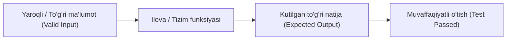
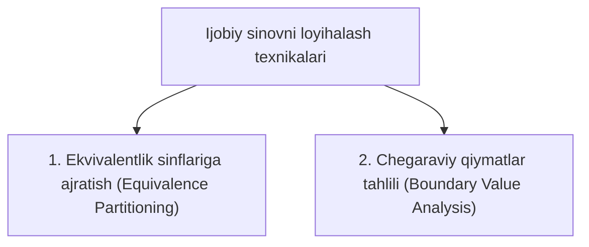

import { Callout } from 'nextra/components'

# Ijobiy sinov (Positive Testing)

**Ijobiy sinov (Positive Testing)** — bu dasturiy ta'minotga faqat to'g'ri, yaroqli (**Valid**) va kutilgan ma'lumotlar kiritilganda tizimning talablarga muvofiq to'g'ri ishlashini tekshiruvchi asosiy sinov usulidir.

U dasturiy ta'minot sinovining eng birinchi va asosiy bosqichi bo'lib, uning vazifasi dastur aynan nima uchun yaratilgan bo'lsa, o'sha funksiyani bekamu-ko'st bajarishini tasdiqlashdir. Dasturlashda bu ko'pincha **"Baxtli yo'l" (Happy Path)** deb ataladi.

---

## Ijobiy sinovning asosiy maqsadlari

* **Talablarga muvofiqlikni tekshirish:** Dastur biznes talablari (BRS) va tizim texnik talablariga (SRS) mos kelishini tasdiqlash.
* **Asosiy funksionallikni tasdiqlash:** Foydalanuvchi tizimdan belgilangan yo'riqnoma asosida foydalanganda hech qanday to'siqlarga uchramasligini kafolatlash.
* **Keyingi sinovlarga yo'l ochish:** Regressiya, xavfsizlik yoki salbiy sinovlarni boshlashdan oldin dasturning asosiy o'zagi ishlayotganiga ishonch hosil qilish.

---

## Ijobiy sinovni loyihalash texnikalari

Ijobiy sinov uchun samarali test holatlarini (Test Cases) ishlab chiqishda ikkita muhim texnikadan foydalaniladi:

### 1. Ekvivalentlik sinflariga ajratish (Equivalence Partitioning - EP)
* Kiritilishi mumkin bo'lgan barcha ma'lumotlar to'plami teng qiymatli guruhlarga ajratiladi va har bir to'g'ri oraliqdan bittadan vakil olinadi.
* **Misol:** Agar tizim 1 dan 100 gacha bo'lgan yoshni qabul qilsa:
  * Yaroqli oraliq: `[1 - 100]` -> Test uchun masalan, `25` yoki `60` olinadi.

### 2. Chegaraviy qiymatlar tahlili (Boundary Value Analysis - BVA)
* Xatoliklarning aksariyati oraliqlarning eng chekka chegaralarida yuz beradi. Shuning uchun chegaraning eng chekkasidagi to'g'ri qiymatlar tekshiriladi:
  * Minimal chegara: `Min` va `Min + 1` (masalan: `1` va `2`)
  * Maksimal chegara: `Max - 1` va `Max` (masalan: `99` va `100`)

---

## Amaliy misollar

| Ssenariy | Kiritilgan ma'lumot | Kutilgan natija |
| :--- | :--- | :--- |
| **Kirish (Login)** | To'g'ri login va to'g'ri parol | Foydalanuvchi bosh sahifaga (Dashboard) yo'naltiriladi |
| **Matn maydoni (Faqat harflar)** | `Alisher Navoiy` | Ma'lumot qabul qilinadi va muvaffaqiyatli saqlanadi |
| **Yosh (18 dan 65 gacha)** | `18`, `30`, `65` | Muvaffaqiyatli ro'yxatdan o'tadi |
| **To'lov kartasi** | 16 xonali to'g'ri karta raqami va yaroqlilik muddati | To'lov tranzaksiyasi qabul qilinadi |

---

## Ijobiy sinovning afzalliklari va cheklovlari

### Afzalliklari:
* **Resurs va vaqtni tejaydi:** Yangi yig'ilgan versiyadagi (Build) xatoliklarni dastlabki daqiqalardayoq aniqlash imkonini beradi.
* **Mijoz talablarini kafolatlaydi:** Tizimning asosiy biznes maqsadini oqlayotganini ko'rsatadi.
* **Avtomatlashtirish oson:** Ijobiy ssenariylar aniq va bir xil bo'lgani tufayli ularni Selenium, Playwright yoki Cypress yordamida avtomatlashtirish juda qulay.

### Cheklovlari:
* **Tizim mustahkamligini to'liq qamrab olmaydi:** Ijobiy sinov orqali dastur noto'g'ri ma'lumot kiritilganda qanday ishlashini bilib bo'lmaydi.
* Shuning uchun to'liq sifat nazorati faqat **Ijobiy sinov** va **Salbiy sinov (Negative Testing)** birgalikda qo'llanilgandagina ta'minlanadi.

<Callout type="info">
  **Tutun sinovi (Smoke Testing)** va **Sanity Testing** deyarli to'liq ijobiy sinov ssenariylariga tayanadi.
</Callout>
