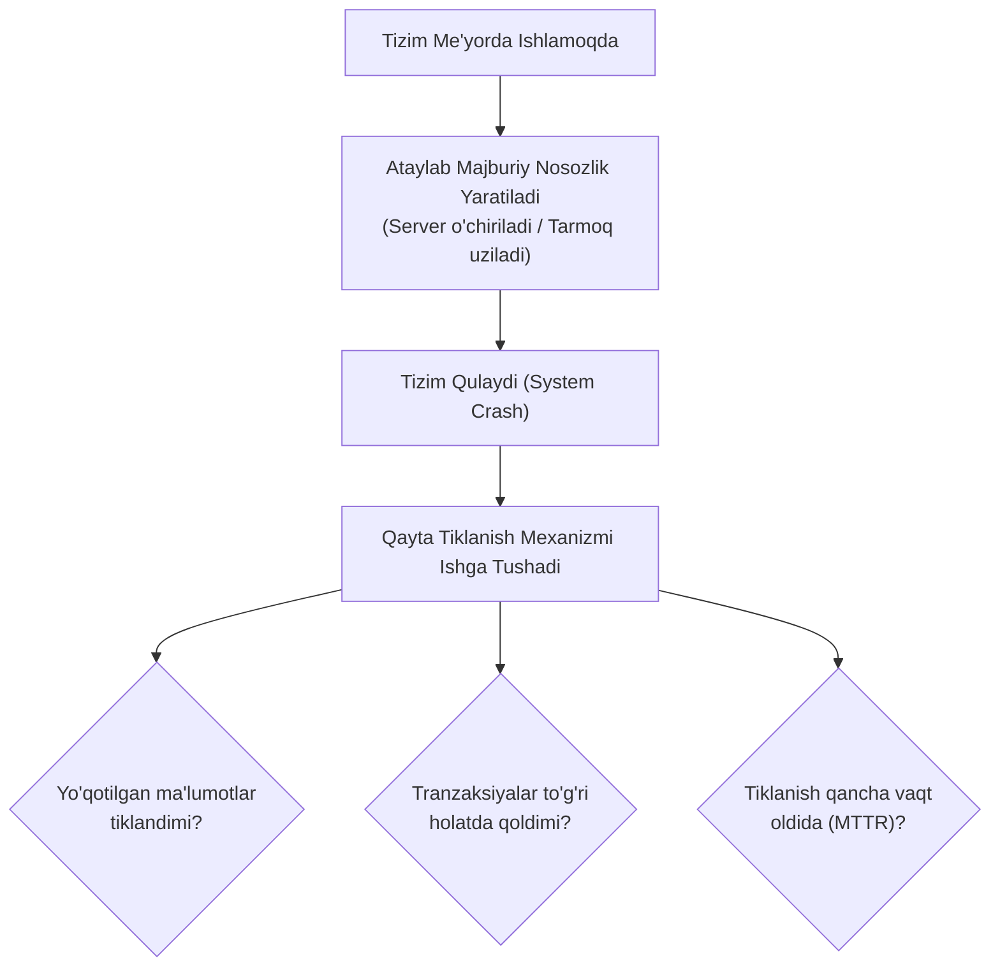

import { Callout } from 'nextra/components'

# Qayta Tiklanish Sinovi (Recovery Testing)

**Qayta tiklanish sinovi (Recovery Testing)** — dasturiy ta'minot yoki apparat tizimida to'satdan nosozlik, qulash (*Crash*), elektr ta'minoti uzilishi yoki tarmoq xatosi yuz berganda, tizim o'z ish faoliyatini qanchalik tez, to'liq va ma'lumotlarni yo'qotmasdan tiklay olishini baholash uchun o'tkaziladigan nofunksional sinov turidir.

Ushbu sinov **Biznes Uzluksizligini Ta'minlash (Business Continuity Planning — BCP)** va **Falokatdan Tiklanish (Disaster Recovery)** strategiyasining asosiy poydevori hisoblanadi.

---

## Qayta Tiklanish Sinovi Nima? (What is Recovery Testing?)

Mukammal yozilgan dastur ham tashqi omillar (server quvvatining o'chishi, internet kabelining uzilishi, ma'lumotlar bazasi diskining to'lib qolishi) sababli to'xtab qolishi mumkin. 

**Qayta tiklanish sinovining asosiy maqsadi** — dasturni ataylab turli yo'llar bilan **majburiy nosozlikka (*Forced Failure*)** uchratish va tizimning quyidagi muhim qobiliyatlarini tekshirishdir:

<Callout type="warning">
**Muhim qoida (Zaxira nusxa):**  
Qayta tiklanish sinovini o'tkazishdan oldin, tizim va ma'lumotlar bazasining to'liq **zaxira nusxasi (Backup)** olinishi va xavfsiz joyda saqlanishi shart! Agar sinov chog'ida qayta tiklanish muvaffaqiyatsiz tugasa, haqiqiy ma'lumotlar yo'qolmasligi kerak.
</Callout>

---

## Amaliy Misol: Brauzer Sessiyasini Tiklash

- **Ssenariy:** Foydalanuvchi Google Chrome brauzerida 15 ta muhim sahifani ochib ishlayotgan paytda to'satdan elektr ta'minoti uzildi yoki kompyuter o'chib qoldi.
- **Tiklanish jarayoni:** Kompyuter qayta yoqilib, brauzer ochilganda, ekranda: *"Brauzer kutilmaganda yopildi. Avvalgi sessiyani qayta tiklashni xohlaysizmi?"* degan dialog oynasi chiqadi.
- **Sinov mezonlari:** "Tiklash" tugmasi bosilganda barcha 15 ta oyna o'zining avvalgi holati, to'ldirilgan shakllari va tarixi bilan birga to'liq ochilishi kerak.

---

## Qayta Tiklanish Sinovida Tekshiriladigan Asosiy Nosozliklar

Sinov jarayonida dasturiy ta'minot quyidagi eng keng tarqalgan nosozliklar bo'yicha sun'iy ravishda sinab ko'riladi:

1. **Elektr ta'minotining to'satdan uzilishi (Power Failure);**
2. **Server bilan aloqa uzilishi yoki javob bermasligi (Server Not Responding);**
3. **Tarmoq kabeli yoki Wi-Fi signalining yo'qolishi (Network Failure);**
4. **Ma'lumotlar bazasining haddan tashqari to'lib ketishi (DB Overload);**
5. **Kritik tizim fayllari yoki DLL kutubxonalarining yetishmasligi (Missing DLL);**
6. **Tashqi apparat qurilmalarining javob bermay qolishi (External Device Failure);**
7. **Fon xizmatlarining (Background Services / Daemons) to'xtab qolishi.**

---

## Qayta Tiklanish Sinovini Kimlar Amalga Oshiradi?

Bu sinov faqat sinovchilar emas, balki butun infratuzilma jamoasi hamkorligida o'tkaziladi:

- **IT Operatsion jamoasi (IT Operations / DevOps):** Serverlar, virtual mashinalar va apparat vositalarini boshqaruvchi muhandislar.
- **Xizmatni boshqarish guruhi (Service Management / SRE):** Favqulodda vaziyatlarni boshqarish tajribasiga ega mutaxassislar.
- **Texnik soha ekspertlari (Technical SMEs):** Tizim yadrosi va apparat integratsiyasini chuqur biluvchi mutaxassislar.
- **Test muhandislari (QA Engineers):** Ma'lumotlarning butunligi va qayta tiklangan dastur funksionalligini tekshiruvchilar.

---

## Qayta Tiklanish Sinovining Hayotiy Sikli (5 Bosqich)

1. **Me'yordagi ish (Standard Operations):** Tizim belgilangan texnik talablar doirasida kutilganidek ishlaydi.
2. **Nosozlik sodir bo'lishi (Disaster / Failure Occurrence):** Kutilmagan apparat, tarmoq yoki quvvat nosozligi sun'iy keltirib chiqariladi.
3. **Jarayonning to'xtashi (Interruption):** Tizim to'xtaydi; ushbu to'xtash biznes va mijozlarga qanchalik zarar yetkazishi mumkinligi tahlil qilinadi.
4. **Qayta tiklanish (Recovery Process):** Favqulodda zaxira protokollari ishga tushadi, zaxira serverlar (*Failover*) ulanadi.
5. **Qayta qurish (Rebuild Process):** Ma'lumotlar bazasi va fayllar zaxira nusxadan (*Backup*) qayta tiklanadi va tizim to'liq ishchi holatga keltiriladi.

---

## Sinovni Amalga Oshirishdan Oldingi 6 Muhim Qadam

Qayta tiklanish sinovini xavfsiz va samarali o'tkazish uchun quyidagi tayyorgarlik ishlari bajariladi:

1. **Qayta tiklanish tahlili (Recovery Analysis):** Tizimning qo'shimcha resurslarni (zaxira CPU, zaxira serverlar) qanday taqsimlay olishi o'rganiladi.
2. **Sinov rejasini (Test Plan) ishlab chiqish:** Har bir nosozlik turi uchun aniq harakatlar rejasi tuziladi.
3. **Sinov muhitini tayyorlash:** Sinov muhiti real ishlab chiqarish infratuzilmasiga mos holatga keltiriladi.
4. **Zaxira nusxalarni yaratish (Data Backup):**
   - Bir yoki bir nechta turli geografik nuqtalarda zaxira saqlash;
   - Har N daqiqada (masalan, har 15–20 daqiqada) avtomatik backup sozlash;
   - Onlayn (*Hot Backup*) va oflayn (*Cold Backup*) zaxira nusxalarini shakllantirish.
5. **Javobgar xodimlarni belgilash (Personnel Allocation):** Nosozlik yuz berganda har bir mutaxassisning aniq vazifasi belgilanadi.
6. **Jarayonni to'liq hujjatlashtirish:** Nosozlikdan so'ng tizimning tiklanish vaqti (*MTTR — Mean Time To Recover*) va qadamlar qayd etib boriladi.

---

## Xulosa

Qayta tiklanish sinovi (Recovery Testing) — har qanday jiddiy korporativ tizimning eng so'nggi xavfsizlik chegarasidir. Nosozliklar qachondir baribir yuz beradi; ammo ularga oldindan tayyor bo'lish, zaxira tizimlarni to'g'ri sozlash va tiklanish jarayonini amalda sinab ko'rish biznesni xonavayron bo'lishdan va mijozlar ma'lumotlarini butunlay yo'qolishdan asrab qoladi.
