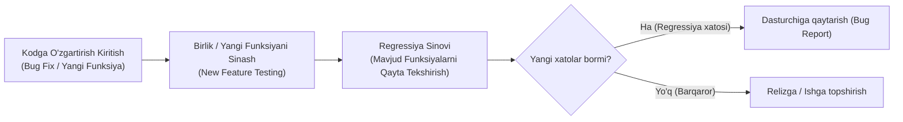
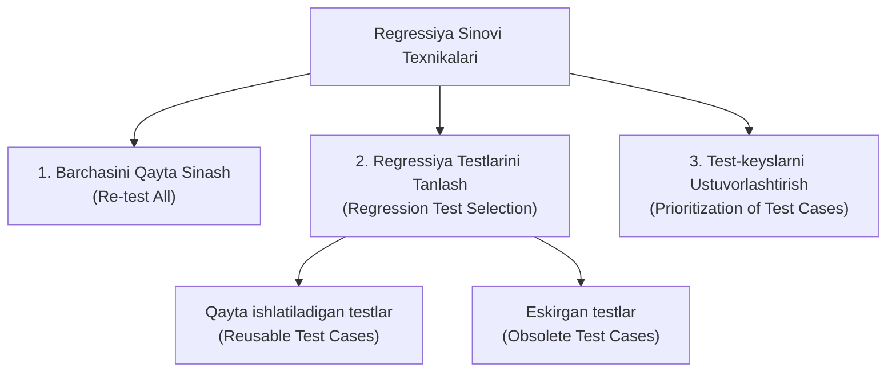
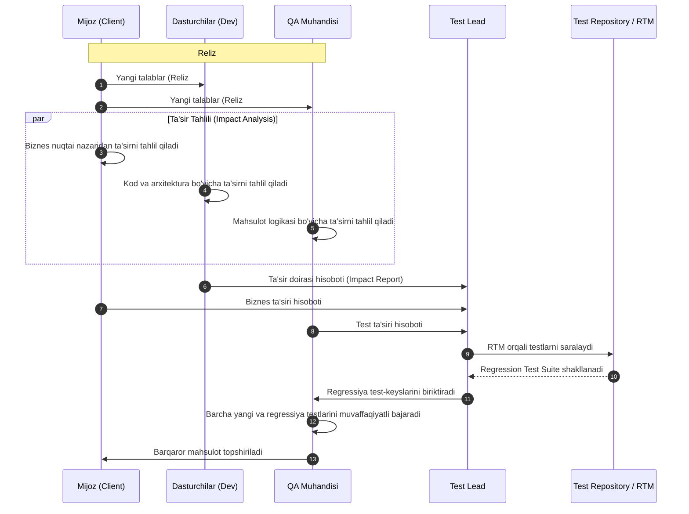
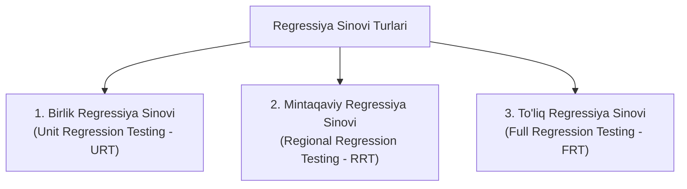
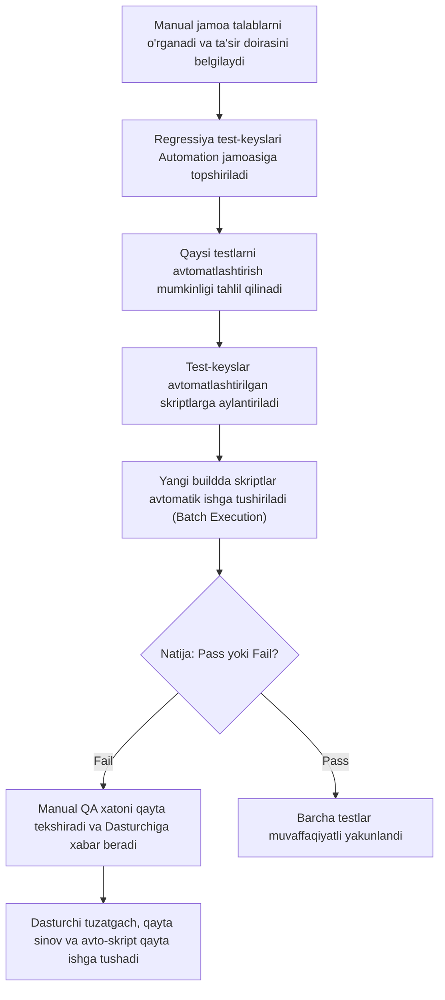

import { Callout } from 'nextra/components'

# Regressiya Sinovi (Regression Testing)

**Regressiya sinovi (Regression Testing)** — dasturiy ta'minot kodiga kiritilgan har qanday o'zgartirish (yangi funksiyalar qo'shish, nuqsonlarni to'g'rilash, kodni refaktoring qilish yoki tizim muhitini yangilash) dasturning avvaldan barqaror ishlab turgan qismlariga salbiy ta'sir ko'rsatmaganligini tasdiqlash uchun o'tkaziladigan sinov usulidir.

Ushbu qo'llanmada regressiya sinovining maqsadi, turlari, o'tkazish usullari, buildlar va relizlar kesimidagi jarayonlari, avtomatlashtirish mexanizmlari hamda qayta sinov (re-testing) bilan o'zaro farqlari batafsil yoritilgan.

---

## Regressiya Sinovi Nima? (What is Regression Testing?)

Dasturiy ta'minot ishlab chiqish jarayonida kod muntazam ravishda yangilanib boradi. Biroq dasturchi biror xatoni to'g'rilaganda yoki yangi funksiya qo'shganda, bu o'zgarish boshqa bog'liq modullardagi mavjud funksiyalarning kutilmaganda buzilishiga (buni **regressiya nuqsoni** yoki *side effect* deyiladi) sabab bo'lishi mumkin.

**Regressiya sinovining asosiy maqsadi** — dasturning o'zgartirilmagan qismlari yangilanishlardan keyin ham kutilganidek to'g'ri ishlashda davom etayotganini kafolatlashdir. Buning uchun ilgari muvaffaqiyatli o'tgan test-keyslar qayta ishga tushiriladi.



<Callout type="info">
Regressiya sinovida bir xil test-keyslar to'plami qayta-qayta ishga tushirilganligi sababli, u odatda **avtomatlashtirilgan test vositalari (Automation Testing)** yordamida amalga oshiriladi. Biroq dastlabki bosqichlarda yoki kichik tizimlarda u qo'lda (manual) ham bajarilishi mumkin.
</Callout>

---

## Amaliy Misol (Example of Regression Testing)

Faraz qilaylik, bizda **"Y" nomli elektron tijorat mahsuloti** mavjud. Tizimda buyurtma berilganda mijozga quyidagi xabarnomalar yuboriladi:
1. Tasdiqlash xati (*Confirmation email*)
2. Buyurtma qabul qilinganligi xati (*Acceptance email*)
3. Buyurtma yetkazishga topshirilganligi xati (*Dispatched email*)

Dasturchilar tizimga yangi to'lov usulini (masalan, yangi bank kartasi yoki to'lov shlyuzi) integratsiya qildilar. Regressiya sinovining vazifasi — ushbu yangi to'lov tizimi qo'shilgandan so'ng yuqoridagi 3 ta eski elektron pochta xabarnomasi avvalgidek o'z vaqtida va to'g'ri ma'lumotlar bilan yuborilayotganini tekshirishdir.

Regressiya sinovi dasturlash tiliga (Java, Python, C#, C++ va h.k.) bog'liq emas. U kiritilgan o'zgarishlar dasturning avvalgi barqaror versiyasida yangi muammolar keltirib chiqarmaganligini tekshiradi.

---

## Regressiya Sinovi Qachon O'tkaziladi?

Regressiya sinovi ishlab chiqarish kodi (production code) o'zgartirilgan har qanday holatda o'tkaziladi. Asosiy ssenariylar quyidagilardan iborat:

| Ssenariy | Sababi va Mazmuni | Hayotiy Misol |
| :--- | :--- | :--- |
| **1. Yangi funksionallik qo'shilganda** | Yangi modul eski modullar bilan to'g'ri integratsiyalashganini tekshirish. | Saytda avval faqat Email orqali kirish mavjud edi, endi Facebook/Google orqali kirish qo'shildi. |
| **2. Talablar o'zgarganda (Change Requirement)** | Mijoz talabiga binoan biror modul o'zgartirilganda yoki olib tashlanganda. | Kirish sahifasidagi ilgari mavjud bo'lgan "Parolni eslab qolish" (*Remember password*) funksiyasi olib tashlandi. |
| **3. Nuqson (bug) to'g'rilanganda** | Dasturchi xatoni to'g'rilagandan so'ng, bu tuzatish boshqa funksiyalarga zarar yetkazmaganligini tekshirish. | Kirish tugmasi (*Login button*) bosilmay qolgan edi. Xato tuzatilgach, tugmaning o'zi va unga bog'liq profildagi barcha funksiyalar tekshiriladi. |
| **4. Unumdorlik muammolari tuzatilganda** | Tezlikni oshirish uchun kod optimizatsiya qilinganda funksional mantiq buzilmasligini tekshirish. | Bosh sahifaning yuklanish vaqti 5 soniyadan 2 soniyaga tushirildi. |
| **5. Muhit o'zgarganda (Environment Change)** | Server, operatsion tizim yoki ma'lumotlar bazasi yangilanganda. | Loyihaning ma'lumotlar bazasi MySQL'dan Oracle'ga ko'chirildi yoki Node.js/Java versiyasi yangilandi. |

---

## Regressiya Sinovini O'tkazish Texnikalari (Techniques)

Regressiya sinovi loyihaning vaqt, byudjet va resurslariga qarab quyidagi 3 ta asosiy texnika orqali amalga oshiriladi:



### 1. Barchasini Qayta Sinash (Re-test All)
Ushbu yondashuvda mavjud bo'lgan barcha test-keyslar to'plami (*Test Suite*) boshidan oxirigacha to'liq qayta ishga tushiriladi.
- **Kamchiligi:** Juda qimmat, ulkan vaqt va inson resurslarini talab etadi.
- **Qo'llanilishi:** Odatda yirik relizlardan oldin yoki ilovaning asosiy yadrosi tubdan o'zgarganda ishlatiladi.

### 2. Regressiya Testlarini Tanlash (Regression Test Selection)
Butun test to'plamini emas, balki faqat o'zgartirishlarga aloqador bo'lgan tanlangan test-keyslarni bajarish usulidir. Test-keyslar ikki toifaga ajratiladi:
- **Qayta ishlatiladigan test-keyslar (Reusable Test Cases):** Keyingi regressiya davrlarida ham o'z kuchida qoladigan va qayta ishga tushiriladigan testlar.
- **Eskirgan test-keyslar (Obsolete Test Cases):** Funksionallik o'zgargani yoki o'chirilgani sababli o'z dolzarbligini yo'qotgan va keyingi sinovlarda qo'llanilmaydigan testlar.

### 3. Test-keyslarni Ustuvorlashtirish (Prioritization of Test Cases)
Test-keyslar biznesga ta'siri, kritik darajasi va foydalanuvchilar tomonidan eng ko'p ishlatilishiga qarab ustuvorliklarga (Priority 1, 2, 3) ajratiladi. Eng muhim testlar birinchi navbatda ishga tushirilib, qisqa vaqt ichida maksimal samara olinadi.

---

## Regressiya Sinovidagi Asosiy Qiyinchiliklar (Challenges)

Regressiya sinovi dastur sifatini ta'minlashda hal qiluvchi o'rin tutsa-da, sinov jarayonida bir qator murakkabliklar yuzaga keladi:

1. **Vaqt sarfi (Time Consuming):** Mavjud testlarni qayta-qayta ishga tushirish ko'p vaqt oladi.
2. **Murakkablik (Complexity):** Har bir yangi relizda ilova kengayib borishi bilan testlar soni va ularning o'zaro bog'liqligi keskin ortadi.
3. **Biznes qiymatini tushuntirish:** Texnik bo'lmagan rahbarlarga dasturning allaqachon ishlayotgan qismlarini qayta-qayta sinash uchun nega katta vaqt va resurs kerakligini tushuntirish qiyin bo'lishi mumkin.
4. **Ta'sir doirasini (Impact Area) aniqlash:** Kodning qaysi qismi boshqa qismlar bilan yashirin bog'liqlikka egaligini aniqlash katta tajriba talab qiladi.
5. **Relizdan relizga testlar sonining o'sishi:** Har bir yangi funksiya bilan testlar to'plami kattalashadi va qo'lda sinash imkonsiz bo'lib qoladi.
6. **Inson omili va bir xillik (Monotonous Job):** Bir xil test-keyslarni muntazam qo'lda bajarish sinovchining diqqatini pasaytiradi va xatolarni o'tkazib yuborish ehtimolini oshiradi.

---

## Regressiya Sinovi Jarayoni (Regression Testing Process)

Regressiya sinovi **Buildlar (Builds)** va **Relizlar (Releases)** darajasida bosqichma-bosqich tashkil qilinadi.

### 1. Buildlar Kesimida Regressiya Sinovi (Across Builds)

Har bir yangi yig'ilmada (build) dasturiy ta'minot o'zgarib boradi. Keling, buni ketma-ket uchta build misolida ko'rib chiqaylik:

```mermaid
flowchart TD
    subgraph Build 1
    B1_Dev["Funksiyalar ishlab chiqiladi"] --> B1_QA["900 ta test-keys yoziladi va sinovdan o'tadi"]
    B1_QA --> B1_Prod["Mijoz qabul qiladi -> Ishga tushadi"]
    end
    
    subgraph Build 2
    B2_Req["3-4 ta yangi funksiya qo'shiladi"] --> B2_QA1["150 ta yangi test yoziladi (Jami: 1050 ta)"]
    B2_QA1 --> B2_QA2["Yangi 150 ta test sinovdan o'tkaziladi"]
    B2_QA2 --> B2_Reg["Eski 900 ta test REGRESSIYA sifatida tekshiriladi"]
    B2_Reg --> B2_Prod["Qabul sinovi -> Ishga tushadi"]
    end

    subgraph Build 3
    B3_Del["Mijoz biror modulni (masalan, Savdo/Sales) o'chirishni so'raydi"] --> B3_Mod["Savdoga oid 120 ta test o'chiriladi"]
    B3_Mod --> B3_Reg["Qolgan barcha funksiyalar REGRESSIYA orqali tekshiriladi"]
    end

    Build 1 --> Build 2 --> Build 3
```

- **Build 1:** Dastlabki 900 ta test-keys yoziladi va dastur topshiriladi.
- **Build 2:** Yangi talablar bo'yicha 150 ta yangi test qo'shiladi (jami 1050 ta). Yangi funksiyalar tekshirilgach, yangi kod eski funksiyalarga zarar yetkazmaganini tekshirish uchun **eski 900 ta test qayta ishga tushiriladi — bu aynan regressiya sinovidir**.
- **Build 3:** Agar biror modul o'chirilsa, unga tegishli testlar olib tashlanadi va qolgan barcha modullar regressiya sinovidan o'tkaziladi.

---

### 2. Relizlar Kesimida Regressiya Sinovi (Across Releases)

Relizlar darajasida regressiya sinovi tizimli **11 ta qadam** orqali amalga oshiriladi:



1. **1-qadam:** Reliz #1 da regressiya sinovi o'tkazilmaydi, chunki mahsulot noldan yaratilgan bo'lib, unda hali o'zgartiriladigan eski funksiyalar yo'q.
2. **2-qadam:** Regressiya tushunchasi Reliz #2 dan — mijoz yangi talablar va o'zgartirishlar bergan paytdan boshlanadi.
3. **3-qadam:** Dasturchilar va test muhandislari yangi talablarni to'liq o'rganib chiqadilar.
4. **4-qadam:** Katta xatarlarning oldini olish uchun **Ta'sir tahlili (Impact Analysis)** o'tkaziladi.
5. **5-qadam:** Ta'sir tahlilini bir kishi emas, uch tomon birgalikda o'tkazadi:
   - **Mijoz:** Biznes jarayonlari bo'yicha;
   - **Dasturchi:** Kod va tizim arxitekturasi bo'yicha;
   - **Test muhandisi:** Mahsulot funksionalligi va foydalanuvchi yo'llari bo'yicha.
6. **6-qadam:** Har bir tomon o'zining ta'sir doirasi hujjatini (*Impact Area Document*) tayyorlaydi.
7. **7-qadam:** Barcha hisobotlar **Test Lead (Sinov rahbari)**ga topshiriladi.
8. **8-qadam:** Test Lead hisobotlarni umumlashtiradi va test-keyslar omboriga (*Test Case Repository*) kiritadi.
9. **9-qadam:** Test Lead **RTM (Talablar kuzatuvchanligi matritsasi)** yordamida qayta tekshirilishi kerak bo'lgan testlarni ajratib olib, **Regressiya test to'plamini (Regression Test Suite)** shakllantiradi.
10. **10-qadam:** Ushbu to'plam test muhandislariga biriktiriladi.
11. **11-qadam:** Yangi funksiyalar va regressiya testlari to'liq barqarorlashib (*Pass* bo'lgach), mahsulot mijozga topshiriladi.

---

## Regressiya Sinovining Turlari (Types of Regression Testing)

Regressiya sinovi qamrov darajasiga ko'ra 3 ta asosiy turga bo'linadi:



### 1. Birlik Regressiya Sinovi (Unit Regression Testing — URT)
Bunda faqatgina o'zgartirilgan modul yoki funksiyaning o'zi tekshiriladi, uning atrofidagi boshqa ta'sir doiralari tekshirilmaydi (chunki o'zgarish boshqa modullarga ta'sir qilmasligi aniq bo'lgan holatlarda).

- **1-misol:** Dastlab qidiruv maydoni 1 dan 15 tagacha belgi qabul qilgan. Mijoz uni 1 dan 35 tagacha kengaytirishni so'radi. Test muhandisi faqatgina ushbu Qidiruv maydonining 35 tagacha belgi qabul qilishini tekshiradi va dasturning boshqa qismlarini qayta tekshirib o'tirmaydi.
- **2-misol:** Foydalanuvchi "Submit" tugmasini bosganda bo'sh oyna ochilayotgan edi (xatolik). Dasturchi ushbu xatoni to'g'riladi. Test muhandisi yangi buildda faqat "Submit" tugmasini tekshiradi, chunki bu tuzatish boshqa funksiyalarga ta'sir qilmasligi kafolatlangan.

---

### 2. Mintaqaviy / Hududiy Regressiya Sinovi (Regional Regression Testing — RRT)
Bunda kiritilgan o'zgarish bilan birga, unga bog'liq bo'lgan barcha qo'shni modullar va ta'sir doiralari (*Impact Areas*) birgalikda tekshiriladi.

- **Misol:** Tizimda 4 ta modul mavjud: **A, B, C va D modullari**. Dasturchilar **D modulidagi** xatoni to'g'riladilar. Biroq tahlillar shuni ko'rsatadiki, D moduli **A va C modullari** bilan chambarchas bog'langan. Shuning uchun test muhandisi nafaqat D modulini, balki A va C modullarini ham to'liq sinovdan o'tkazadi. B moduli esa tekshirilmaydi.

#### RRT'dagi Muammo va Yechim:
- **Muammo:** Test Lead mijoz va dasturchilardan qaysi joylar ta'sirlanganligi haqidagi to'liq ro'yxatni o'z vaqtida ololmasligi mumkin.
- **Yechim:** Yangi build kelganda jamoa tezkor uchrashuv o'tkazib, birgalikda **Impact List (Ta'sir ro'yxati)** tuzadi. Sinov jarayoni quyidagi qat'iy tartibda amalga oshiriladi:
  1. Ilovaning umumiy ishga yaroqliligini tekshirish uchun **Smoke Testing** o'tkaziladi;
  2. Yangi qo'shilgan funksiyalar sinab ko'riladi;
  3. O'zgartirilgan funksiyalar tekshiriladi;
  4. Tuzatilgan nuqsonlar qayta tekshiriladi (*Re-testing*);
  5. Ta'sir ro'yxatidagi barcha qo'shni sohalar bo'yicha **Regional Regression Testing** bajariladi.

<Callout type="warning">
**URT va RRT'ning kamchiligi:**  
Kichik yoki mintaqaviy regressiya o'tkazilganda ba'zi yashirin ta'sir sohalari e'tibordan chetda qolib ketishi yoki ta'sir doirasi noto'g'ri baholanishi xavfi mavjud.
</Callout>

---

### 3. To'liq Regressiya Sinovi (Full Regression Testing — FRT)
Dasturiy ta'minotning ham o'zgartirilgan, ham barcha eski funksiyalari boshidan oxirigacha to'liq qayta sinovdan o'tkazilishi **To'liq Regressiya Sinovi** deyiladi.

**Qachon o'tkaziladi?**
- Tizimning ildiz (yadrosi yoki root) fayllari o'zgarganda. *Masalan:* Java dasturida JVM yangilanganda yoki ma'lumotlar bazasi drayveri tubdan almashtirilganda butun dastur qayta tekshirilishi shart.
- Mahsulotga juda ko'p sonli o'zgartirishlar kiritilganda.
- Asosiy relizdan oldingi yakuniy bosqichlarda.

**Tavsiya etiladigan amaliy strategiya:**
- Dastlabki 10–14 ta sinov siklida **RRT (Mintaqaviy regressiya)** o'tkaziladi;
- 15-siklida **FRT (To'liq regressiya)** bajariladi;
- Keyingi 10–15 siklda yana RRT, 31-siklda yana FRT o'tkaziladi;
- Relizdan oldingi oxirgi 10 ta siklda esa faqat **To'liq Regressiya Sinovi** amalga oshiriladi. Bu yondashuv barcha yashirin nuqsonlarni aniqlash imkonini beradi.

---

## Avtomatlashtirilgan Regressiya Sinovi Jarayoni (Automated Regression Testing)

Regressiya sinovini qo'lda qayta-qayta bajarish mahsuldorlikni pasaytiradi, vaqt va xarajatni oshiradi. Shu sababli ko'p siklli loyihalarda avtomatlashtirishga o'tiladi.

Amaliyotda loyihada odatda ikki guruh parallel ishlaydi:
- **Manual QA muhandislari:** Yangi funksiyalarni o'rganadi, qo'lda sinaydi va ta'sir doiralarini aniqlaydi.
- **Automation QA muhandislari:** Regressiya test-keyslarini avtomatlashtirilgan skriptlarga aylantiradi va ularni muntazam ishga tushirib boradi.



### Avtomatlashtirishning Afzalliklari:
- **Yuqori aniqlik:** Avtomatlashtirilgan vositalar charchamaydi va testlarni har safar bir xil qat'iy aniqlikda bajaradi.
- **Qayta ishlatuvchanlik:** Bir marta yozilgan test skriptlari keyingi o'nlab relizlar davomida qayta ishlatiladi.
- **Paketli va parallel bajarish (Batch Execution):** Yuzlab testlar bir vaqtning o'zida bir nechta muhit va brauzerlarda parallel ishlay oladi.
- **Vaqt va xarajatni tejash:** Sinov davomiyligi bir necha kundan bir necha soat yoki daqiqalarga qisqaradi.

---

## Regressiya Uchun Test-keyslarni Saralash Qoidalari

Mavjud barcha testlarni regressiyaga kiritish har doim ham to'g'ri emas. Regressiya to'plamiga kiritilishi zarur bo'lgan asosiy test-keyslar toifalari:

1. **Tez-tez xato chiqadigan modullar testlari:** Ilgari ko'p nuqson aniqlangan va o'zgarishlarga ta'sirchan sohalar.
2. **Foydalanuvchi ko'ziga ko'rinadigan asosiy funksiyalar:** Tizimning foydalanuvchi tajribasiga bevosita daxldor elementlari.
3. **Dasturning asosiy biznes logikasi (Core Features):** Tizimning poydevor vazifalari (masalan, ro'yxatdan o'tish, to'lov qilish, qidiruv).
4. **Barcha integratsiya test-keyslari:** Modullararo ma'lumot almashinuvini tekshiruvchi testlar.
5. **Murakkab funksional testlar:** Ko'p bosqichli mantiqiy ssenariylar.
6. **Chegara qiymatli test-keyslar (Boundary Value Analysis):** Muhim oraliqlar va limitlar tekshiruvi.

---

## Ommabop Regressiya Sinovi Asboblari (Tools)

Regressiya sinovini avtomatlashtirishda quyidagi yetakchi vositalar keng qo'llaniladi:

- **Selenium:** Veb-ilovalarni avtomatlashtirish uchun jahonda eng keng tarqalgan, ochiq manbali (open-source) vosita. Brauzer darajasidagi UI regressiya sinovlari uchun ideal.
- **Playwright / Cypress:** Zamonaviy veb-ilovalar uchun tezkor, ishonchli va zamonaviy avtomatlashtirish freymvorklari.
- **Ranorex Studio:** Desktop, Web va Mobil ilovalarni bitta platformada kodli yoki kodsiz (*codeless*) sinash imkonini beruvchi to'liq muhit.
- **OpenText UFT (avvalgi QTP — QuickTest Professional):** Korporativ darajadagi avtomatlashtirish vositasi bo'lib, harakatlarni yozib olish va qayta ijro etish (*Record & Playback*) mexanizmiga ega.
- **IBM Rational Functional Tester (RFT):** Java asosidagi dasturlar va turli korporativ ilovalarni regressiya qilish uchun mo'ljallangan ixtisoslashgan vosita.

---

## Regressiya Sinovi va Konfiguratsiyani Boshqarish (Configuration Management)

Ayniqsa, doimiy integratsiya (CI/CD) va Agile muhitlarida kod to'xtovsiz yangilanadi. Regressiya sinovi aniq va adolatli natija berishi uchun quyidagi qoidalarga qat'iy amal qilinishi kerak:

- **Kodni muzlatish (Code Freeze):** Regressiya sinovi davom etayotgan vaqtda sinov muhitidagi kodga dasturchilar tomonidan yangi o'zgarishlar kiritilishi qat'iyan man etiladi.
- **O'zgarmas test ma'lumotlar bazasi:** Regressiya sinovi uchun alohida, izolyatsiyalangan ma'lumotlar bazasi qo'llanilishi va unga boshqa jarayonlar aralashmasligi kerak.
- **Muhitning izolyatsiyasi:** Sinov muhiti ishlab chiqarish (production) muhitiga maksimal darajada mos bo'lishi lozim.

---

## Qayta Sinov (Retesting) va Regressiya Sinovi (Regression Testing) Farqlari

Dasturiy sinovda ko'pincha **Retesting** va **Regression Testing** tushunchalari adashtiriladi. Ular tubdan farq qiluvchi jarayonlardir:

| Solishtirish Mezoni | Qayta Sinov (Retesting) | Regressiya Sinovi (Regression Testing) |
| :--- | :--- | :--- |
| **Maqsadi** | Aniq bir aniqlangan xatolik dasturchi tomonidan haqiqatan to'g'rilanganligini tekshirish. | Yangi kiritilgan o'zgarishlar yoki tuzatishlar boshqa mavjud funksiyalarga salbiy ta'sir qilmaganligini tekshirish. |
| **Fokus obyekti** | Faqat xato aniqlangan modul yoki funksiya. | Ilgari barqaror ishlagan barcha bog'liq funksiyalar. |
| **Test-keyslar holati** | Ilgari **muvaffaqiyatsiz bo'lgan (Failed)** test-keyslar qayta bajariladi. | Ilgari **muvaffaqiyatli o'tgan (Passed)** test-keyslar qayta bajariladi. |
| **Bajarilish tartibi** | Regressiya sinovidan **oldin** bajariladi (ustuvorligi yuqori). | Retesting tugagach va xato tuzatilgani tasdiqlangach o'tkaziladi. |
| **Nuqsonni tekshirish** | Nuqsonning bartaraf etilganini to'g'ridan-to'g'ri tekshirish uning asosiy qismidir. | Nuqsonning o'zini emas, uning kutilmagan nojo'ya ta'sirlarini (*Side Effects*) tekshiradi. |
| **Xususiyati** | Rejalashtirilgan, aniq nuqsonga yo'naltirilgan sinov. | Umumiy qamrovli, tizimli sinov. |
| **Avtomatlashtirish** | Odatda qo'lda bajariladi (alohida bitta xatoni avtomatlashtirish samarasiz). | Oson va maqsadga muvofiq avtomatlashtiriladi. |
| **Sinov ma'lumotlari** | Xato sodir bo'lgan aynan bir xil muhit va kirish ma'lumotlaridan foydalaniladi. | Turli xil regressiya to'plamlari va biznes ssenariylari qo'llaniladi. |

---

## Xulosa

Regressiya sinovi dasturiy ta'minotning uzoq muddatli hayotiy siklida uning sifati va barqarorligini ta'minlovchi eng muhim himoya qalqonidir. Dastur doimiy ravishda yangilanib, unga yangi imkoniyatlar qo'shilar ekan, har bir relizda regressiya sinovini to'g'ri rejalashtirish, ta'sir tahlilini puxta o'tkazish hamda testlarni avtomatlashtirish dasturning nosozliklarsiz ishonchli ishlashiga xizmat qiladi.
