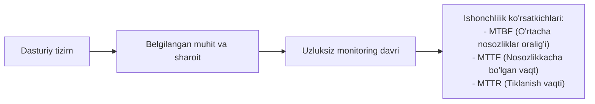
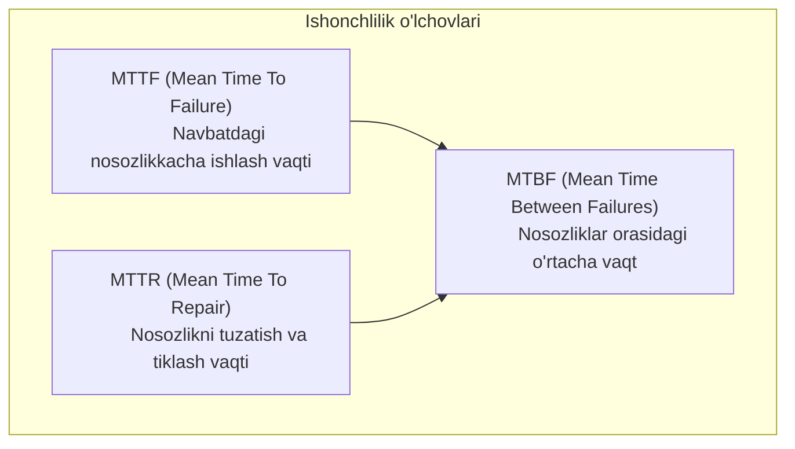
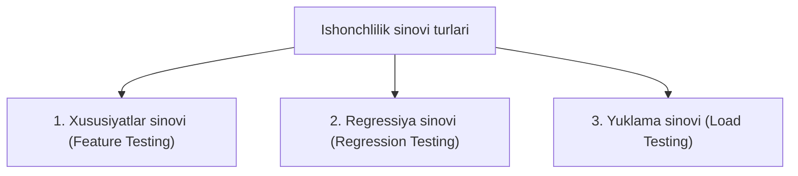

import { Callout } from 'nextra/components'

# Ishonchlilik sinovi (Reliability Testing)

**Ishonchlilik sinovi (Reliability Testing)** — bu dasturiy ta'minotning belgilangan texnik muhitda va aniq belgilangan vaqt oralig'ida **hech qanday nosozliklarsiz (Failure-free)** o'z vazifalarini to'laqonli bajara olish ehtimolini tekshiruvchi nofunksional sinov turidir.

Ushbu sinov foydalanuvchiga taqdim etilayotgan mahsulotning barqarorligi, ma'lumotlar aniqligi va har qanday sharoitda bir xil ishonchli natija berishini kafolatlaydi.



---

## Ishonchlilikning asosiy matematik ko'rsatkichlari

Dasturiy ta'minotning ishonchliligini baholashda xalqaro standartlarga asosan quyidagi 3 ta asosiy formula qo'llaniladi:



```text
MTBF = MTTF + MTTR
```

* **MTTF (Mean Time To Failure):** Tizim ishga tushirilgandan boshlab birinchi yoki navbatdagi nosozlik yuz bergunga qadar ishlagan o'rtacha vaqt.
* **MTTR (Mean Time To Repair):** Yuzaga kelgan nosozlikni aniqlash, bartaraf etish va tizimni qayta ishga tushirish uchun ketgan o'rtacha vaqt.
* **MTBF (Mean Time Between Failures):** Ikki nosozlik o'rtasida o'tgan umumiy vaqt (MTTF va MTTR yig'indisi). MTBF qanchalik yuqori bo'lsa, tizim shunchalik ishonchli hisoblanadi.

---

## Ishonchlilik sinovining uchta asosiy turi

Ishonchlilik sinovi dasturiy ta'minotning har xil jihatlarini qamrab oluvchi 3 qismdan iborat:



### 1. Xususiyatlar sinovi (Feature Testing)
* Dasturga kiritilgan barcha funksiyalar va xususiyatlar talablarga muvofiq kamida bir marta to'liq va to'g'ri bajarilishini tekshirish.
* Xavfsizlik va kirish huquqlarining to'g'ri ishlashini nazorat qilish.

### 2. Regressiya sinovi (Regression Testing)
* Yangi kod yoki xatoliklar tuzatilgandan so'ng dasturning avvalgi to'g'ri ishlab turgan qismlari buzilmaganligini kafolatlash.

### 3. Yuklama sinovi (Load Testing)
* Maksimal kutilayotgan ish yuklamasi ostida tizim o'zining ishonchliligini yo'qotmasligi va so'rovlarni bir xil sifatda qayta ishlashini tasdiqlash.

---

## Ishonchlilikni o'lchash metrikalari (Measurement)

Dasturiy ta'minotning ishonchliligi quyidagi 4 toifadagi metrikalar orqali o'lchanadi:

1. **Mahsulot metrikalari (Product Metrics):**
   * **Kod murakkabligi (Complexity):** Siklomatik murakkablik qanchalik yuqori bo'lsa, xatoliklar ehtimoli shunchalik ko'p bo'ladi;
   * **Kod hajmi (LOC - Lines of Code):** Kod satrlari soni;
   * **Test qamrovi (Test Coverage):** Kodning qanchasi avtomatlashtirilgan testlar bilan qamrab olingani.
2. **Nosozliklar va xatolar statistikasi (Fault & Failure Metrics):**  
   Sinov davrida aniqlangan defektlar soni va foydalanuvchilar tomonidan ishlab chiqarishda bildirilgan shikoyatlar chastotasi.
3. **Jarayon metrikalari (Process Metrics):**  
   Dasturiy ta'minotni ishlab chiqish va sinash jarayonlarining sifat darajasi.
4. **Loyiha boshqaruvi metrikalari (Project Management Metrics):**  
   Xatarlarni boshqarish va konfiguratsiyani to'g'ri tashkil etish orqali erishilgan barqarorlik.

---

## Ishonchlilik sinovining asosiy yondashuvlari

* **Test-Retest Reliability:** Muayyan test ssenariylarini vaqt oralig'ida qayta-qayta yurgizib, tizim doimo bir xil barqaror natija qaytarishini tekshirish.
* **Parallel shakllar (Parallel Forms Reliability):** Ikkita mustaqil test muhandislari guruhi tomonidan o'xshash test to'plamlari orqali mahsulotni sinash va natijalarni solishtirish.
* **Qarorlar izchilligi (Decision Consistency):** Barcha sinov usullaridan olingan xulosalarni taqqoslab, mahsulotning bozorga chiqishga tayyorligi bo'yicha yakuniy qaror qabul qilish.

<Callout type="info">
  Ishonchlilik sinovi bank tizimlari, tibbiy uskunalar, avtomobil va aviatsiya boshqaruv tizimlari kabi inson hayoti va katta moliyaviy aktivlar bilan bog'liq sohalarda eng muhim va majburiy sinov hisoblanadi.
</Callout>
