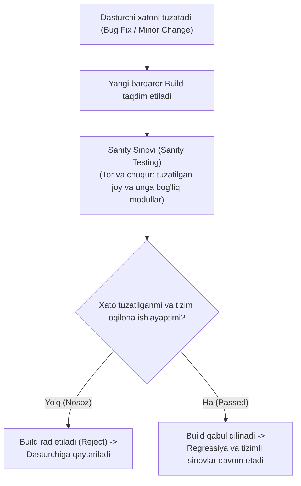
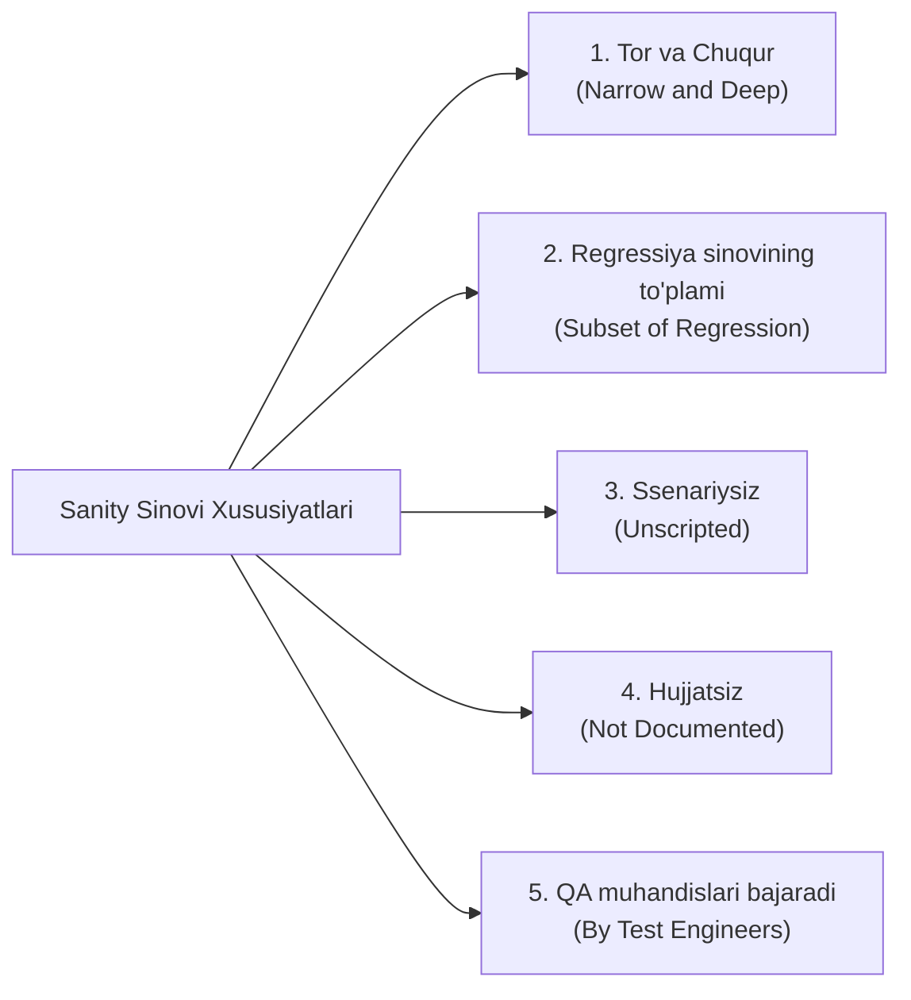
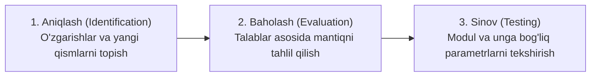
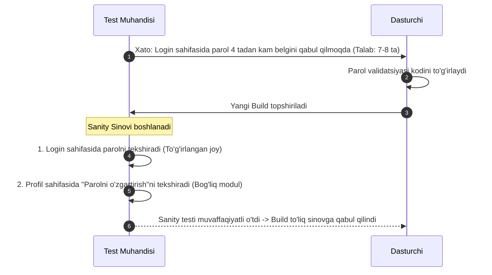

import { Callout } from 'nextra/components'

# Sanity Sinovi (Sanity Testing)

**Sanity sinovi (Sanity Testing)** — dastur kodiga kichik o'zgartirishlar kiritilganda yoki aniqlangan nuqsonlar (*Bug fixes*) tuzatilgandan so'ng, ushbu tuzatishlar kutilganidek to'g'ri ishlaganligini hamda ularga bevosita bog'liq qo'shni modullarga salbiy ta'sir ko'rsatmaganligini tezkor tasdiqlash uchun o'tkaziladigan sinov turidir.

Sanity sinovi dasturiy ta'minot sinovida **Regressiya sinovining kichik to'plami (Subset of Regression Testing)** yoki **Dasturchining aqliy salomatligini tekshirish sinovi** deb ham ataladi.

---

## Sanity Sinovi Nima? (What is Sanity Testing?)

Odatda Sanity sinovi dasturning nisbatan barqaror (*Stable*) yig'ilmalarida (build) o'tkaziladi. Dasturchilar jamoasi biror kichik xatolikni to'g'rilab yoki kichik yaxshilanish (*Minor enhancement*) kiritib, yangi build taqdim etganda, Sanity sinovi keyingi to'liq va keng qamrovli sinovlarga ruxsat berish uchun **nazorat punkti (Checkpoint)** vazifasini o'taydi.

Agar kiritilgan tuzatish hatto asosiy mantiqni ham qanoatlantirmasa yoki qo'shni modulni ishdan chiqargan bo'lsa, vaqt va xarajatlarni tejash maqsadida butun yig'ilma (build) darhol rad etiladi.

<Callout type="info">
**Nega "Sanity" (Aql-idrok) deb ataladi?**  
Ingliz tilidagi "Sanity" so'zi aql-hush, sog'lom mantiq ma'nosini bildiradi. Bu sinovning maqsadi — dasturchi kodga kiritgan tuzatishlari bilan dasturni mantiqsiz holatga keltirib qo'ymaganligini va tizim o'zini "oqilona" tutayotganini tezkor tekshirishdir.
</Callout>

---

## Sanity Sinovining Asosiy Xususiyatlari (Attributes)

Sanity sinovi o'zining quyidagi 5 ta muhim belgisi bilan boshqa sinov turlaridan ajralib turadi:

1. **Tor va chuqur (Narrow and Deep):** Tutun sinovidan farqli ravishda, dasturning butun tizimi emas, balki faqat o'zgartirish kiritilgan aniq bir modul va unga bog'liq bo'lgan qo'shni qismlar chuqur tekshiriladi.
2. **Regressiya sinovining bo'limi (Subset of Regression Testing):** U regressiya sinovining bir shakli bo'lib, e'tiborni eng asosiy ta'sirlangan sohalarga qaratadi.
3. **Ssenariysiz (Unscripted):** Rasmiy qat'iy test skriptlari yozilmaydi; testlovchi o'z tajribasi va mantiqiy fikrlashiga tayanadi.
4. **Hujjatsiz (Not Documented):** Odatda rasmiy test rejalari yoki rasmiy qadamlar jadvallari tuzilmaydi (vaqtni tejash uchun).
5. **Test muhandislari tomonidan o'tkaziladi:** Sinov to'liq QA mutaxassislari tomonidan bajariladi.

---

## Sanity Sinovi Jarayoni (3 Asosiy Qadam)

Sanity sinovi tizimli ravishda quyidagi uchta qadam orqali amalga oshiriladi:

### 1. Aniqlash (Identification)
Dasturchi tuzatgan nuqsonlar, o'zgartirilgan kod fayllari hamda tizimga yangi kiritilgan kichik funksiyalar to'liq aniqlab olinadi.

### 2. Baholash (Evaluation)
Aniqlangan o'zgarishlar loyiha talablari asosida tahlil qilinadi: ushbu o'zgarish dasturning aynan qaysi qismlariga ta'sir o'tkazishi mumkinligi baholanadi.

### 3. Sinash (Testing)
Tuzatilgan funksiya va unga bevosita bog'langan barcha parametrlar sinovdan o'tkaziladi. Agar sinov muvaffaqiyatli o'tsa, build qabul qilinadi va chuqur regressiya sinovlariga ruxsat beriladi.

---

## Amaliy Misol: E-Tijorat Tizimida Parol Maydoni

Tasavvur qiling, internet-do'kon tizimida quyidagi modullar mavjud:
- **Kirish sahifasi (Login page)**
- **Bosh sahifa (Home page)**
- **Yangi profil yaratish (Sign up page)**
- **Foydalanuvchi profili (User profile page)**

1. Yangi foydalanuvchi ro'yxatdan o'tayotganda xatolik aniqlandi: **Login sahifasida** parol maydoni 4 tadan kam harf va raqamni qabul qilmoqda. Texnik talabga ko'ra esa parol kamida 7–8 belgidan iborat bo'lishi shart.
2. Test guruhi ushbu nuqson bo'yicha xato hisoboti (*Bug Report*) tuzib, dasturchiga yubordi.
3. Dasturchi kodni tuzatib, yangi build taqdim etdi.
4. **Sanity sinovi doirasida QA muhandisi:**
   - Birinchi navbatda Login sahifasini tekshiradi (parol qoidalari to'g'ri ishlayotganini tasdiqlaydi);
   - So'ngra ushbu o'zgarish bilan bog'liq bo'lgan **Profil sahifasidagi "Parolni yangilash"** bo'limini ham tekshiradi.
5. Har ikki bog'liq joyda ham tizim kutilganidek ishlasa, Sanity sinovi muvaffaqiyatli deb topiladi.

---

## Sanity Sinovi Qachon O'tkaziladi?

Sinov jarayonida quyidagi ikki asosiy holatda Sanity sinovi o'tkazilishi shart:

1. **Funksional yaxshilanish kiritilganda (Minor Enhancement):** Mavjud funksiyalarga kichik qo'shimcha yoki optimizatsiya qilinganda.
2. **Nuqsonlar to'g'rilangandan so'ng (Bug Fixes):** Dasturchi ma'lum bir xatoni bartaraf etgach, dastur yana avvalgidek barqaror ishlayotganini tekshirish uchun.

---

## Tutun, Sanity va Regressiya Sinovlari Farqi

Ushbu uchta sinov turi dasturiy ta'minot hayotiy siklida bir-birini to'ldiradi:

| Xususiyati | Tutun Sinovi (Smoke Testing) | Sanity Sinovi (Sanity Testing) | Regressiya Sinovi (Regression Testing) |
| :--- | :--- | :--- | :--- |
| **Qachon o'tkaziladi?** | Har bir yangi dastlabki yig'ilmada (*Initial Build*). | Xato tuzatilgach yoki kichik o'zgarishdan so'ng. | Tizimga har qanday o'zgarish kiritilgandan so'ng. |
| **Maqsadi** | Buildning umumiy barqarorligini tekshirish. | Tuzatishning oqilona ishlashini tekshirish. | O'zgarishlar eski kodni buzmaganligini tasdiqlash. |
| **Fokus va qamrov** | **Keng va yuzaki** (*Wide & Shallow*) — butun tizim bo'ylab. | **Tor va chuqur** (*Narrow & Deep*) — faqat tegishli modullar. | **Keng va chuqur** — butun tizim yoki katta ta'sir sohalari. |
| **Hujjatlashtirish** | Skriptlar va tayyor test to'plami mavjud. | Odatda hujjatsiz, ssenariysiz. | To'liq rasmiy test-keyslar to'plami. |
| **Avtomatlashtirish** | Oson avtomatlashtiriladi. | Kamdan-kam avtomatlashtiriladi (qo'lda). | To'liq avtomatlashtirishga mos. |
| **Bog'liqligi** | Qabul sinovining boshlang'ich qismi. | Regressiya sinovining kichik qismi. | Mustaqil keng ko'lamli sinov bosqichi. |

---

## Xulosa

Sanity sinovi (Sanity Testing) — dasturchilar tomonidan kiritilgan tuzatishlarning sifati va mantiqiyligini tezkor baholovchi samarali vositadir. U butun tizimni sinab vaqt yo'qotishning oldini oladi va faqat o'zgarishga daxldor sohalarga diqqat qaratish orqali loyihaning sinov muddatlarini qisqartirishga xizmat qiladi.
