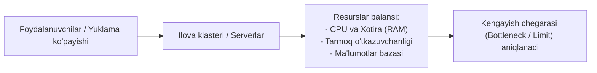
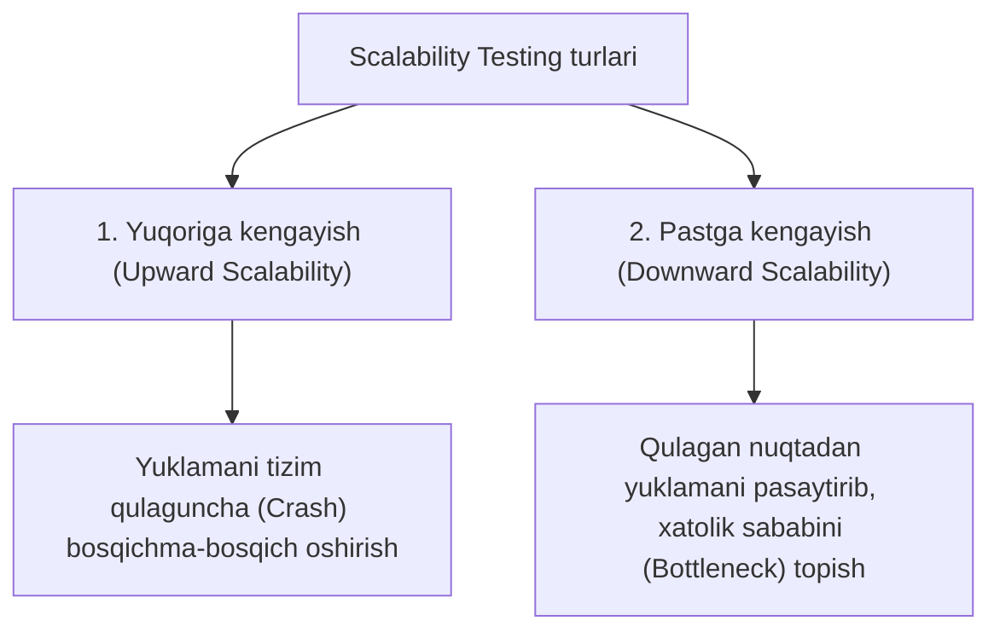
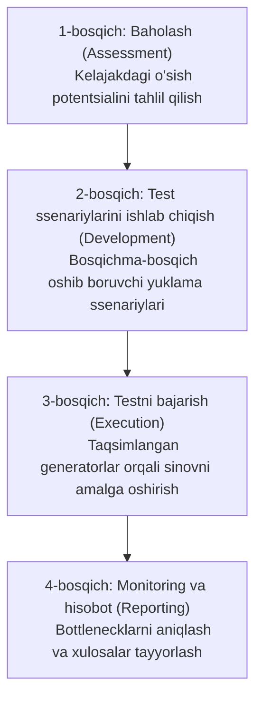

import { Callout } from 'nextra/components'

# Kengayuvchanlik sinovi (Scalability Testing)

**Kengayuvchanlik sinovi (Scalability Testing)** — bu dasturiy ta'minot yoki tizimning ortib borayotgan yoki kamayayotgan yuklama (foydalanuvchilar oqimi, ma'lumotlar hajmi yoki so'rovlar miqdori) sharoitida o'z unumdorligi va barqarorligini qay darajada saqlab qolishini baholovchi nofunksional samaradorlik (Performance Testing) sinovidir.

Ushbu sinov **apparat ta'minoti (hardware)**, **dasturiy ta'minot (software)** yoki **ma'lumotlar bazasi (database)** darajasida o'tkazilib, tizimning masshtablanish chegaralarini aniqlashga xizmat qiladi.

---

## Kengayuvchanlik sinovining asosiy maqsadlari

* **Masshtablash chegarasini aniqlash:** Tizim yuklama ortishi bilan qaysi nuqtagacha bir tekis kengayishi va qayerda ishlashdan to'xtashini (crash yoki bottleneck) ko'rsatish.
* **Maksimal foydalanuvchilar sig'imi:** Tizim javob berish sifati pasaymagan holda bir vaqtning o'zida qancha faol foydalanuvchiga xizmat qila olishini belgilash.
* **Mijoz va server barqarorligi:** Yuklama ostida foydalanuvchi interfeysidagi sekinlashuvlar va server tomondagi kechikishlarni aniqlash.
* **Infratuzilma xarajatlarini optimallashtirish:** Yangi serverlar yoki bulutli resurslarni (AWS, Azure, GCP) ortiqcha xarajatlarsiz aniq rejalashtirish.

---

## Kengayuvchanlik sinovining turlari

Kengayuvchanlik sinovi ikkita asosiy yo'nalishga bo'linadi:

### 1. Yuqoriga kengayuvchanlik sinovi (Upward Scalability Testing)
* Foydalanuvchilar soni yoki so'rovlar miqdori tizim maksimal quvvatiga yetgunga qadar yoki xatoliklar yuzaga kelguncha bosqichma-bosqich oshirib boriladi.
* **Maqsad:** Ilovaning maksimal imkoniyatlari va chegaralarini aniqlash.

### 2. Pastga kengayuvchanlik sinovi (Downward Scalability Testing)
* Agar dastur yuqori yuklama sinovidan o'ta olmasa yoki qulab tushsa, foydalanuvchilar va so'rovlar soni asta-sekin pasaytirib boriladi.
* **Maqsad:** Qaysi yuklama darajasida tizim o'zining normal faoliyatini tiklashini va aynan qaysi komponentda to'siq ("tor bo'yin" / bottleneck) borligini aniqlash.

---

## Sinov uchun zaruriy shartlar (Prerequisites)

Kengayuvchanlik sinovini boshlashdan oldin quyidagi talablar tayyor bo'lishi lozim:

1. **Operatsion tizim (OS):** Yuklama generatorlari va master-serverlar uchun mos keladigan OS konfiguratsiyasi;
2. **Yuklamani taqsimlash qobiliyati (Load Distribution):** Bir nechta generator mashinalaridan taqsimlangan holda so'rovlar oqimini yo'llash imkoniyati;
3. **Xotira (Memory - RAM):** Virtual foydalanuvchilar simulyatsiyasi uchun yetarli darajada ajratilgan RAM;
4. **Protsessor (CPU):** Test master va virtual user agentlari uchun mos protsessor quvvati.

---

## Asosiy o'lchov ko'rsatkichlari (Key Metrics)

| Ko'rsatkich | Tavsif | O'lchov birligi |
| :--- | :--- | :--- |
| **O'tkazuvchanlik (Throughput)** | Tizim vaqt birligi ichida bajargan umumiy so'rovlar yoki tranzaksiyalar hajmi | Requests/sec, Transactions/sec |
| **Javob berish vaqti (Response Time)** | Foydalanuvchi so'rov yuborganidan tizim to'liq javob qaytarguniga qadar ketgan vaqt | Millisekund (ms), Sekund |
| **CPU sarfi (CPU Usage)** | Buyruqlarni bajarish jarayonida protsessorning bandlik darajasi | Foiz (%), Megagerts (MHz) |
| **Xotira sarfi (Memory Usage)** | Jarayonlar va ma'lumotlarni qayta ishlash uchun operativ xotiradan foydalanish | Megabayt (MB), Gigabayt (GB) |
| **Tarmoq sarfi (Network Usage)** | Sinov paytida iste'mol qilingan tarmoq o'tkazish qobiliyati (Bandwidth) | Kbit/s, Mbit/s, Packet/sec |

---

## Kengayuvchanlik sinovini o'tkazish bosqichlari

1. **Baholash va rejalashtirish (Assessment):**  
   Dasturning hozirgi holati va kelgusida kutilayotgan foydalanuvchilar o'sish sur'atlari aniqlanadi. Sinov vositalari (masalan, JMeter, k6, Locust) tanlanadi.
2. **Test ssenariylarini tayyorlash (Test Development):**  
   Yuklamani bosqichma-bosqich (masalan, 100 -> 500 -> 2000 -> 10 000 foydalanuvchi) oshirish ssenariylari yoziladi.
3. **Sinovni bajarish (Test Execution):**  
   Har bir bosqichda sinov muhiti barqaror ushlab turilgan holda testlar yuritiladi va apparat resurslari nazorat qilinadi.
4. **Tahlil va hisobot (Logging and Reporting):**  
   Natijalar solishtiriladi, tizim o'tkazuvchanligi qayerda sekinlashgani hujjatlashtiriladi va tizim arxitektorlariga takliflar beriladi.

<Callout type="info">
  Kengayuvchanlik sinovida eng yaxshi amaliyot — yuklamani darhol eng yuqori darajaga ko'tarmasdan, qadam-baqadam oshirib borishdir. Bu tizimning qaysi bosqichda resurslarni to'liq sarflab qo'yishini aniq ko'rsatadi.
</Callout>
