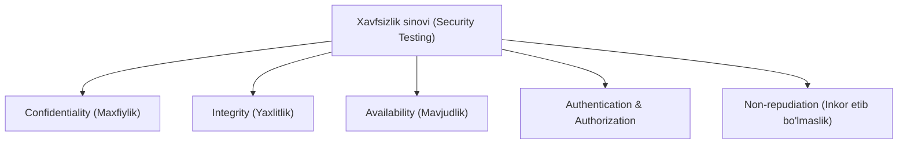
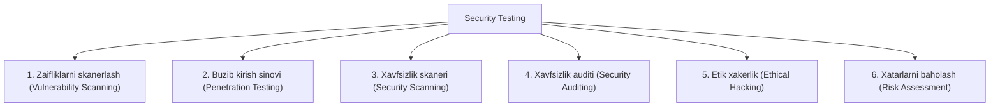

import { Callout } from 'nextra/components'

# Xavfsizlik sinovi (Security Testing)

**Xavfsizlik sinovi (Security Testing)** — bu dasturiy ta'minot tizimidagi zaifliklar (vulnerabilities), xavf-xatarlar (risks) va potensial tahdidlarni aniqlash, ruxsatsiz kirishlardan himoyalanish hamda ma'lumotlar maxfiyligini ta'minlashga qaratilgan sinov turidir.

Uning asosiy vazifasi — ilovani kiberhujumlardan, ma'lumotlarning sizib chiqishidan (data leakage) va tashqi buzg'unchilarning g'arazli harakatlaridan ishonchli himoya qilishdir.

---

## Axborot xavfsizligining oltita asosiy tamoyili

Har qanday dasturiy ta'minot xavfsizligi quyidagi fundamental prinsiplarga asoslanadi:

| Tamoyil | Qisqacha ta'rifi | QA nuqtai nazaridan tekshiruv |
| :--- | :--- | :--- |
| **Maxfiylik (Confidentiality)** | Ma'lumotlarga faqat ruxsati bor shaxslarning kira olishi | Parollar, karta raqamlari shifrlanganmi (HTTPS, AES)? |
| **Yaxlitlik (Integrity)** | Ma'lumotlarning ruxsatsiz o'zgartirilmasligi | Tranzitdagi ma'lumotlar o'zgartirilsa tizim buni aniqlaydimi? |
| **Mavjudlik (Availability)** | Xizmat va ma'lumotlarning istalgan paytda foydalanishga tayyorligi | DDoS hujumlariga qarshi tizim chidamlimi? |
| **Autentifikatsiya (Authentication)** | Foydalanuvchining shaxsini tasdiqlash | Login, 2FA, biometrik tekshiruvlar to'g'ri ishlayaptimi? |
| **Avtorizatsiya (Authorization)** | Foydalanuvchining huquq doirasini belgilash | Oddiy foydalanuvchi Admin sahifasiga kira oladimi? |
| **Inkor etib bo'lmaslik (Non-repudiation)** | Amalni bajargan shaxs o'z harakatini rad eta olmasligi | Muhim amallar (pul o'tkazish) audit loglarida saqlanadimi? |

---

## Xavfsizlik sinovining asosiy turlari

1. **Zaifliklarni skanerlash (Vulnerability Scanning):** Tizimdagi ma'lum zaifliklar (eskirgan kutubxonalar, ochiq portlar) avtomatlashtirilgan vositalar orqali tekshiriladi.
2. **Penetratsion sinov (Penetration Testing / Pen-testing):** Sertifikatlangan xavfsizlik mutaxassisi (kiberxavfsizlik eksperti) haqiqiy xaker rolida tizimga hujum qilib, real himoyani yorib o'tishga harakat qiladi.
3. **Xavfsizlik auditi (Security Auditing):** Dastur kodi va infratuzilmaning xalqaro xavfsizlik standartlariga (ISO 27001, PCI-DSS, SOC2) muvofiqligi ko'rib chiqiladi.
4. **Etik xakerlik (Ethical Hacking):** Tashkilot ruxsati bilan barcha mumkin bo'lgan hujum usullari qo'llanilib, tizimning zaif tomonlari topiladi va rahbariyatga hisobot beriladi.

---

## Veb-ilovalardagi eng keng tarqalgan xavflar (OWASP Top 10)

* **SQL Injection (SQLi):** Qidiruv yoki login maydonlariga g'arazli SQL kod kiritish orqali butun ma'lumotlar bazasini o'qish yoki o'chirish.
* **Cross-Site Scripting (XSS):** Foydalanuvchi sahifasiga zararli JavaScript skriptlarini kiritish orqali boshqa foydalanuvchilarning sessiyalarini o'g'irlash.
* **Buzilgan autentifikatsiya (Broken Authentication):** Sessiya identifikatorlarini o'g'irlash yoki zaif parollarni Brute-force (kuch ishlatib terish) yo'li bilan buzish.
* **Buzilgan kirish nazorati (Broken Access Control):** URL manzilidagi identifikatorni o'zgartirish orqali boshqa foydalanuvchining shaxsiy ma'lumotlarini ko'rish (masalan: `/user/10` o'rniga `/user/11`).

<Callout type="warning">
Xavfsizlik sinovlarini faqat loyiha yakunlanganda emas, balki SDLC'ning har bir bosqichida (DevSecOps — Shift Left) o'tkazish tavsiya etiladi. Kod yozish bosqichida topilgan xatolikni tuzatish ishlab chiqarishdagi (production) xatoga nisbatan o'nlab barobar arzonroqqa tushadi.
</Callout>

---

## Ommabop xavfsizlik sinovi vositalari

* **OWASP ZAP (Zed Attack Proxy):** Veb-ilovalardagi zaifliklarni topish uchun eng mashhur bepul va ochiq manbali vosita;
* **Burp Suite:** Penetratsion sinovlar va veb-trafikni tahlil qilish uchun sanoat standarti;
* **SonarQube:** Manba kodidagi xavfsizlik nuqsonlarini tahlil qiluvchi statik analizator (SAST);
* **Nessus:** Tarmoq va server infratuzilmasi zaifliklarini skanerlash platformasi.
