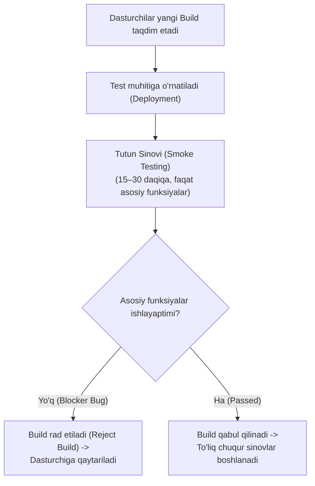
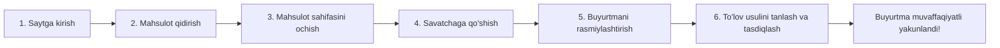
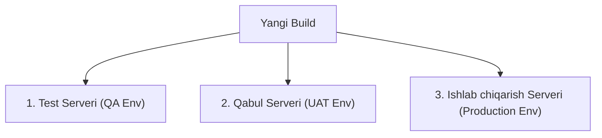
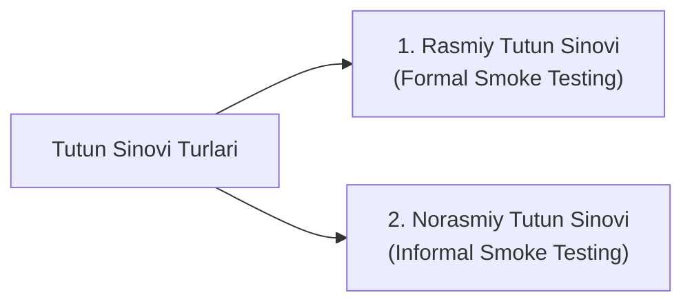

import { Callout } from 'nextra/components'

# Tutun Sinovi (Smoke Testing)

**Tutun sinovi (Smoke Testing)** — dasturchilar jamoasidan yangi dasturiy yig'ilma (*Build*) qabul qilib olinganda, uning keyingi chuqur va keng ko'lamli sinovlarga yaroqli yoki yaroqsizligini aniqlash uchun o'tkaziladigan dastlabki tezkor sinov turidir.

Ushbu jarayon dasturiy ta'minot sinovida **"0-kun" (Day 0)** yoki **Yig'ilmani Tekshirish Sinovi (Build Verification Testing — BVT)** deb ham ataladi.

---

## Tutun Sinovi Nima? (What is Smoke Testing?)

Dastur yangi build sifatida test muhitiga o'rnatilganda, darhol chuqur funksional, integratsion yoki regressiya sinovlarini boshlash to'g'ri emas. Agar dasturning eng asosiy funksiyasi (masalan, tizimga kirish yoki bosh sahifaning ochilishi) ishlamayotgan bo'lsa, qolgan yuzlab murakkab test-keyslarni bajarishga sarflangan vaqt zoe ketadi.

**Tutun sinovining asosiy mohiyati** — ilovaning eng muhim, kritik va asosiy funksional oqimlarini (*Critical Path / Core Workflow*) tezkorlik bilan tekshirib, tizim barqaror va test qilishga tayyor ekanligiga ishonch hosil qilishdir.

<Callout type="info">
**Qayerdan kelib chiqqan?**  
"Smoke testing" atamasi dastlab apparat (hardware) muhandisligidan kirib kelgan: yangi elektr platani yoki qurilmani rozetkaga birinchi bor ulaganda, undan tutun chiqmasa — u keyingi sinovlarga yaroqli hisoblangan. Dasturiy ta'minotda ham yangi kod dasturni "tutun chiqarib" portlatib yubormasligini tezkor tekshirish aynan shunday nomlanadi.
</Callout>

---

## Tutun Sinovining Muhim Xususiyatlari

1. **Faqat ijobiy oqim (Positive Flow):** Tutun sinovida faqat to'g'ri (valid) ma'lumotlar kiritiladi. Bu bosqichda noadekvat yoki xato ma'lumotlar (negative testing) berib tizim qiynalmaydi.
2. **Kenglik bo'yicha sinov (Shallow & Wide):** Dasturning ich-ichiga kirmasdan, uning barcha asosiy modullari yuzaki, ammo to'liq qamrab olinadi.
3. **Vaqt tejamkorligi:** Sinov odatda juda qisqa vaqt — **15 daqiqadan 30 daqiqagacha** davom etadi.
4. **Bloklovchi xatolarni (Blocker / Show-stopper Bugs) erta aniqlash:** Agar kritik xato aniqlansa, butun QA jamoasi behuda vaqt yo'qotmasdan dasturchilarga darhol xabar beradi.

---

## Amaliy Misol: E-Tijorat Sayti Oqimi

Tasavvur qiling, biz internet-do'kon ilovasining yangi buildini qabul qilib oldik. Mazkur sayt uchun tutun sinovining kritik ssenariysi quyidagicha bo'ladi:

- Agar foydalanuvchi mahsulotni savatga qo'sha olmasa yoki to'lov sahifasi ochilmay qolsa, bu **Blocker (bloklovchi xato)** hisoblanadi. 
- Bunday holatda boshqa sahifalarning dizayni yoki mayda elementlarini tekshirib o'tirishning foydasi yo'q — build darhol rad etiladi.
- Agar ushbu asosiy zanjir muvaffaqiyatli ishlasa, build qabul qilinadi va qolgan chuqur sinovlar boshlanadi.

---

## Tutun Sinovini O'tkazish Jarayoni

Tutun sinovi uchun noldan yangi test-keyslar yozish talab etilmaydi. Buning o'rniga allaqachon mavjud bo'lgan test to'plamidan eng muhim va asosiy ssenariylar saralab olinadi:

1. **Minimal test to'plami:** Dasturning asosiy funksiyalarini qamrab oluvchi eng oz miqdordagi testlar tanlanadi.
2. **Tezkor bajarilish:** Qo'lda yoki avtomatik tarzda yarim soatdan oshmagan vaqtda yakunlanishi kerak.
3. **Muntazamlik:** Har safar yangi build kelganda birinchi navbatda shu to'plam ishga tushiriladi.

---

## Tutun Sinovi Qachon O'tkaziladi? (4 Asosiy Ssenariy)

Tutun sinovi yangi yig'ilma (build) o'rnatilgan har qanday muhitda o'tkaziladi:

Keling, buni 4 ta hayotiy ssenariy orqali tushunamiz:

### 1-Ssenariy: Reliz Kechikishining Oldini Olish
- **Muammo:** Loyihaga 4 kunlik funksional sinov ajratilgan. QA jamoasi birinchi kuni 1-modulni, ikkinchi kuni 2-modulni chuqur tekshiradi. 4-kuni esa tizimning boshqa modulida kritik bloklovchi xatoga duch keladi. Dasturchi buni tuzatish uchun yana 2 kun so'raydi. Natijada loyihaning topshirilish muddati (release) 2 kunga kechikadi.
- **Yechim:** Yangi build kelishi bilanoq barcha modullar bo'yicha 20 daqiqalik **tutun sinovi** o'tkazilsa, 4-kuni chiqadigan kritik xato dastlabki 20 daqiqadayoq aniqlanadi va dasturchiga zudlik bilan yuboriladi. Dasturchi xatoni tuzatgunicha QA boshqa mustaqil qismlarni sinashni davom ettiradi.

### 2-Ssenariy: Testlovchilarning Beholat Qolmasligi
Agar kritik xato kech aniqlansa, test muhandislari dastur ishlamay qolgani sababli bekor o'tirib qolishlari mumkin. Tutun sinovi orqali qaysi modullar mustaqil ishlashi oldindan aniqlanadi, shunda xatolar tuzatilayotgan paytda ham jamoa boshqa modullarni sinashda davom etadi.

### 3-Ssenariy: Foydalanuvchi Qabul Sinovlaridan (UAT) Oldin
Dastur mijozga (buyurtmachiga) UAT sinovi uchun topshirilishidan oldin uning serverida tutun sinovi o'tkaziladi. Bu mijozning oldida dastur ilk daqiqalardayoq ishlamay qolishi va kompaniya obro'siga putur yetishining oldini oladi.

### 4-Ssenariy: Ishlab Chiqarish (Production) Serverida O'rnatilgandan So'ng
Dastur jonli serverga (*Production*) muvaffaqiyatli chiqarilgach, barcha sozlamalar va ma'lumotlar bazasi to'g'ri ulanganini tekshirish uchun maxsus sinov akkauntlari orqali tezkor tutun sinovi o'tkaziladi.
- *Misol:* Facebook yoki Instagram kabi gigant tizimlarda har kuni yuzlab yangilanishlar kiritiladi. Haqiqiy foydalanuvchilar muammoga duch kelmasligi uchun jonli tizimda doimiy tutun tekshiruvlari amalga oshiriladi.

<Callout type="info">
**Production muhitida tutun sinovini kimlar o'tkazishi mumkin?**  
- Test muhandislari (QA Engineers);  
- Biznes tahlilchi (Business Analyst — BA);  
- Dasturchilar guruhi rahbari (Dev Lead);  
- Sinov jamoasi menejeri (QA Manager);  
- DevOps / Build jamoasi;  
- Buyurtmachi (Mijoz vakili).
</Callout>

---

## Nega Tutun Sinovi Zarur? (Asosiy Afzalliklari)

1. **Mahsulotning testga yaroqliligini tasdiqlaydi:** Nosoz dasturga behuda vaqt sarflanmaydi.
2. **Kritik xatolarni eng erta bosqichda aniqlaydi:** Dasturchilarga nuqsonlarni bartaraf etish uchun yetarli vaqt beradi.
3. **To'g'ri o'rnatilganlikni tekshiradi:** Build muhitga xatosiz joylashganligini (*Deployment verification*) kafolatlaydi.
4. **Vaqt o'tishi bilan xarajatlarni kamaytiradi:** Loyihaning dastlabki bosqichlarida tutun sinovida ko'plab xatolar topiladi. Tizim ulg'aygan sari bu testlar orqali xatolar kamayib, loyiha barqarorlashadi.

---

## Tutun Sinovining Turlari

Tutun sinovi tashkiliy jihatdan ikki shaklda o'tkaziladi:

### 1. Rasmiy Tutun Sinovi (Formal Smoke Testing)
- Dasturchilar guruhi dasturni rasman Test Lead'ga topshiradi.
- Test Lead test muhandislariga tutun sinovini bajarishni rasmiy topshiriq sifatida biriktiradi.
- QA muhandislari sinovni yakunlab, Test Lead va jamoaga rasmiy **Smoke Test Hisoboti (Report)** taqdim etadilar.
- Hisobot ijobiy bo'lsa, keyingi bosqichga ruxsat beriladi.

### 2. Norasmiy Tutun Sinovi (Informal Smoke Testing)
- Test Lead dastur sinovga tayyorligini aytadi, lekin maxsus tutun sinovini rasman buyurmaydi.
- Test muhandislari o'z tashabbuslari bilan asosiy oqimlarni tezkor tekshirib oladilar va shundan so'ng rejalashtirilgan to'liq sinovlarga kirishadilar.

---

## Tutun Sinovi (Smoke Testing) va Sanity Sinovi (Sanity Testing) Farqlari

Bu ikki sinov turi ko'pincha adashtiriladi. Ularning asosiy farqlari quyidagi jadvalda keltirilgan:

| Solishtirish Mezoni | Tutun Sinovi (Smoke Testing) | Aqliy Sinov (Sanity Testing) |
| :--- | :--- | :--- |
| **Qachon o'tkaziladi?** | Yangi dasturiy yig'ilma (*Build*) olingan dastlabki daqiqalarda ("0-kun"). | Xato to'g'rilangandan (*Bug fix*) yoki kichik o'zgarish kiritilgandan keyin. |
| **Asosiy maqsadi** | Buildning umumiy barqarorligini va testga yaroqliligini tekshirish. | Muayyan o'zgartirish yoki tuzatish oqilona ishlaganini tasdiqlash. |
| **Sinov qamrovi** | **Keng, lekin yuzaki (Wide & Shallow)** — barcha asosiy modullar tekshiriladi. | **Tor, lekin chuqur (Narrow & Deep)** — faqat tuzatilgan aniq modullar tekshiriladi. |
| **Kim tomonidan bajariladi?** | Odatda test muhandislari yoki avtomatlashtirilgan CI/CD vositalari. | Test muhandislari (QA) tomonidan. |
| **Ijro tezligi** | Juda tez (15–30 daqiqa). | Nisbatan tez, lekin aniq modulga chuqurlashiladi. |
| **Hujjatlashtirish** | Oldindan saralab qo'yilgan test-keyslar to'plami ishlatiladi. | Odatda ssenariylar yozilmaydi (norasmiy / unscripted). |
| **Boshqa nomi** | Yig'ilmani Tekshirish Sinovi (*Build Verification Testing*). | Qabul Tekshiruvi (*Tester Acceptance Testing*). |

---

## Xulosa

Tutun sinovi (Smoke Testing) sifatni ta'minlash jarayonining dastlabki darvozaboni hisoblanadi. U dasturiy ta'minotning keyingi sinovlarga tayyorligini kafolatlab, jamoaning vaqti va resurslarini behuda sarflanishdan asraydi hamda chiqarilayotgan mahsulotning barqaror poydevorga ega bo'lishini ta'minlaydi.
