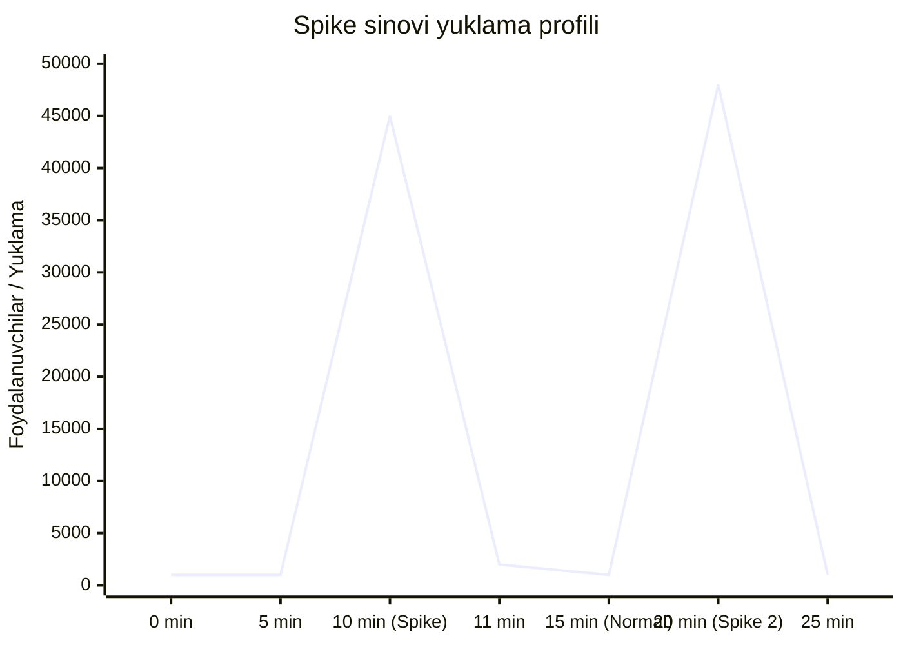
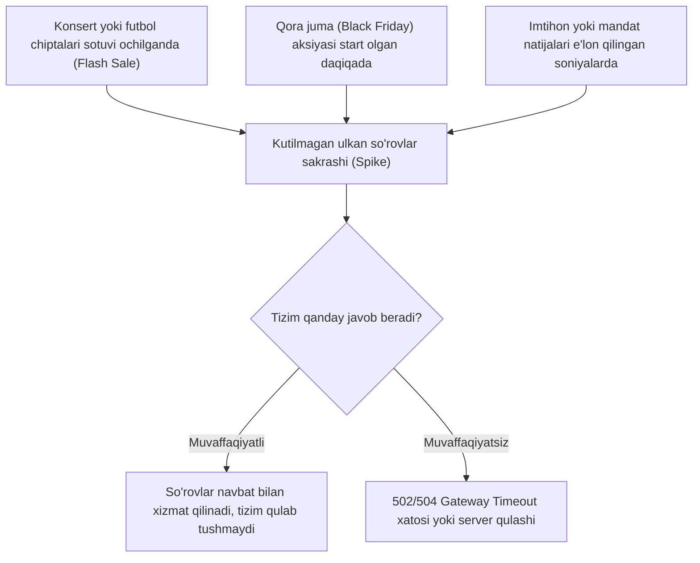

import { Callout } from 'nextra/components'

# Spike sinovi (Spike Testing)

**Spike sinovi (Spike Testing)** — bu dasturiy ta'minot yoki tizimga kutilmaganda, bir lahzada keskin oshib ketuvchi yuklama (so'rovlar yoki foydalanuvchilar oqimi) berilganda va yuklama darhol pasayganda tizimning xatti-harakatini tahlil qiluvchi **Stress sinovi (Stress Testing)** ning ixtisoslashgan kichik turidir.

Oddiy yuklama sinovlarida foydalanuvchilar soni asta-sekin oshirilsa, Spike sinovida oqim bir necha soniya ichida yuzlab martaga oshiriladi va tizim qulamasdan o'zini qanday tiklay olishi o'rganiladi.

---

## Spike sinovining asosiy maqsadlari

* **Tizimning qulash nuqtasini aniqlash:** Keskin sakrash vaqtida dastur xizmat ko'rsatishdan butunlay to'xtaydimi yoki so'rovlarni navbatga (Queue) qo'yib boshqara oladimi?
* **Tiklanish vaqtini o'lchash (Recovery Time):** Keskin yuklama pasayganidan so'ng tizim o'zining normal ish tezligiga qancha soniya yoki daqiqada qayta olishini aniqlash.
* **Zaifliklarni (Bottlenecks) topish:** Tarmoq shlyuzlari (API Gateway), yuklama taqsimlagichlar (Load Balancer) yoki ma'lumotlar bazasida navbatlar tiqilib qolishini oldindan ko'rish.

---

## Real hayotiy misollar (Use Cases)

---

## Spike sinovini o'tkazish jarayoni (7 bosqich)

1. **Test muhitini sozlash (Setup Test Environment):** Haqiqiy ishlab chiqarish (Production) serveriga ta'sir qilmasligi uchun alohida, izolyatsiyalangan sinov serverlari sozlanadi.
2. **Kutilayotgan maksimal yuklamani aniqlash (Detect Maximum Load):** Tizimga tushishi mumkin bo'lgan maksimal ehtimoliy pik ko'rsatkichi (masalan, 50 000 foydalanuvchi) belgilanadi.
3. **Maksimal pik yuklamasini berish (Apply Maximum Load):** Avtomatlashtirilgan vosita yordamida bir necha soniyada yuklama eng yuqori darajaga chiqariladi.
4. **Cho'qqi nuqtasidagi ishlashni baholash (Evaluate Peak Performance):** Cho'qqida serverlarning javob berish vaqti, xatoliklar soni (4xx, 5xx) va CPU/RAM holati qayd qilinadi.
5. **Yuklamani keskin pasaytirish (Reduce Load to Minimum/Zero):** So'rovlar oqimi birdaniga normal holatga yoki nolga tushiriladi.
6. **Tiklanish qobiliyatini tahlil qilish (Evaluate Recovery):** Tizim kutilmagan bosimdan keyin normal ish holatiga qanchalik tez va muammosiz qaytishi o'rganiladi.
7. **Natijalar grafigini tahlil qilish (Performance Graph Analysis):** Chiqqan loglar va grafiklar asosida ishlab chiquvchilar bilan birgalikda xatoliklar bartaraf etiladi.

---

## Spike sinovida qo'llaniladigan vositalar (Tools)

* **Apache JMeter:** Ochiq manbali va eng mashhur yuklama vositasi. `Ultimate Thread Group` plagini yordamida keskin yuklama sakrashlarini oson simulyatsiya qilish mumkin.
* **k6:** Dasturchilar uchun qulay zamonaviy vosita (JavaScript asosida ssenariylar yoziladi), `ramping-arrival-rate` yoki executorlar orqali bir necha soniya ichida minglab VUlarni ishga tushiradi.
* **LoadRunner:** Korporativ darajadagi eng quvvatli sinov platformasi bo'lib, keng miqyosli protokollar va murakkab arxitekturalarda spike sinovlarini o'tkazishga mo'ljallangan.

---

## Spike sinovining afzalliklari va cheklovlari

### Afzalliklari:
* Tizimning keskin vaziyatlarda butunlay qulab tushishini oldini oladi.
* Katta aksiyalar va marketing kampaniyalari oldidan ishonchni mustahkamlaydi.
* Kesh mexanizmlari (Redis, Memcached, CDN) to'g'ri sozlanganligini isbotlaydi.

### Cheklovlari:
* Katta hajmdagi virtual foydalanuvchilarni generatsiya qilish uchun alohida quvvatli serverlar talab etiladi.
* Ssenariylarni to'g'ri ishlab chiqish malakali QA muhandislari va DevOps mutaxassislarini talab qiladi.

<Callout type="warning">
  Spike sinovida asosiy xavf — yuklama tushganidan keyin ham server resurslari (xotira, ulanishlar oqimi) bo'shatilmasdan tiqilib qolishi mumkin. Shuning uchun nafaqat yuklama cho'qqisi, balki undan keyingi tiklanish fazasi ham chuqur tahlil qilinishi shart!
</Callout>
