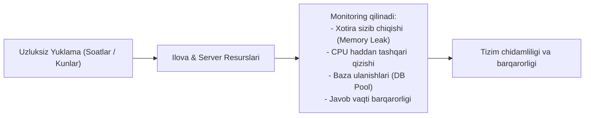
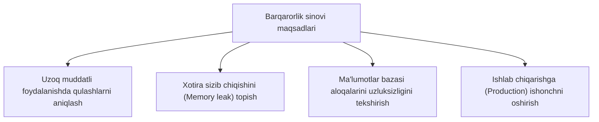

import { Callout } from 'nextra/components'

# Barqarorlik sinovi (Stability Testing)

**Barqarorlik sinovi (Stability Testing)** — bu dasturiy ta'minot yoki butun tizimga ma'lum bir vaqt davomida uzluksiz yuklama berish orqali uning mustahkamligi (**Robustness**), ishonchliligi (**Reliability**) va xatoliklarni qayta ishlash qobiliyatini tahlil qiluvchi nofunksional samaradorlik (Performance Testing) sinovi turidir.

Ushbu sinov tizimning oddiy sharoitdagi qisqa muddatli holatini emas, balki bir vaqtning o'zida minglab foydalanuvchilar uzoq muddat (bir necha soat yoki kunlar davomida) tizimdan foydalanganda uning qulab tushmasdan bir xil maromda ishlashini kafolatlaydi.

---

## Barqarorlik sinovining asosiy maqsadlari

* **Uzoq muddatli chidamlilikni baholash:** Ilova uzoq vaqt davomida o'z vazifalarini to'xtovsiz bajara olishini aniqlash.
* **Xotira va resurslar monitoringi:** Ish jarayonida xotira qaytarilmasdan to'planib qolishi (`Memory Leak`) yoki CPU o'z-o'zidan 100% ga chiqib ketish holatlarini fosh qilish.
* **Ma'lumotlar bazasi barqarorligi:** Baza ulanishlari (Connection Pool) to'lib qolmasligi va tranzaksiyalar to'xtab qolmasligini ta'minlash.
* **Yuklama ostida xatoliklarni aniqlash:** Faqat uzoq vaqt ishlagandan keyingina yuzaga keladigan yashirin defektlarni aniqlash.

---

## Barqarorlik sinovini o'tkazish tartibi

1. **Tayyorgarlik va tekshiruv:** Barqarorlik sinovidan avval ilovada asosiy funksiyalar to'g'ri ishlashi uchun **Tutun sinovi (Smoke Testing)** yoki **Regressiya sinovi** o'tkaziladi.
2. **Sinov doirasi va parametrlarini aniqlash:** Tizimga beriladigan barqaror yuklama darajasi (masalan, 5 000 foydalanuvchi) va sinov davomiyligi (masalan, 24 soat) belgilanadi.
3. **Avtomatlashtirilgan ijro:** Barqaror yuklama skriptlari orqali tizimga uzluksiz so'rovlar yuboriladi.
4. **Metrikalarni kuzatish:** Har bir soat oralig'ida CPU, RAM, Disk I/O, tarmoq va xatoliklar loglari tekshirib boriladi.
5. **Natijalarni baholash:** Sinov oxirida dasturning javob berish tezligi boshidagi bilan bir xil darajada qolganligi yoki pasayganligi tahlil qilinadi.

---

## Barqarorlik sinovi vositalari (Tools)

Barqarorlik sinovlari tizim darajasi (apparat va OS) hamda ilova darajasida maxsus vositalar bilan amalga oshiriladi:

| Vosita | Sohasi | Asosiy xususiyati |
| :--- | :--- | :--- |
| **System Stability Tester** | Protsessor va RAM | CPU va xotirani maksimal darajada to'ldirib, barqarorlikni hisoblaydi |
| **HeavyLoad** | Butun tizim apparati | Xotira, protsessor va qattiq diskka (HDD/SSD) kuchli yuklama beradi |
| **IntelBurn Test** | Protsessor (CPU) | Protsessorning chegaraviy barqarorligi va qizish darajasini sinaydi |
| **FurMark** | Grafik karta (GPU) | GPU chiplarini qizdirish va ekstremal yuklamaga chidamliligini tekshirish |
| **Apache JMeter / k6** | Veb va API ilovalar | Uzoq muddatli virtual foydalanuvchilar oqimini yaratish (Endurance/Soak testing) |

---

## Barqarorlik sinovining afzalliklari va xavflari

### Afzalliklari:
* **Foydalanuvchi tajribasini yaxshilaydi:** Tizim kutilmaganda "muzlab qolishi" yoki serverni qayta yuklash (restart) zaruratini kamaytiradi.
* **Tizim xizmat muddatini uzaytiradi:** Dasturiy ta'minotning uzoq muddat barqaror turishini ta'minlaydi.
* **Resurs sarfini oldindan ko'rsatadi:** Qaysi vaqtda qancha apparat resursi zarurligini aniqlab beradi.

### O'tkazilmaslik oqibatlari:
* Dastur production muhitida 2-3 kun ishlagach, xotira to'lib qolishi hisobiga qulab tushadi.
* Foydalanuvchilar soni ko'paygan paytda kutilmagan ma'lumotlar yo'qotilishi ro'y beradi.
* Serverlarning doimiy to'xtab qolishi biznes obro'siga va moliyaviy daromadga jiddiy zarar yetkazadi.

<Callout type="info">
  **Barqarorlik sinovi (Stability Testing)** ko'pincha **Bardoshlilik sinovi (Endurance Testing / Soak Testing)** bilan birga qo'llaniladi va uzoq vaqt davomida resurslarning sizib chiqishini aniqlashning eng samarali vositasi hisoblanadi.
</Callout>
