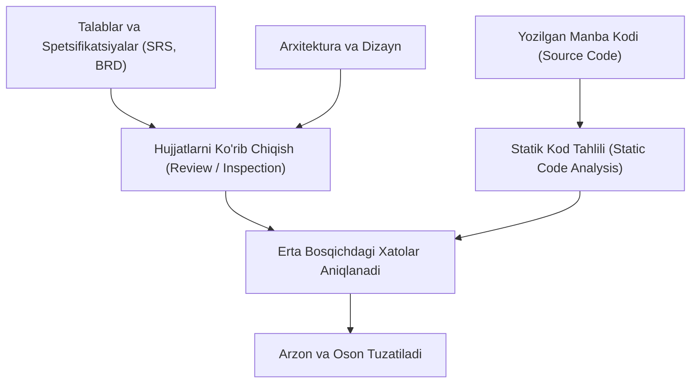
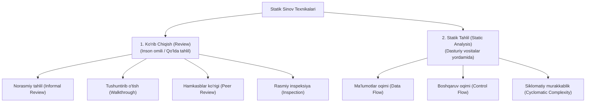

import { Callout } from 'nextra/components'

# Statik Sinov (Static Testing)

**Statik sinov (Static Testing)** — dasturiy ta'minot kodini bevosita kompyuterda ishga tushirmasdan (*Execution* qilmasdan), talablar, dizayn hujjatlari va manba kodini tekshirish hamda tahlil qilish orqali xatoliklarni aniqlash usulidir.

Ushbu jarayon dasturiy ta'minot sifatini ta'minlashda **Tekshiruv (Verification)** bosqichining asosi hisoblanadi va eng kam xarajat bilan nuqsonlarni bartaraf etishga imkon beradi.

---

## Statik Sinov Nima? (What is Static Testing?)

Dasturiy ta'minotni ishlab chiqishda xatoliklar qanchalik kech aniqlansa, ularni tuzatish shunchalik qimmatga tushadi. Statik sinov loyihaning eng dastlabki bosqichlaridanoq (talablar yig'ish, arxitektura loyihalash va kod yozish davrida) boshlanadi.

Statik sinovda dastur kodi yoki hujjatlar **qo'lda (ko'rib chiqish / review orqali)** yoki **avtomatlashtirilgan vositalar (linterlar, statik tahlilchilar)** yordamida chuqur o'rganiladi.

<Callout type="info">
**Statik sinovning oltin qoidasi:**  
Statik sinov orqali dasturiy ta'minotdagi xatolarning 60% dan ortig'ini kodni ishga tushirishdan oldinoq aniqlash va bartaraf etish mumkin.
</Callout>

---

## Nega Statik Sinov O'tkaziladi?

1. **Unumdorlikni oshirish:** Dasturchilar va testchilar xatolarni kechikib emas, boshidanoq tushunib ishlaydi.
2. **Erta bosqichda nuqsonlarni topish:** Talablar va arxitekturadagi chalkashliklarni kod yozilishidan oldin to'g'rilash imkonini beradi.
3. **Xarajat va vaqtni tejash:** Dinamik sinovda xatolarni topish, qayta tekshirish va muhitni sozlash katta vaqt talab etadi; statik sinov esa bu xarajatlarni keskin kamaytiradi.
4. **Dinamik sinovda topib bo'lmaydigan xatolarni aniqlash:** Ishlatilmaydigan o'lik kodlar (*Dead code*), standartlarga mos kelmaydigan tuzilmalar va xavfsizlik zaifliklarini ochib beradi.

---

## Statik Sinovda Nimalar Tekshiriladi?

Statik sinov qamrovi faqat dastur kodi bilan cheklanmaydi. Quyidagi barcha hujjatlar va artefaktlar tekshiriladi:

| Hujjat / Artefakt | Tekshirish Maqsadi va Mazmuni |
| :--- | :--- |
| **BRD (Biznes talablari hujjati)** | Biznes ehtiyojlarining to'g'ri va to'liq aks ettirilganligi. |
| **SRS (Dastur talablari spetsifikatsiyasi)** | Funksional va nofunksional talablarning aniqligi va ziddiyatsizligi. |
| **Use Cases (Foydalanish ssenariylari)** | Yakuniy foydalanuvchi amallari, kiruvchi va chiquvchi ma'lumotlar mantiqi. |
| **Dizayn va Prototip (Mockup/UI)** | Foydalanuvchi interfeysining talablarga muvofiqligi. |
| **Ma'lumotlar bazasi lug'ati (DB Dictionary)** | Maydonlar turlari, cheklovlar, jadvallararo munosabatlar. |
| **Test hujjatlari (Test Plan, Test Cases)** | Test qamrovi, test-keyslarning aniqligi va RTM matritsasi. |
| **Manba kodi (Source Code)** | Kodlash standartlariga rioya qilinganligi, xavfsizlik va sintaksis. |

---

## Statik Sinov Texnikalari (Static Testing Techniques)

Statik sinov ikki asosiy yo'nalishga bo'linadi: **Ko'rib chiqish (Review)** va **Statik tahlil (Static Analysis)**.

---

### 1. Ko'rib Chiqish Texnikalari (Review)

Ko'rib chiqish jarayonida jamoa a'zolari hujjatlar yoki kodni birgalikda tahlil qilib, noaniqliklar va kamchiliklarni aniqlaydilar:

1. **Norasmiy tahlil (Informal Review):**
   - Hujjat muallifi o'z ishini hamkasblariga ko'rsatadi va norasmiy fikr-mulohazalar (*Feedback*) oladi.
   - Maxsus qoidalar va yig'ilish bayonnomalari talab etilmaydi.
2. **Tushuntirib o'tish (Walkthrough):**
   - Hujjat yoki kod muallifi ishtirokchilarga materialni bosqichma-bosqich, qadamma-qadam tushuntirib beradi.
   - Asosiy maqsad — jamoani loyiha mantiqi bilan tanishtirish va umumiy tushunchaga kelish.
3. **Hamkasblar ko'rigi (Peer / Technical Review):**
   - Bir xil malakadagi mutaxassislar (masalan, dasturchi dasturchining kodini, QA boshqa QA'ning test-keyslarini) o'rganib chiqib, texnik jihatdan baholaydilar (*Code Review*).
4. **Rasmiy inspeksiya (Inspection):**
   - Eng qat'iy va rasmiy ko'rib chiqish shakli.
   - Maxsus tayyorlangan nazorat ro'yxatlari (*Checklists*), tayinlangan moderator va qat'iy qoidalar asosida olib boriladi (masalan, me'moriy arxitektura yoki SRS inspeksiyasi).

---

### 2. Statik Tahlil (Static Code Analysis)

Statik tahlil dastur kodini ishga tushirmasdan, maxsus avtomatlashtirilgan dasturlar orqali chuqur tekshirish jarayonidir.

**Statik tahlil aniqlaydigan asosiy xatoliklar:**
- **O'lik kod (Dead code):** Hech qachon bajarilmaydigan yoki chaqirilmaydigan kod qismlari.
- **Ishlatilmagan o'zgaruvchilar (Unused variables):** E'lon qilingan, ammo dasturda foydalanilmagan elementlar.
- **Cheksiz sikllar (Endless loops):** To'xtash sharti xato yozilgan zanjirlar.
- **Noto'g'ri sintaksis va uslubiy xatolar:** Dasturlash tili standartlarining buzilishi.
- **Qiymati belgilanmagan o'zgaruvchilar (Undefined variables):** Initsializatsiya qilinmagan xotira murojaatlari.

#### Statik Tahlilning 3 Muhim Qismi:
- **Ma'lumotlar oqimi (Data Flow):** O'zgaruvchilar qayerda yaratilgani, qayerda o'zgartirilgani va qayerda o'chirilishini tahlil qilish.
- **Boshqaruv oqimi (Control Flow):** Dastur buyruqlari va shartlarining ketma-ketlik tartibini o'rganish.
- **Siklomatiy murakkablik (Cyclomatic Complexity):** Kodning mantiqiy tarmoqlanishi va mustaqil yo'llari sonini o'lchash (murakkablik qanchalik yuqori bo'lsa, xatolar ehtimoli shunchalik ko'p bo'ladi).

---

## Ommabop Statik Sinov Vositalari (Tools)

Kod sifatini va standartlarga muvofiqligini tekshirishda quyidagi yetakchi vositalardan foydalaniladi:

- **CheckStyle:** Java dasturlash tili uchun eng mashhur linter bo'lib, kodning kompaniya standartlariga (masalan, Google Java Style yoki Sun Conventions) mosligini avtomatik tekshiradi.
- **SourceMeter:** C/C++, C#, Java, Python kabi ko'plab tillardagi loyihalarni chuqur tahlil qilib, zaif va xatarli nuqtalarni aniq ko'rsatib beruvchi ilg'or vosita.
- **Soot:** Java va Android dasturlarini tahlil qilish, optimallashtirish va bayt-kod darajasida tekshirish uchun ixtisoslashgan freymvork.
- **SonarQube / ESLint:** Zamonaviy dasturlashda kod sifati, xavfsizlik teshiklari va texnik qarzni (*Technical Debt*) doimiy nazorat qiluvchi keng tarqalgan platformalar.

---

## Statik Sinov va Dinamik Sinov Farqlari

| Solishtirish Mezoni | Statik Sinov (Static Testing) | Dinamik Sinov (Dynamic Testing) |
| :--- | :--- | :--- |
| **Kodni bajarish** | Kod **bajarilmaydi (ishga tushirilmaydi)**. | Kod albatta **ishga tushiriladi va bajariladi**. |
| **Jarayon turi** | **Tekshiruv (Verification)** — "Mahsulotni to'g'ri qurayapmizmi?" | **Tasdiqlash (Validation)** — "To'g'ri mahsulot qurayapmizmi?" |
| **Qachon o'tkaziladi?** | SDLC'ning eng erta bosqichlarida (kodlashdan oldin va davomida). | Kod tayyor bo'lib, dastur ishga tushirilgandan so'ng. |
| **Nimani aniqlaydi?** | Xatoliklarning **asosiy sababini (Cause / Flaw)**. | Dasturdagi **nosozlik va oqibatlarni (Failure / Defect)**. |
| **Xarajat va vaqt** | Kam xarajatli, juda tez va samarali. | Qimmatroq va ko'proq vaqt talab qiladi. |
| **Asosiy usullari** | Ko'rib chiqish (Reviews), Inspeksiya, Linterlar, Statik tahlil. | Funksional, integratsion, yuklama va tizimli sinovlar. |

---

## Xulosa

Statik sinov (Static Testing) dasturiy ta'minot sifatini ta'minlashning eng arzon va eng samarali usulidir. Hujjatlarni puxta ko'rib chiqish va kodni avtomatlashtirilgan statik vositalar bilan tahlil qilish orqali jamoa keyingi dinamik sinovlar bosqichida yuzaga kelishi mumkin bo'lgan yuzlab qiyin muammolarning oldini oladi.
