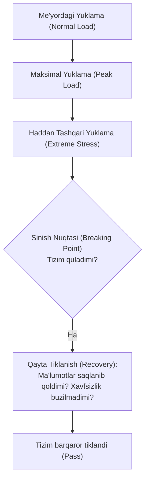
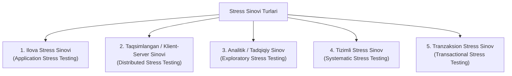

import { Callout } from 'nextra/components'

# Stress Sinovi (Stress Testing)

**Stress sinovi (Stress Testing)** — dasturiy ta'minotning me'yordagi operatsion quvvatidan ancha yuqori bo'lgan haddan tashqari yuklama (*Extreme Overload*) ostida o'zini qanday tutishi, qachon va qanday sharoitda **qulashini (Breaking Point)** hamda nosozlikdan so'ng qayta tiklanish qobiliyatini (*Recoverability*) aniqlash uchun o'tkaziladigan nofunksional sinov turidir.

Ushbu sinov dasturiy ta'minot sohasida **Chidamlilik sinovi (Endurance Testing)**, **Toliqish sinovi (Fatigue Testing)** yoki **Qiynoq sinovi (Torture Testing)** deb ham ataladi.

---

## Stress Sinovi Nima? (What is Stress Testing?)

Agar Yuklama sinovida dasturning kutilgan maksimal oqimda to'g'ri ishlashi tekshirilsa, Stress sinovida dastur ataylab **resurslar yetishmovchiligi (CPU 100%, operativ xotira to'lishi, disk maydoni tugashi yoki tarmoqning uzilishi)** darajasiga olib boriladi.

**Stress sinovining asosiy maqsadi** — dastur nosozlikka uchragan taqdirda ham uning "chiroyli va xavfsiz" qulashini (*Graceful Degradation*), ma'lumotlarni yo'qotmasligini va kiberxavfsizlik teshiklari yuzaga kelmasligini tekshirishdir.

<Callout type="info">
**Stress sinovining asosiy savoli:**  
"Tizim qachon qulaydi, qulagan paytda qanday xato xabari ko'rsatadi, ma'lumotlar bazasidagi tranzaksiyalar saqlanib qoladimi va tizim qayta ishga tushganda o'zini qanday tiklaydi?"
</Callout>

---

## Nega Stress Sinovi Zarur? (Hayotiy Misollar)

1. **Favqulodda xabarlar va OAV saytlari:** 
   - Mashhur insonlarning to'satdan vafot etishi (masalan, Maykl Jekson vafot etgan kuni dunyodagi eng yirik yangiliklar saytlarining 80% qismi qulagan) yoki global yangiliklar tarqalganda axborot saytlariga bir daqiqada millionlab odam yopiriladi.
2. **Imtihon va ta'lim natijalari saytlari:**
   - Davlat test markazi yoki oliygohlar mandat natijalarini e'lon qilgan soniyada yuz minglab abituriyentlar bir vaqtning o'zida tizimga kiradi. Stress sinovidan o'tmagan tizimlar bir necha soatlab ishlamay qoladi.
3. **Chegirmalar va Flash-Savdolar:**
   - Katta bayramlarda e-tijorat tizimlarida qisqa vaqtli ulkan yuklama to'lqini (*Spike*) paydo bo'ladi. Tizim bu bosimga dosh bera olmasa, biznes millionlab dollarlik savdoni yo'qotadi.

---

## Stress Sinovining Asosiy Vazifalari va Maqsadlari

- **Tizim resurslari tugaganda qulamasligini tekshirish:** Xotira (RAM) yoki disk to'lganda dastur boshqaruvsiz to'xtab qolmasligi kerak.
- **Xavfsiz qulash va ma'lumotlar butunligi (Data Integrity):** Tizim qulaganda bazadagi ma'lumotlar buzilmasligi yoki shaxsiy ma'lumotlar ruxsatsiz ochilib qolmasligi shart.
- **Tushunarli xato xabarlari:** Foydalanuvchiga texnik tushunarsiz kodlar o'rniga "Hozirda tizimda yuklama yuqori, iltimos 2 daqiqadan so'ng qayta urinib ko'ring" kabi to'g'ri xabarlar chiqarish.
- **Avtomatik qayta tiklanish (Recoverability):** Haddan tashqari yuklama to'lqini pasaygach, tizim inson aralashuvisiz o'zini qayta o'nglay olishi lozim.

---

## Stress Sinovining Turlari

Stress sinovi o'zining yo'nalishiga ko'ra 5 ta asosiy turga bo'linadi:

### 1. Ilova Stress Sinovi (Application Stress Testing)
Faqat dasturning o'ziga e'tibor qaratadi: tarmoq tiqilinchi, ma'lumotlar bazasida qulflanishlar (*Deadlocks*) va ichki xotira sizib chiqishini aniqlaydi.

### 2. Taqsimlangan / Klient-Server Stress Sinovi (Distributed Stress Testing)
Bir vaqtning o'zida barcha klientlar serverga ulanganida serverning taqsimlangan yuklamani qanday boshqarishini tekshiradi (masalan, server A va B klientlarga javob berib, C va D bilan aloqani uzib qo'ymasligini aniqlash).

### 3. Analitik / Tadqiqiy Stress Sinov (Exploratory Stress Testing)
Haqiqiy hayotda kamdan-kam sodir bo'ladigan favqulodda ssenariylarni tekshirish:
- Ma'lumotlar bazasiga bir zumda haddan tashqari ulkan fayllar kiritilishi;
- Foydalanuvchi to'lov qilayotgan soniyada ma'lumotlar bazasi serverining to'satdan o'chib qolishi.

### 4. Tizimli Stress Sinov (Systematic Stress Testing)
Bitta umumiy serverda ishlayotgan bir nechta turli ilovalarni bir vaqtda sinash (bir ilovaning resurslarni to'liq egallab olib, qo'shni ilovalarni to'xtatib qo'ymasligini tekshirish).

### 5. Tranzaksion Stress Sinov (Transactional Stress Testing)
Turli xizmatlar va dasturlar o'rtasida millionlab tranzaksiyalar (masalan, banklararo to'lovlar) parallel o'tganda tranzaksiyalar xavfsizligini ta'minlash.

---

## Stress Sinovini O'tkazishning 7 Bosqichi

1. **Muhitni aniqlash:** Apparat, dasturiy va tarmoq parametrlarini to'liq belgilab olish.
2. **Kriteriyalarni belgilash:** Sinish nuqtasi qayerdaligini (masalan, CPU 95% ga yetganda yoki soniyasiga 5000 so'rovdan oshganda) belgilash.
3. **Sinovni rejalashtirish va loyihalash:** Haddan tashqari yuklama ssenariylarini ishlab chiqish.
4. **Muhitni sozlash va vositalarni tayyorlash.**
5. **Sinov skriptlarini tayyorlash.**
6. **Sinovni ishga tushirish:** Yuklamani tizim qulaguncha muntazam oshirib borish.
7. **Natijalarni tahlil qilish va xulosalar:** Dastur qanday qulaganligi va tiklanish vaqtini o'lchash.

---

## Ommabop Stress Sinovi Vositalari (Tools)

- **Apache JMeter:** Haddan tashqari ko'p sonli parallel so'rovlarni yaratish va stress nuqtasini aniqlashda eng mashhur vosita.
- **Locust:** Python tilida yozilgan taqsimlangan stress testlari uchun ajoyib yechim.
- **NeoLoad:** Korporativ veb va mobil ilovalar uchun chuqur tahlilli stress sinov platformasi.
- **OpenText LoadRunner:** Barcha tizim ko'rsatkichlarini real vaqt rejimida kuzatuvchi professional sanoat vositasi.

---

## Xulosa

Stress sinovi (Stress Testing) dasturiy ta'minotning favqulodda vaziyatlarga shayligini sinovdan o'tkazadi. Tizimning qulash chegarasini oldindan bilish va uni to'g'ri boshqarish orqali loyihaning ishonchliligi, barqarorligi va foydalanuvchilar ma'lumotlarining daxlsizligi to'liq ta'minlanadi.
