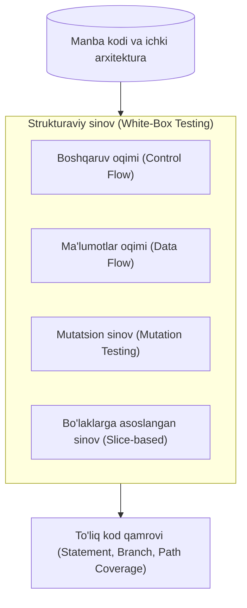
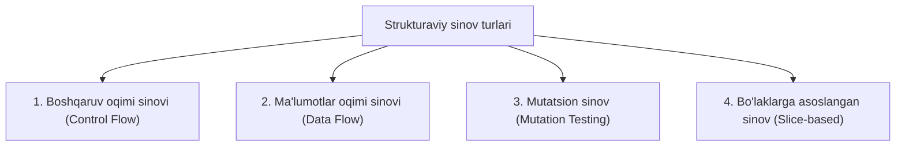

import { Callout } from 'nextra/components'

# Strukturaviy sinov (Structural Testing)

**Strukturaviy sinov (Structural Testing)** — bu dasturiy ta'minotning tashqi xulq-atvorini emas, balki uning **ichki arxitekturasi, mantiqiy tuzilishi va manba kodini** tekshirishga qaratilgan sinov usulidir.

U odatda **Oq quti (White-box testing)**, **Shaffof quti (Clear-box testing)** yoki **Shisha quti (Glass-box testing)** deb ham ataladi. Ushbu sinovni amalga oshirish dasturlash tillari, algoritmlar va ma'lumotlar oqimini chuqur bilishni talab etadi.

---

## Funksional (Qora quti) va Strukturaviy (Oq quti) sinov farqi

| Xususiyat | Funksional sinov (Black-Box) | Strukturaviy sinov (White-Box) |
| :--- | :--- | :--- |
| **Tekshirish sohasi** | Tizim talablari va tashqi xulq-atvori | Dasturning ichki kodi va mantiqiy yo'llari |
| **Kodga kirish huquqi** | Manba kodi ko'rinmaydi | Manba kodi to'liq ochiq va tahlil qilinadi |
| **Bajaruvchilar** | QA muhandislari, foydalanuvchilar | Dasturchilar va oq quti test muhandislari |
| **Foydalaniladigan daraja** | Tizimli va qabul sinovlarida | Birlik (Unit) va integratsiya sinovlarida |

---

## Strukturaviy sinovning to'rtta asosiy turi

### 1. Boshqaruv oqimi sinovi (Control Flow Testing)
* Dastur kodi orqali buyruqlarning bajarilish ketma-ketligi grafik (Control Flow Graph — CFG) ko'rinishida ifodalanadi.
* Asosiy e'tibor quyidagi qamrovlarga (Coverage) qaratiladi:
  * **Statement Coverage:** Kodning har bir qatori kamida bir marta bajarilganligini tekshirish;
  * **Branch / Decision Coverage:** Har bir shart operatorining (`if/else`) `True` va `False` shoxlari sinab ko'rilganligini tekshirish;
  * **Path Coverage:** Kod orqali o'tishi mumkin bo'lgan barcha mumkin bo'lgan yo'llarni to'liq qamrab olish.

### 2. Ma'lumotlar oqimi sinovi (Data Flow Testing)
* Dasturdagi o'zgaruvchilarning hayotiy siklini kuzatish:
  * O'zgaruvchini e'lon qilish (**Definition - d**);
  * O'zgaruvchiga qiymat berish va uni o'qish (**Usage - u**);
  * O'zgaruvchini o'chirish yoki xotiradan bo'shatish (**Kill - k**).
* Maqsad: E'lon qilinmasdan ishlatilgan yoki qiymat berilib hech qayerda foydalanilmagan "o'lik kod" (Dead code) va xotira sizib chiqishlarini aniqlash.

### 3. Mutatsion sinov (Mutation Testing)
* Kodga ataylab mayda o'zgarishlar kiritilib, testlarning bu xatoni seza olish qobiliyati tekshiriladi (testlarning samaradorligi baholanadi).

### 4. Bo'laklarga asoslangan sinov (Slice-based Testing)
* Katta va murakkab dasturiy kodni alohida mantiqiy bo'laklarga (slices) ajratib olib, har bir qismning ishlashini alohida tahlil qilish.
* Bu usul eski va ulkan kod bazalarini (legacy code) refaktoring qilish va nosozliklarni izolyatsiya qilishda juda qo'l keladi.

---

## Strukturaviy sinov vositalari

* **JUnit / TestNG:** Java dasturchilari uchun birlik va strukturaviy testlarni yozish freymvorklari;
* **JaCoCo / Istanbul (NYC):** Kod qamrovini (Statement, Branch, Line coverage) hisoblab beruvchi ommabop vositalar;
* **Cfix:** C va C++ tillarida yozilgan tizimlar va drayverlarni sinash uchun mo'ljallangan xUnit freymvorki;
* **SonarQube:** Kodning ichki strukturaviy sifatini, texnik qarzni va murakkablikni (Cyclomatic Complexity) tahlil qiluvchi statik analizator.

---

## Afzalliklari va Kamchiliklari

### Afzalliklari
* Yashirin mantiqiy xatoliklarni, ortiqcha kod qatorlarini va yozilmagan shartlarni erta bosqichda aniqlaydi.
* Kodning ichki sifatini, tozaligini va arxitektura mustahkamligini oshiradi.
* Test qamrovini (Code Coverage) matematik aniqlikda o'lchash imkonini beradi.

### Kamchiliklari
* Dasturlash va kod tuzilishini chuqur tushunishni talab qiladi (faqat maxsus dasturchi-testchilar bajara oladi).
* Juda murakkab tizimlarda barcha shox va yo'llarni qamrab olish ko'p vaqt va mablag' talab qiladi.
* Kod talablarga muvofiq bo'lsa ham, agar talabning o'zi noto'g'ri bo'lsa, strukturaviy test bu xatoni aniqlay olmaydi.
