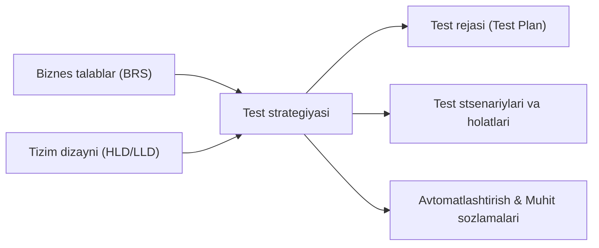
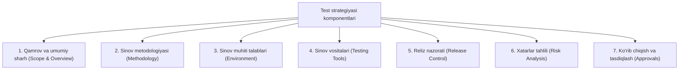

import { Callout } from 'nextra/components'

# Test strategiyasi (Test Strategy)

**Test strategiyasi (Test Strategy)** — dasturiy ta'minotni ishlab chiqish hayotiy siklida (SDLC) mahsulotni sinash yondashuvini, sinov darajalari va turlarini belgilab beruvchi yuqori darajadagi (high-level) rasmiy hujjatdir. U loyiha davomida qanday sinov faoliyatlari bajarilishi, qanday vositalar va resurslar ishlatilishi hamda sifat maqsadlariga qay tartibda erishilishini aniq ko'rsatib beradi.

Odatda Test strategiyasi loyihaning talablar bosqichida ishlab chiqiladi, Loyiha menejeri (Project Manager), Dasturlash yetakchisi (Development Lead) va QA menejeri tomonidan ko'rib chiqilib tasdiqlanadi. Bir marta tasdiqlangandan so'ng, ushbu hujjat odatda o'zgarmas (statik) hisoblanadi va loyihaning butun hayotiy sikli uchun asosiy yo'riqnoma bo'lib xizmat qiladi.

---

## Test strategiyasining asosiy maqsadi

Test strategiyasining tub maqsadi barcha manfaatdor tomonlar (stakeholders) o'rtasida sifat nazorati bo'yicha yagona tushuncha va kelishuvni ta'minlashdir:

- Sinov jarayonining to'liq qamrovini (coverage) va maqsadlarini aniq belgilash.
- Resurslarni rejalashtirish, jamoa a'zolarining roli va mas'uliyatini taqsimlash.
- Sinov darajalari, integratsiya tartiblari va mos keluvchi metodologiyalarni muvofiqlashtirish.
- Kutilayotgan texnik va tashkiliy xatarlarni (risks) oldindan aniqlash va ularni kamaytirish rejalarini tuzish.

---

## Asosiy xususiyatlari

1. **Yuqori darajali hujjat:** Test rejasi (Test Plan) kabi tez-tez yangilanmaydi; loyiha yoki butun tashkilot miqyosida barqaror qoladi.
2. **BRS va Dizayn hujjatlariga asoslanadi:** Asosan Biznes talablar spetsifikatsiyasi (BRS) va Tizim arxitekturasi hujjatlaridan kelib chiqadi.
3. **Rahbariyat tomonidan tasdiqlanadi:** QA Lead, Development Manager, Product Manager va Project Manager tomonidan sinchkovlik bilan ko'rib chiqilib tasdiqlanadi.
4. **Yo'naltiruvchi xarakter:** Test muhandislari va avtomatlashtiruvchilar uchun testlarni bajarish va boshqarish jarayonlarida qat'iy standart va yo'riqnoma vazifasini o'taydi.

---

## Test strategiyasi hujjatining asosiy komponentlari

To'liq va mukammal tuzilgan Test strategiyasi 7 ta muhim komponentni o'z ichiga oladi:

### 1. Qamrov va umumiy sharh (Scope and Overview)
Hujjatning kimlar uchun mo'ljallangani, uni kim tasdiqlashi va foydalanishi kerakligi bayon qilinadi. Qaysi modullar sinovdan o'tkazilishi (In-Scope) va qaysilari sinov qilinmasligi (Out-of-Scope) aniq chegaralab beriladi.

### 2. Sinov metodologiyasi (Testing Methodology)
Amalda qo'llaniladigan sinov darajalari (Unit, Integration, System, Acceptance), sinov turlari, jamoa a'zolarining rollari va o'zgarishlarni boshqarish (Change Management) tartibi ko'rsatiladi.

### 3. Sinov muhiti spetsifikatsiyasi (Testing Environment Specifications)
Kerakli test muhitlari soni, server konfiguratsiyalari, apparat va dasturiy ta'minot parametrlari hamda test ma'lumotlarini (Test Data) tayyorlash yo'riqnomalari o'rin oladi. Shuningdek, ma'lumotlar yo'qolishining oldini olish uchun zaxira nusxalash (backup & restore) rejalari kiritiladi.

### 4. Sinov vositalari (Testing Tools)
Loyiha doirasida ishlatiladigan test boshqaruvi (Jira, TestRail), xatoliklarni kuzatish, yuklama va samaradorlikni baholash (JMeter, k6) hamda avtomatlashtirish freymvorklari (Playwright, Cypress, Selenium) ko'rsatib o'tiladi.

### 5. Reliz nazorati (Release Control)
Dasturiy mahsulot versiyalarini sinovdan o'tkazish va ishlab chiqarish (production) muhitiga chiqarish jarayonlari, versiyalar nazorati va reliz boshqaruvi standartlari tartibga solinadi.

### 6. Xatarlar tahlili (Risk Analysis)
Sinov jarayoniga salbiy ta'sir ko'rsatishi mumkin bo'lgan barcha potensial xatarlar (resurs yetishmovchiligi, muhit kechikishi, murakkab uchinchi tomon integratsiyalari) sanab o'tiladi va ularni bartaraf etish bo'yicha favqulodda rejalar (Contingency Plans) tuziladi.

### 7. Ko'rib chiqish va tasdiqlash (Review and Approvals)
Hujjat tizim ma'murlari, loyiha boshqaruvi, dasturlash va biznes tahlil guruhlari tomonidan ko'rib chiqiladi. Tasdiqlovchi shaxs ismi, lavozimi, sanasi va imzolangan versiya o'zgarishlar tarixi qayd etiladi.

---

## Test strategiyalari turlari

Dasturiy ta'minot xususiyatiga va loyiha yondashuviga qarab 7 xil asosiy test strategiyasi qo'llaniladi:

| Strategiya turi | Asosiy mohiyati | Misol / Qo'llanish sohasi |
| :--- | :--- | :--- |
| **Metodik (Methodical)** | Aniq belgilangan nazorat ro'yxatlari (checklists) va sifat standartlariga (masalan, ISO 25000) tayanadi. | Xavfsizlik auditi, standart talablariga moslik tekshiruvi. |
| **Reaktiv (Reactive)** | Sinovlar dastur tayyor bo'lgandan keyin, aniqlangan xatolar va tizim xatti-harakatiga qarab yo'naltiriladi. | Tadqiqiy sinov (Exploratory testing), favqulodda xatoliklarni tuzatish. |
| **Analitik (Analytical)** | Talablar va xatarlarni chuqur tahlil qilishga asoslanadi; testlar xatar darajasiga qarab loyihalanadi. | Xatarga asoslangan sinov (Risk-based testing), talablar qamrovi tahlili. |
| **Standartlarga mos (Standards/Process Compliant)** | Sanoat qoidalari, standartlar yoki aniq boshqaruv uslubiyatlariga (Scrum, FDA, avtomobilsozlik) asoslanadi. | Tibbiy uskunalar (FDA qoidalari), aerokosmik va moliyaviy tizimlar. |
| **Modelga asoslangan (Model-based)** | Dasturning kirish-chiqish parametrlari, holatlari va xatti-harakatlari bo'yicha matematik yoki mantiqiy modellar yaratiladi. | Murakkab apparat-dasturiy drayverlar, telekommunikatsiya protokollari. |
| **Regressiyadan qochish (Regression Averse)** | Mavjud ishlab turgan funksiyalarning buzilmasligini ta'minlashga urg'u beradi; avtomatlashtirishdan keng foydalaniladi. | Har kungi CI/CD relizlari, katta veb va mobil ilovalarning yangilanishlari. |
| **Konsultativ (Consultative)** | Asosiy foydalanuvchilar, biznes ekspertlari va mijozlar fikri, talablari asosida ustuvorliklar belgilanadi. | Ko'p brauzerli va ko'p qurilmali foydalanuvchi interfeyslari sinovi. |

<Callout type="info">
Bitta loyihada yuqoridagi strategiyalarning bir nechtasi birgalikda aralash (gibrid) tarzda qo'llanilishi mumkin. Masalan, moliyaviy tizimda **Analitik (Risk-based)**, **Standartlarga mos (ISO)** va **Regressiyadan qochish** strategiyalari birlashtiriladi.
</Callout>

---

## Test strategiyasini tanlash omillari

Tegishli test strategiyasini to'g'ri tanlash uchun quyidagi omillar inobatga olinadi:

1. **Tashkilot turi va ko'lami:** Katta korporatsiyalarda rasmiy va standartlarga asoslangan strategiyalar ustuvor bo'lsa, startaplarda reaktiv va tadqiqiy usullar samaraliroq bo'lishi mumkin.
2. **Mahsulot xususiyatlari va xavfsizlik darajasi:** Inson hayoti yoki katta moliyaviy oqibatlarga ega bo'lgan tizimlar (tibbiyot, bank, avtomatika) o'ta qat'iy analitik va standartlarga asoslangan yondashuvni talab qiladi.
3. **Ishlab chiqish modeli (SDLC):** Agile/Scrum modellarida iterativ, avtomatlashtirishga va regressiyani minimallashtirishga qaratilgan strategiyalar tanlanadi.

---

## Test rejasi (Test Plan) va Test strategiyasi (Test Strategy) farqi

| Xususiyati | Test rejasi (Test Plan) | Test strategiyasi (Test Strategy) |
| :--- | :--- | :--- |
| **Hujjat darajasi** | Loyiha yoki alohida bosqich darajasida (Low/Mid-level). | Tashkilot yoki butun mahsulot darajasida (High-level). |
| **O'zgaruvchanligi** | Loyiha davomida talablar va muddatlarga qarab tez-tez o'zgaradi. | Odatda o'zgarmas qoladi, uzoq muddatli yondashuvni belgilaydi. |
| **Kim tomonidan tuziladi?** | Test Team Lead yoki QA muhandisi. | QA Menejeri, Loyiha menejeri yoki Loyiha direktori. |
| **Fokus markazi** | Nima, qachon va kim tomonidan sinovdan o'tkazilishi (jadval, muddat). | Qanday umumiy metodologiya va prinsiplar asosida sinov o'tkazilishi. |

<Callout type="warning">
Test rejasi va Test strategiyasini chalkashtirmaslik muhim: Strategiya — umumiy tamoyillar va yo'nalishni ko'rsatuvchi "yo'l xaritasi" bo'lsa, Reja — aniq vazifalar, ijrochilar va muddatlar aks etgan "kundalik taqvim" hisoblanadi.
</Callout>
