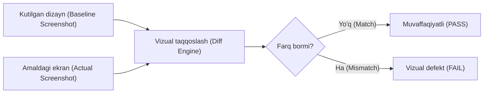
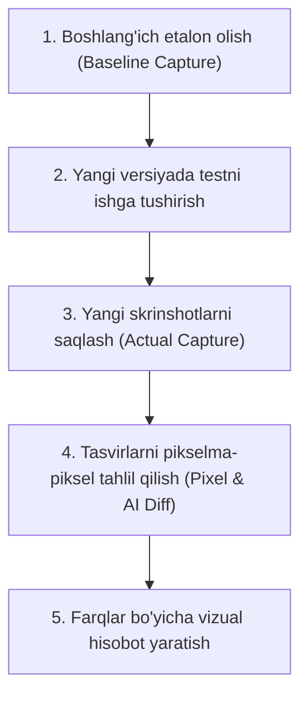

import { Callout } from 'nextra/components'

# Vizual sinov (Visual Testing)

**Vizual sinov (Visual Testing)** — bu dasturiy ta'minotning foydalanuvchi interfeysi (UI) va grafik elementlarining to'g'ri ko'rinishi, joylashuvi hamda kutilgan dizaynga mosligini tekshirish uchun qo'llaniladigan sinov usulidir.

U dasturning ekrandagi kutilgan ko'rinishi (baseline/expected) bilan amaldagi natijasini (actual) solishtirish orqali piksel darajasidagi yoki kompozitsion farqlarni aniqlashga xizmat qiladi.

---

## Visual Testing nima?

Standart funksional testlar elementning DOM (Document Object Model) daraxtida mavjudligini va uning bosilishini tekshirishi mumkin, ammo element boshqa bir element ostida qolib ketganini, matn kesilib qolganini yoki rang noto'g'ri ko'rsatilayotganini aniqlay olmaydi. 

**Vizual sinov aynan quyidagi elementlarni tekshiradi:**
* **Maket va joylashuv (Layout):** Elementlarning bir-biriga nisbatan to'g'ri joylashishi, oraliq masofalari (margins, paddings).
* **Shrift va tipografiya (Typography):** Shrift o'lchami, qalinligi, qatorlar balandligi va matnlarning sig'ishi.
* **Ranglar va vizual effektlar:** Ranglar palitrasi, shaffoflik (opacity), soyalar va chegara (border) chiziqlari.
* **Moslashuvchanlik (Responsiveness):** Turli ekran o'lchamlari (Desktop, Tablet, Mobile) va rezolyutsiyalarda dizaynning buzilmasligi.
* **Tugmalar, piktogrammalar va rasmlar:** Ikonkalar va rasmlarning to'g'ri renderlanishi.

<Callout type="info">
Vizual sinov jarayonida ko'pincha test jarayonining to'liq skrinshotlari, video yozuvlari va loglari saqlanadi. Bu ishlab chiquvchilarga defektni tezda takrorlash (reproduce) va tuzatish imkonini beradi.
</Callout>

---

## Vizual tekshirish qanday ishlaydi?

Vizual testlash tizimi (Visual Inspection / Regression System) asosan quyidagi bosqichlardan iborat:

1. **Etalon tasvir (Baseline Capture):** Dasturning to'g'ri deb tasdiqlangan holatidan skrinshot olinadi va etalon sifatida saqlanadi.
2. **Sinov ijrosi va yangi tasvir:** Kod o'zgargandan keyin avtomatlashtirilgan yoki qo'lda test ishga tushirilib, joriy ekranning skrinshoti olinadi.
3. **Taqqoslash algoritmi:** Solishtirish dvigateli (Pixelmatch yoki AI asosidagi taqqoslash) ikki tasvir orasidagi eng kichik o'zgarishlarni ham ajratib ko'rsatadi (odatda qizil yoki binafsha rang bilan).
4. **Tahlil va qaror:** Test muhandisi aniqlangan farq haqiqiy defektmi (bug) yoki ataylab kiritilgan yangi dizayn o'zgarishimi (intentional change) ekanligini tasdiqlaydi.

---

## Funksional sinov va Vizual sinov farqi

| Xususiyat | Funksional sinov (Functional Testing) | Vizual sinov (Visual Testing) |
| :--- | :--- | :--- |
| **Maqsad** | Dasturning mantiqiy ishlashini tekshirish | Tashqi ko'rinish va UI dizaynini tekshirish |
| **Misol** | "Kirish" tugmasi bosilganda tizimga kiradimi? | "Kirish" tugmasi matn bilan to'qnashib ketmaganmi, rangi to'g'rimi? |
| **Tekshirish sohasi** | DOM atributlari, API javoblari, ma'lumotlar oqimi | Piksellar, shriftlar, maket, ranglar, moslashuvchanlik |
| **E'tibordan chetda qoladigan xatolar** | Elementning ko'rinmasligi, noto'g'ri joylashuvi | Ichki biznes-mantiqdagi xatoliklar |

---

## Vizual sinovning afzalliklari va kamchiliklari

### Afzalliklari
* **Aloqa va muloqot samaradorligi:** Xatolik matn bilan tushuntirilgandan ko'ra, aniq skrinshot yoki video orqali ko'rsatilganda ishlab chiquvchi muammoni ancha tez anglaydi.
* **Vaqt va mablag'ni tejash:** Dizayn buzilishlarini qo'lda birma-bir tekshirishdan ko'ra, avtomatlashtirilgan vizual testlar soniyalar ichida yuzlab sahifalarni solishtiradi.
* **Kross-platforma barqarorligi:** Barcha brauzerlar (Chrome, Safari, Firefox, Edge) va turli qurilmalarda dizayn bir xil chiqishini kafolatlaydi.
* **Regressiyadan himoya:** Kichik CSS o'zgarishi butun tizim bo'ylab boshqa sahifalarni buzib qo'yishining oldini oladi.

### Kamchiliklari
* **Soxta signallar (False positives):** Dinamik kontent (masalan, joriy sana, dinamik bannerlar) yoki rendering dvigatellarining mikroskopik piksel farqlari tufayli testlar xato deb ko'rsatishi mumkin.
* **Faqat ko'rinadigan qism bilan cheklanish:** Dasturning ichki arxitekturasi yoki yashirin backend xatoliklarini aniqlay olmaydi.
* **Etalonlarni (Baselines) yangilab turish xarajati:** Dizayn tez-tez o'zgarib turganda etalon tasvirlarni muntazam ravishda qayta tasdiqlash talab etiladi.

---

## Ommabop vizual test vositalari

Zamonaviy QA amaliyotida eng ko'p qo'llaniladigan vositalar:

* **Applitools Eyes:** Sun'iy intellekt (AI) asosidagi vizual sinov vositasi;
* **Percy (BrowserStack):** Veb va mobil ilovalar uchun avtomatlashtirilgan vizual regressiya platformasi;
* **Playwright / Cypress Visual Regression:** Keng ommalashgan freymvorklarning vizual skrinshot taqqoslash plaginlari;
* **Chromatic:** Storybook komponentlari uchun ixtisoslashgan vizual test vositasi;
* **BackstopJS:** Ochiq manbali va konfiguratsiya qilish qulay bo'lgan vizual test vositasi.
