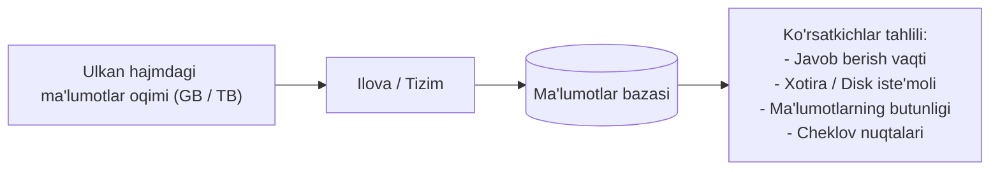
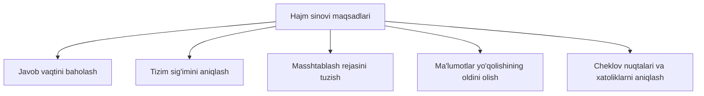
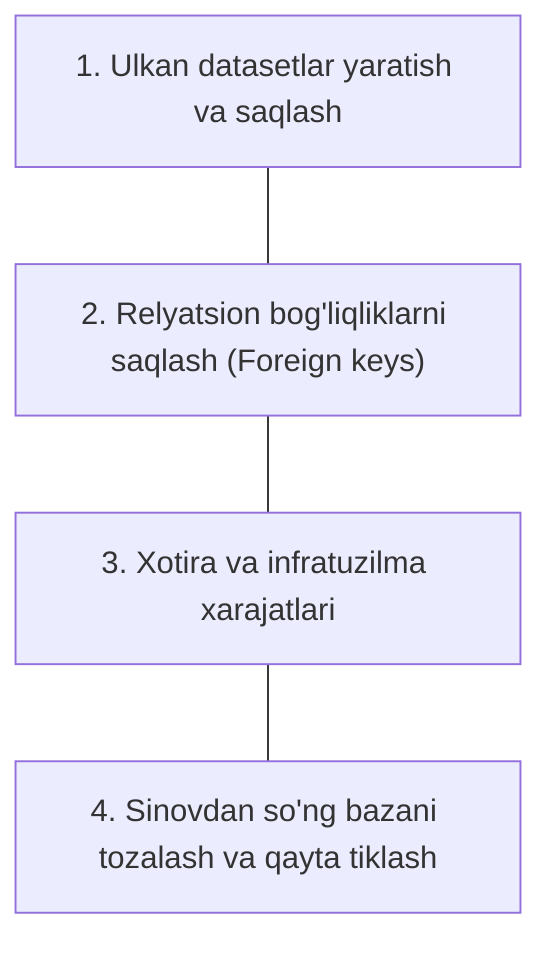

import { Callout } from 'nextra/components'

# Hajm sinovi (Volume Testing)

**Hajm sinovi (Volume Testing)** — bu dasturiy ta'minot yoki uning ma'lumotlar bazasiga ulkan hajmdagi ma'lumotlar yuklanganda tizimning xatti-harakati, barqarorligi va javob berish vaqtini tahlil qiluvchi nofunksional sinov turidir.

Ushbu sinov turi ko'pincha **Flood Testing** (Toshqin sinovi) deb ham yuritiladi. Unda foydalanuvchilar soniga emas, balki tizim qayta ishlayotgan va ma'lumotlar bazasida saqlanayotgan ma'lumotlarning umumiy hajmiga asosiy e'tibor qaratiladi.

<Callout type="info">
  **Hajm va Yuklama (Volume vs Load) farqi:**  
  * **Hajm (Volume)** — bu tizimning sig'imi (masalan, bazadagi 50 million yozuv yoki 5 TB fayl).  
  * **Yuklama (Load)** — bu bir vaqtning o'zida kelayotgan foydalanuvchilar yoki so'rovlar miqdori (masalan, 10 000 ta parallel so'rov).
</Callout>

---

## Hajm sinovining asosiy maqsadlari

1. **Javob berish vaqtini baholash (System Response Time):**  
   Ma'lumotlar bazasi kengaygan sari qidiruv va so'rovlar (SQL queries) qanchalik sekinlashishini aniqlash.
2. **Tizim sig'imi chegarasini belgilash (System Capacity):**  
   Tizim qancha hajmdagi ma'lumotgacha uzluksiz va nosozliklarsiz xizmat ko'rsata olishini oldindan bashorat qilish.
3. **Masshtablash rejalarini ishlab chiqish (Scalability Planning):**  
   Kelajakda ma'lumotlar ko'payganda yangi xotira, disk yoki server resurslari (sharding, partitioning) kerak bo'lishini rejalashtirish.
4. **Ma'lumotlar butunligini ta'minlash (Data Loss Prevention):**  
   Katta hajmdagi ma'lumotlarni yozish yoki o'qish paytida qisman yo'qotishlar (data corruption yoki data loss) ro'y bermasligini kafolatlash.
5. **Turli yuklamalarda tahlil qilish:**  
   Past, o'rta va o'ta yuqori ma'lumot darajalarida tizimning chidamliligini monitoring qilish.

---

## Hajm sinovining asosiy xususiyatlari

* **Vaqt omili:** Dastur ishlab chiqish bosqichida oz sonli ma'lumotlar bilan tez ishlaydi, biroq vaqt o'tishi bilan ma'lumotlar to'planib borishi sababli tizim sekinlashishi mumkin.
* **Mantiqiy to'g'ri test ma'lumotlari:** Test uchun sun'iy ma'lumot yaratuvchi generatorlar (Test Data Generators) yordamida mantiqan to'g'ri va bir-biriga bog'langan ma'lumotlar to'plami shakllantiriladi.
* **To'g'ri saqlanishni tekshirish:** Ma'lumotlar faqatgina bazaga kiritilibgina qolmay, ularning to'g'ri jadvallar va maydonlarga xatosiz joylashishi va indekslanishi tekshiriladi.
* **Tranzaksiya xavfsizligi:** Katta partiyali (batch) ma'lumotlar oqimi paytida xatolik yuz bersa, tizim tranzaksiyani bekor qilib (`Rollback`), avvalgi barqaror holatiga qayta olishi kerak.

---

## Nega Hajm sinovi zarur? (Amaliy misol)

Aksariyat elektron tijorat (E-commerce) ilovalari dastlabki bosqichda kuniga bir necha yuzta buyurtmani qabul qiladi. Ammo 2-3 yil o'tib, ma'lumotlar bazasida:
* 10 millionlab buyurtmalar tarixi,
* 50 milliondan ortiq tranzaksiyalar,
* Gigabaytlab foydalanuvchi jurnallari (logs) to'planadi.

Agar hajm sinovi o'tkazilmagan bo'lsa:
* Foydalanuvchi buyurtmalar tarixini ochishga uringanda so'rov vaqti tugashi (`Timeout`) mumkin;
* Baza to'lib qolishi natijasida yangi to'lovlar qabul qilinmay qoladi;
* Qidiruv mexanizmi butunlay ishdan chiqadi.

Hajm sinovi ana shunday muammolarni tizim jonli efirga (Production) chiqmasidan oldin yoki resurslarni kengaytirishdan avval aniqlashga yordam beradi.

---

## Hajm sinovi va Yuklama sinovi farqi

| Xususiyat | Hajm sinovi (Volume Testing) | Yuklama sinovi (Load Testing) |
| :--- | :--- | :--- |
| **Ta'rifi** | Ma'lumotlar bazasidagi ma'lumotlar hajmiga asoslangan sinov | Bir vaqtning o'zida tushadigan so'rovlar/foydalanuvchilar oqimi |
| **E'tibor markazi** | Ma'lumotlar bazasi sig'imi va ma'lumotlar butunligi | Server va ilovaning parallel so'rovlarni ko'tara olish qobiliyati |
| **O'lchov birligi** | GB, TB, yozuvlar (records) soni | Foydalanuvchilar soni (Virtual Users), RPS (Requests Per Second) |
| **Shart-sharoit** | Tizim ma'lumotlar to'yingan holatda tekshiriladi | Kutilayotgan normal va eng yuqori foydalanuvchilar yuklamasida |
| **Asosiy maqsad** | Ma'lumotlar yo'qolishi va ortiqcha to'lib ketishni oldini olish | Tizimning barqarorligi va javob berish tezligini tasdiqlash |

---

## Hajm sinovidagi asosiy qiyinchiliklar (Challenges)

* **Datasetlarni generatsiya qilish:** Haqiqiy ishlab chiqarish ma'lumotlariga mos keladigan millionlab test yozuvlarini yaratish uzoq vaqt va hisoblash quvvatini talab etadi.
* **Baza butunligi va bog'liqliklar:** Relatsion bazalarda (RDBMS) jadvallar orasida ko'plab xorijiy kalitlar (`Foreign Key`) bo'ladi. Mantiqsiz yoki bog'lanmagan ma'lumot kiritish xatoliklarga olib keladi.
* **Resurslar cheklovi:** Sinov muhitida production darajasidagi disk va xotira quvvatini yaratish har doim ham oson emas.

<Callout type="warning">
  Hajm sinovini hech qachon ishlab chiqarish (Production) serverida to'g'ridan-to'g'ri o'tkazmang! Aks holda haqiqiy foydalanuvchilar ma'lumotlari buzilishi yoki butun tizim qulashi mumkin.
</Callout>

---

## Hajm sinovi uchun mashhur vositalar (Tools)

* **HammerDB:** Ochiq manbali va eng mashhur ma'lumotlar bazasi benchmarking va hajm sinovi vositasi. Oracle, MySQL, SQL Server, PostgreSQL bilan mukammal ishlaydi.
* **DbFit:** Test-Driven Development (TDD) yondashuvini qo'llab-quvvatlovchi, ma'lumotlar bazasi testlarini oson yozish va bajarish imkonini beruvchi vosita.
* **JdbcSlim:** FitNesse freymvorki bilan integratsiyalashgan holda JDBC orqali ma'lumotlar bazasiga buyruqlar va katta hajmdagi so'rovlarni yo'llash vositasi.
* **NoSQLMap:** NoSQL ma'lumotlar bazalarining (MongoDB, CouchDB va h.k.) katta hajmdagi ma'lumotlar va zaifliklar ostida ishlashini baholash uchun Python asosidagi vosita.
