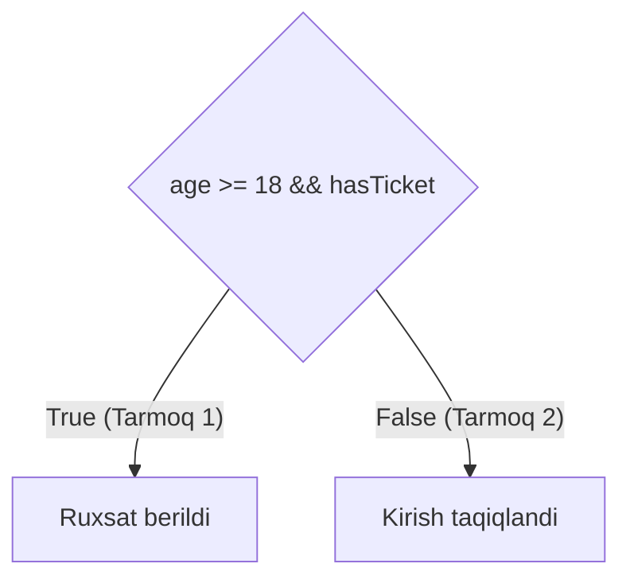

import { Callout } from 'nextra/components'

# Branch va Decision Coverage: Tarmoqlar va Qarorlar Qamrovi

**Branch Coverage** (va unga bevosita bog'liq bo'lgan **Decision Coverage**) — dasturdagi har bir boshqaruv tuzilmasining (masalan, `if-else`, `switch-case`, `while`, `for`) barcha ehtimoliy natijalari (`True` va `False` tarmoqlari) kamida bir marta bajarilishini kafolatlovchi ilg'or oq quti sinov texnikasidir.

---

## Hisoblash Formulasi

```text
Branch Coverage = (Bajarilgan shartli tarmoqlar soni / Jami shartli tarmoqlar soni) * 100%
```

Har bir `if` sharti 2 ta ehtimoliy tarmoqqa ega:
1. Shart to'g'ri bo'lgan holat (`True` tarmog'i)
2. Shart noto'g'ri bo'lgan holat (`False` tarmog'i)

---

## Boshqaruv Grafigi (Control Flow) Misolida Tahlil

```javascript
function verifyAccess(age, hasTicket) {
  if (age >= 18 && hasTicket) { // Tugun 1: Qaror
    return "Ruxsat berildi";    // Tugun 2: True tarmog'i
  } else {
    return "Kirish taqiqlandi"; // Tugun 3: False tarmog'i
  }
}
```



### 100% Branch Coverage uchun Testlar To'plami:

| Test ID | Kiruvchi Qiymatlar | Hisoblangan Mantiq | Bosib O'tilgan Tarmoq |
| :--- | :--- | :--- | :--- |
| **TC-01** | `age = 20`, `hasTicket = true` | Shart: `True` | Tarmoq 1 (`True`) |
| **TC-02** | `age = 16`, `hasTicket = true` | Shart: `False` | Tarmoq 2 (`False`) |

Ushbu ikki test yordamida ikkala tarmoq ham qamrab olinadi:
```text
Branch Coverage = (2 / 2) * 100% = 100%
```

---

## Statement Coverage va Branch Coverage Qiyosi

- **Branch Coverage har doim Statement Coverage dan kuchliroqdir:** Agar siz 100% Branch Coverage ga erishsangiz, bu avtomatik ravishda 100% Statement Coverage ni ham ta'minlaydi.
- Biroq, 100% Statement Coverage ga erishish har doim ham 100% Branch Coverage ni kafolatlamaydi (chunki `else` bloki bo'lmagan shartlarda `False` tarmog'i sinovdan chetda qolishi mumkin).

<Callout type="info">
  **Sanoat standarti:** Kritik dasturiy tizimlarda (banklar, tibbiyot uskunalari) odatda kamida 85-90% Branch Coverage talab qilinadi.
</Callout>
