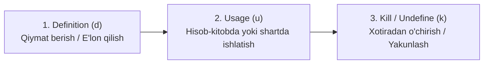

import { Callout } from 'nextra/components'

# Data Flow Testing: Ma'lumotlar Oqimi Sinovi

**Data Flow Testing** — dasturdagi o'zgaruvchilarning (variables) butun hayotiy siklini, ya'ni ularning qiymat qabul qilishi, hisoblashlarda ishlatilishi va xotiradan o'chirilishidagi mantiqiy xatoliklarni aniqlashga yo'naltirilgan oq quti sinov texnikasidir.

---

## O'zgaruvchining Hayotiy Sikli Holatlari

Har qanday o'zgaruvchi kodda quyidagi uchta holatdan birida bo'ladi:

1. **Definition (d) — Ta'riflash:** O'zgaruvchi xotirada yaratiladi va unga birlamchi qiymat beriladi (masalan: `x = 10;` yoki `cin >> x;`).
2. **Usage (u) — Foydalanish:** O'zgaruvchi qiymati kodda qo'llaniladi. Bu ikki xil bo'ladi:
   - *Hisoblashda foydalanish (c-use / computational use):* `y = x + 5;`
   - *Predikatda / shartda foydalanish (p-use / predicate use):* `if (x > 0)`
3. **Kill (k) — Yo'q qilish:** O'zgaruvchi xotiradan ozod qilinadi yoki uning amal qilish doirasi (scope) tugaydi.

---

## Data Flow da Aniqlanadigan Odatdagi Xatoliklar (Anomaliyalar)

- **ur-anomaliya (Undefined-Read):** O'zgaruvchiga hali hech qanday qiymat berilmasdan turib, undan hisob-kitobda foydalanish (masalan: `let a; let b = a + 2;` natijada `NaN` yoki xatolik).
- **dd-anomaliya (Double-Definition):** O'zgaruvchiga qiymat berilgach, undan biror marta ham foydalanmasdan turib, unga yana boshqa yangi qiymat yuklash (resurslarning behuda sarfi).
- **dk-anomaliya (Defined-Killed):** O'zgaruvchiga qiymat berilgach, uni ishlatmasdan darhol o'chirib yuborish.

<Callout type="info">
  **Statik va Dinamik tahlil:** Data Flow xatolarining ko'p qismi zamonaviy statik kod tahlilchilari (masalan, ESLint, SonarQube) tomonidan kod yozish jarayonidayoq darhol aniqlanadi.
</Callout>
