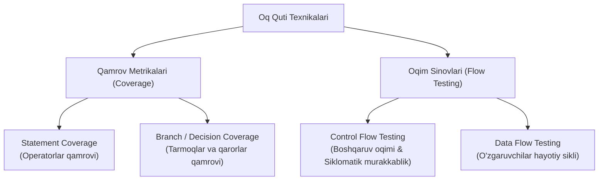

import { Cards, Callout } from 'nextra/components'

# Oq Quti Sinov Texnikalari (White Box Techniques)

Oq quti sinov texnikalari — dastur manba kodining ichki arxitekturasi, mantiqiy tarmoqlari va bajarilish yo'llari qanchalik to'liq tekshirilganligini matematik va tahliliy aniqlashga xizmat qiluvchi usullardir.

Ushbu usullar yordamida **Kod Qamrovi (Code Coverage)** o'lchanadi va dasturning hech qachon ishga tushmaydigan yoki xatoga olib keluvchi yashirin qismlari fosh etiladi.

---

## Oq Quti Texnikalari Ierarxiyasi

---

## Modul Bo'limlari

<Cards num={2}>
  <Cards.Card
    title="▶️ Statement Coverage"
    href="/docs/white-box-techniques/statement-coverage"
  >
    Dastur kodidagi har bir satr operator kamida bir marta bajarilishini ta'minlash formulasi va hisoblash usuli.
  </Cards.Card>
  <Cards.Card
    title="▶️ Branch & Decision Coverage"
    href="/docs/white-box-techniques/branch-coverage"
  >
    Har bir shartli tarmoqning (if-else, switch-case) `True` va `False` yo'nalishlarini to'liq qamrab olish.
  </Cards.Card>
  <Cards.Card
    title="▶️ Control Flow Testing"
    href="/docs/white-box-techniques/control-flow-testing"
  >
    Boshqaruv grafigi (CFG) va Mak-Keybning Siklomatik Murakkabligi (Cyclomatic Complexity) orqali zaruriy testlar sonini topish.
  </Cards.Card>
  <Cards.Card
    title="▶️ Data Flow Testing"
    href="/docs/white-box-techniques/data-flow-testing"
  >
    O'zgaruvchilarning e'lon qilinishi (Definition), ishlatilishi (Usage) va yo'q qilinishi (Kill) zanjirini tekshirish.
  </Cards.Card>
</Cards>
